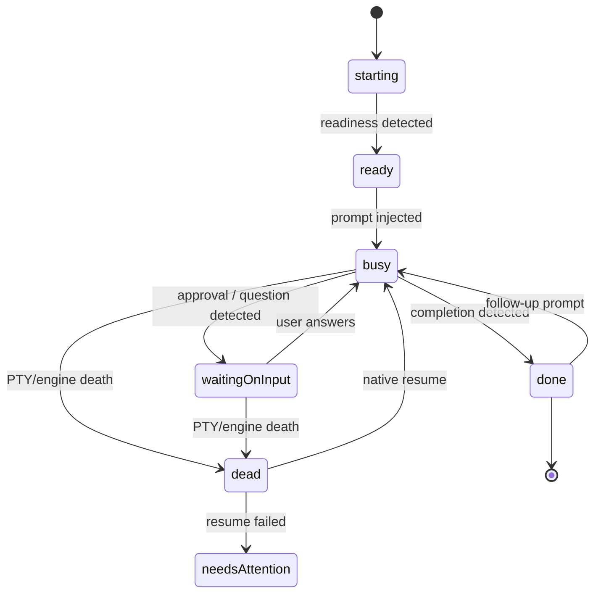

# CLI Executor — Requirements

## Summary

Add a new executor type — **cli-agent** — that runs Fusion agent sessions inside server-owned PTYs running interactive CLI coding agents (Claude Code, Codex, Droid, Pi). Fusion injects prompts, tracks agent state and session identity through each CLI's native telemetry, and drives the full task pipeline off it, while the user co-drives through a live interactive terminal on any surface. Chat gains a CLI-backed mode rendered as a structured transcript with a raw-terminal toggle.

---

## Problem Frame

Fusion's primary persona is the developer juggling many Claude Code and Codex terminals across machines. Today Fusion can only drive agents through API-backed runtimes (model executors and agent executors over headless adapters like ACP). But the CLI agents are where these developers actually live: their subscriptions, authentication, configuration, skills, hooks, and muscle memory are attached to the CLI tools, not to raw API keys. There is currently no way to make a board task's execution *be* a Claude Code or Codex session — visible, steerable, and co-drivable — nor any way to chat through one.

Orca (onorca.dev) demonstrates the model this feature should match: server-managed terminal sessions with per-CLI awareness — readiness detection, prompt injection, idle/busy tracking via installed agent hooks, native session-id capture, and resume across restarts — while the terminal stays fully interactive for the human.

---

## Key Decisions

- **Native telemetry first, heuristics as fallback.** Each launch CLI gets an adapter that taps the CLI's own machinery — hooks and structured session logs — for precise state (busy / waiting-on-input / done), transcript content, and session identity. Any CLI without an adapter can still run through a generic PTY adapter using screen-quiet/idle heuristics, with a raw-terminal-only view. This mirrors Orca's hooks-based approach and keeps the adapter registry open, consistent with Fusion's neutrality thesis. Native-telemetry status for Codex, Droid, and Pi is contingent on a planning-time verification gate; only Claude Code is verified today.
- **The executor identifier is `cli-agent`, not `cli`.** The engine already wires an `executorKind` of `cli` as a non-interactive runner for named project scripts and approval-gated raw commands (`packages/engine/src/executor.ts`) — opposite semantics to this feature. The interactive-PTY executor ships under the distinct `cli-agent` identifier, joining the existing executor kinds (model, agent, skill, and the script-runner `cli`).
- **Full pipeline retained.** A CLI-executed task is a normal task: worktree and branch setup, completion detection driving the lifecycle, validator, in-review, and auto-merge all apply. The terminal is the execution surface; the board lifecycle is unchanged.
- **Per-CLI launch configuration.** Each adapter carries its own configurable launch settings (command, args, permission/autonomy flags) with sensible shipped defaults, rather than a single global autonomy posture.
- **Executor selection and attention behavior live on the workflow node for task surfaces; chat and CE sessions choose per session.** The workflow's execute node configures the CLI executor for task execution — the same node-level pattern covers planning and validator runs — including what happens when the agent blocks on input (notification), with per-task override. Chat and CE plugin sessions are not workflow nodes; they select their CLI executor in per-session settings.
- **Orca-style session identity and resume.** The CLI's native session ID is captured per session and persisted; a dead PTY or engine restart relaunches the CLI with its native resume mechanism so agent context survives. Needs-attention is the fallback when resume fails, not the first response.
- **Chat is a hybrid transcript.** A CLI-backed chat session renders structured messages parsed from the CLI's native telemetry, with a toggle to drop into the raw interactive terminal. No screen-scraping of TUI output into bubbles.
- **Full surface parity.** The interactive terminal works on the desktop dashboard, mobile, and the TUI surface, all attached to the same server-owned session.

---

## Actors

- A1. Developer — selects CLI executors, watches sessions, co-drives in the terminal, answers agent prompts.
- A2. CLI agent — an external interactive process (Claude Code, Codex, Droid, Pi) running in a Fusion-owned PTY.
- A3. Engine — spawns and owns CLI sessions, injects prompts, consumes telemetry, drives the task pipeline.
- A4. Surfaces — desktop dashboard, mobile, and TUI clients that attach to live sessions for viewing and input.

---

## Key Flows

- F1. CLI task execution
  - **Trigger:** A task whose resolved executor is `cli-agent` starts its execute step.
  - **Steps:** Engine prepares worktree/branch as usual; the adapter launches the configured CLI in a server-owned PTY in the worktree; waits for readiness; injects the task prompt; tracks busy state via telemetry; on done, the normal pipeline continues (validator, in-review, auto-merge).
  - **Covers:** R1, R4, R5, R6, R10.
- F2. Waiting on input
  - **Trigger:** The CLI agent blocks mid-task (permission prompt, clarifying question).
  - **Steps:** Telemetry (or heuristic) detects waiting-on-input; the task surfaces the state and fires the notification configured on the workflow node; the user opens the terminal on any surface, answers, and the agent resumes; state returns to busy.
  - **Covers:** R6, R9, R11, R14.
- F3. CLI-backed chat
  - **Trigger:** User starts or switches a chat session to a CLI executor.
  - **Steps:** Engine spawns (or resumes) the CLI session; chat messages are injected into the CLI; the conversation renders as a structured transcript from native telemetry; the user can toggle into the raw terminal at any time and type directly; transcript persists as chat history.
  - **Covers:** R1, R15, R16.
- F4. Session resume
  - **Trigger:** Engine restart, PTY death, or a task/chat reopening an existing session.
  - **Steps:** Engine looks up the persisted native session ID; relaunches the CLI with its resume mechanism in the same worktree; telemetry re-attaches; if resume fails, the task or chat surfaces needs-attention instead.
  - **Covers:** R7, R8.
- F5. Multi-surface attach
  - **Trigger:** User opens a running session from another surface (e.g., phone).
  - **Steps:** The surface attaches to the same server-owned PTY; output streams live; input from any attached surface reaches the session; detaching never kills the session.
  - **Covers:** R4, R14.

---

## Requirements

**Executor model**

- R1. A task's execute step, planning session, validator run, Compound Engineering plugin session, and chat session can each specify executor type `cli-agent` with a chosen CLI adapter, alongside the existing executor kinds (model, agent, skill, and the non-interactive `cli` script runner, from which `cli-agent` is distinct).
- R2. For task surfaces (execute, planning, validator), CLI executor selection and attention/notification behavior are configured on the workflow node, with per-task override. Chat and CE plugin sessions are not workflow nodes: they select their CLI executor in per-session settings.
- R3. CLI support is an adapter registry. Claude Code ships as a verified native-telemetry adapter; Codex, Droid, and Pi are native-telemetry targets contingent on a planning-time verification gate (telemetry + resume), and any that fail verification launch on the generic tier instead. Any other CLI command can run through the generic PTY adapter (heuristic state detection, raw-terminal-only view).

**Session management**

- R4. CLI sessions are server-owned PTYs bound to their task or chat entity: they survive client disconnects and browser refreshes, and any number of surfaces can attach concurrently.
- R5. The adapter detects CLI readiness before injecting a prompt, and defines the canonical safe injection format for its CLI; all injected text — task prompts and chat-composed messages alike — is escaped and delivered per that format (no premature or interleaved injection, no raw control-sequence passthrough).
- R6. The engine tracks each session's agent state — starting, ready, busy, waiting-on-input, done/idle, dead — via the adapter's native telemetry, falling back to idle heuristics for generic adapters. A positive completion signal is distinct from mere idleness; adapters report which of the two they observed.
- R7. The adapter captures the CLI's native session identity and persists it with the Fusion session record.
- R8. After engine restart or PTY death, the engine resumes the session via the CLI's native resume mechanism in the same worktree; if resume fails, the owning task or chat surfaces needs-attention. Resume restores conversation context, not in-flight work: behavior for an action interrupted mid-flight (mid-tool-call or mid-edit at death) is explicitly defined, and worktree state is reconciled at resume rather than assumed clean.
- R9. The user can type into the session at any time. Non-interference is a designed behavior, not an assumption: engine injection and human keystrokes are serialized on the shared PTY input stream (injection only occurs in detected ready/quiet windows, never mid-keystroke), and user input that changes the agent's state is reflected back into state tracking via telemetry.
- R17. Attaching to a session from any surface requires the same authentication that governs other dashboard access; a session ID alone is never sufficient authorization, and sessions are accessible only to their owning authenticated user or workspace member.
- R18. The engine enforces a configurable per-node limit on concurrent CLI sessions with a defined behavior at the ceiling (queue, or reject with a clear error) — never silent degradation.
- R19. Stall backstop: a session showing no output progress beyond a configurable threshold without a detected done or waiting-on-input signal surfaces needs-attention, bounding the cost of a missed detection.

**Pipeline integration**

- R10. A CLI-executed task follows the full task lifecycle: worktree/branch setup, completion detection advancing the task to the next stage, validator, in-review, and auto-merge behave as they do for model-executed tasks.
- R11. When a session enters waiting-on-input, Fusion fires a notification according to the workflow node's configuration.
- R12. A validator run on a CLI executor produces the same verdict contract (pass / fail / blocked / error) as a model-executed validator run.
- R20. Advancement that leads toward merge (execute → validator → in-review/auto-merge) requires a positive completion signal from the adapter's native telemetry; idleness alone never advances a task. On the generic heuristic tier, idle-based completion requires explicit user confirmation before the task leaves the execute step; idle without a completion signal surfaces needs-attention instead of advancing.

**Per-CLI configuration**

- R13. Each adapter exposes launch configuration — command, arguments, permission/autonomy mode — with shipped defaults, editable in settings at the adapter level.
- R21. Autonomy/permission launch flags above an adapter's shipped baseline are privileged settings (workspace-administrator editable), and a session's active autonomy posture is visibly surfaced wherever its terminal renders.
- R22. Each adapter defines an explicit environment allowlist for its spawned CLI process; Fusion service credentials (API keys, tokens, database paths) are never forwarded into CLI-agent PTY environments.

**Surfaces**

- R14. The desktop dashboard task card, mobile, and the TUI surface each provide a live interactive terminal attached to the task's session.
- R15. A CLI-backed chat session renders as a structured transcript with the standard chat composer injecting into the session, plus a toggle to a raw interactive terminal view.
- R16. The structured transcript persists as the chat session's history, available after the session ends and across surfaces. Persistence reuses the existing chat-history storage layer (no parallel history store), and transcripts are sensitive data inheriting the originating session's access controls; retention specifics are a planning question.

---

## Acceptance Examples

- AE1. **Covers R6, R10.** Given a CLI task whose agent finishes its work and goes idle with a completed result, when the adapter reports done, then the task advances out of the execute step into the normal validator/in-review flow without user action.
- AE2. **Covers R6, R11.** Given a Claude Code task configured interactive, when the CLI shows a permission prompt, then the session state becomes waiting-on-input and the notification configured on the workflow node fires; the task does not advance and is not marked failed.
- AE3. **Covers R7, R8.** Given an in-progress CLI task whose engine restarts, when the engine comes back up, then the session relaunches with the CLI's native resume and the agent retains its prior conversation context; the task remains in-progress.
- AE4. **Covers R3.** Given a CLI with no native adapter launched via the generic adapter, when its session runs, then the user gets a raw interactive terminal and heuristic idle-based state, and no structured transcript is shown.
- AE5. **Covers R9.** Given a busy CLI task session, when the user types guidance directly into the terminal mid-run, then the agent receives it, state tracking continues, and subsequent completion detection still advances the task normally.
- AE6. **Covers R4, R14.** Given a CLI session started from the desktop, when the user opens the same task on mobile, then the same live terminal renders there and input from either surface reaches the one session.
- AE7. **Covers R15, R16.** Given a CLI-backed chat session, when the user toggles between transcript and terminal views, then both reflect the same underlying session, and the transcript persists as chat history after the session ends.

---

## Scope Boundaries

Deferred for later:

- Agent-side completion protocol (instructing the agent to run a command when done) — a reliability layer on top of telemetry, not core.
- CLI executors for arbitrary workflow script/prompt nodes — v1 surfaces are the execute step, planning, validator, CE plugin sessions, and chat.
- Structured transcripts for generic-adapter CLIs (screen-output parsing) — generic tier is raw terminal only.
- Multi-user collaborative co-driving semantics (presence, input arbitration) — v1 assumes the single-developer persona; concurrent attach is supported but unmediated.

---

## Dependencies / Assumptions

- The chosen CLIs are installed and authenticated on the node where the engine runs; Fusion does not manage CLI installation or vendor auth in v1.
- Each launch CLI offers usable native telemetry (hooks and/or structured session logs) and a session-resume mechanism. Verified for Claude Code (hooks, JSONL transcripts, `--resume`). Codex, Droid, and Pi verification is an explicit planning gate (per R3): each must demonstrate telemetry and resume before shipping at the native tier, with the generic tier as the defined fallback.
- Existing engine PTY infrastructure (node-pty) and realtime transport (SSE/WebSocket) can carry interactive terminal streams to all three surfaces.
- Mobile interactive terminal is feasible within the existing mobile web constraints (virtual keyboard handling is a known hard area).

---

## Outstanding Questions

Deferred to planning:

- Exact telemetry mechanism per CLI (hook events vs session-log tailing vs both) and what each CLI's resume supports.
- Idle-heuristic thresholds and prompt-pattern sets for the generic adapter.
- How planning and validator sessions map onto each CLI (interactive session vs the CLI's non-interactive/one-shot mode) while keeping the terminal visible.
- Transcript persistence format and its relationship to existing chat history storage.
- Concurrency/resource limits for simultaneous PTY sessions per node.

---

## Sources / Research

- Orca behavior (inspected locally): per-CLI agent hook scripts (`~/.orca/agent-hooks/*.sh`) POST native CLI telemetry payloads — including the CLI's session ID — to a local endpoint keyed by pane/tab/worktree; terminals carry stable runtime handles; workspace session state (tabs, agent association) persists and restores across restarts; `orca terminal wait --for tui-idle` exposes idle detection as a primitive.
- Existing executor/runtime seam: `packages/engine/src/runtime-resolution.ts`, `packages/engine/src/agent-runtime.ts`, `packages/engine/src/executor.ts`; headless CLI adapters already exist (`plugins/fusion-plugin-acp-runtime`, `packages/pi-claude-cli`, `packages/droid-cli`) — precedent for adapters, but none expose an interactive PTY.
- PTY and transport infrastructure: `packages/dashboard/src/terminal-service.ts` (node-pty session manager, backend-only today), SSE buffers (`packages/dashboard/src/sse-buffer.ts`) and WebSocket manager (`packages/dashboard/src/websocket.ts`).
- Workflow graph context: execute-node seam and node-level configuration per `docs/workflow-steps.md` (workflow IR, columns/traits, step instances) — the natural home for R2.

---

## Deferred / Open Questions

### From 2026-06-04 review

- **Mobile interactive terminal fallback posture** — Surfaces / Dependencies (P1, design-lens, scope-guardian, confidence 100)

  R14 commits full mobile interactive terminal while the dependencies section acknowledges mobile virtual-keyboard handling as a known hard area. No fallback posture is defined if full interactivity slips — e.g., a read-only terminal stream with a simplified input affordance and desktop handoff.

  <!-- dedup-key: section="surfaces dependencies" title="mobile interactive terminal fallback posture" evidence="Mobile interactive terminal is feasible within the existing mobile web constraints (virtual keyboard handling is a known hard area)." -->

- **Terminal embed placement on task card/detail view** — Surfaces (P1, design-lens, confidence 100)

  The requirements give no product-level guidance on where the terminal lives in the existing task detail structure — a new tab, replacing the log viewer, or an overlay. Different implementers will independently invent the placement, producing inconsistent UX across surfaces.

  <!-- dedup-key: section="surfaces" title="terminal embed placement on task carddetail view" evidence="R14. The desktop dashboard task card, mobile, and the TUI surface each provide a live interactive terminal attached to the task's session." -->

- **Composer behavior in raw-terminal chat mode** — Surfaces (P1, design-lens, confidence 100)

  R15 defines the transcript/terminal toggle but not what happens to the standard chat composer when raw-terminal mode is active. If the composer stays visible alongside a terminal that also accepts input, two competing input paths exist simultaneously.

  <!-- dedup-key: section="surfaces" title="composer behavior in rawterminal chat mode" evidence="R15. A CLI-backed chat session renders as a structured transcript with the standard chat composer injecting into the session, plus a toggle to a raw interactive terminal view." -->

- **Waiting/needs-attention surfacing vs existing stall badges** — Session management (P1, design-lens, confidence 100)

  waiting-on-input and needs-attention are new task-card states with no defined visual relationship to the existing staleness, stuck, and stalled-review signals. Implementers will invent badges that may collide with the existing signal system.

  <!-- dedup-key: section="session management" title="waitingneedsattention surfacing vs existing stall badges" evidence="R8. if resume fails, the owning task or chat surfaces needs-attention." -->

- **Generic-adapter empty-state where transcripts render** — Requirements (P2, design-lens, confidence 75)

  AE4 specifies generic-adapter sessions show no structured transcript, but not what users see where a transcript normally renders — hidden panel, explanatory message, or absent toggle. Each surface rendering transcripts must handle this fallback state consistently.

  <!-- dedup-key: section="requirements" title="genericadapter emptystate where transcripts render" evidence="AE4. Given a CLI with no native adapter launched via the generic adapter, when its session runs, then the user gets a raw interactive terminal and heuristic idle-based state, and no structured transcript is shown." -->
