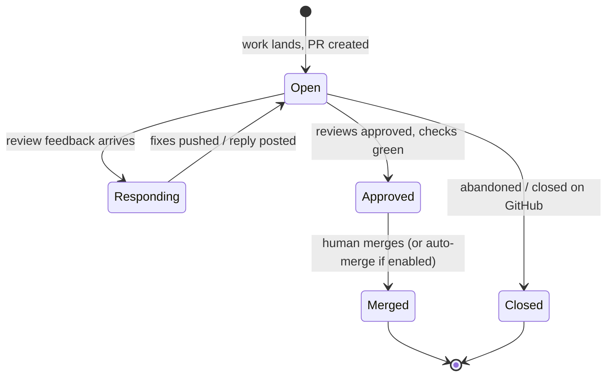

# PR Lifecycle Replacement: Unified PR Entity with Closed Review Loop

## Summary

Replace fusion's PR machinery with a single first-class **PR entity** — one lifecycle whether the work lands as a lone task or a shared branch group. Fusion opens the PR, watches review feedback from humans and bots, auto-fixes and pushes, replies to threads, and the dashboard renders live review state (checks, comments, merge status, conflicts) from that entity.

---

## Problem Frame

Fusion's current PR support is split across two paths and neither delivers what the product needs. The per-task path (`fn task pr create`) works but is manual and per-task. The branch-group single-PR path has never worked end-to-end: entry points stamp synthetic group IDs so members never enumerate, the dashboard promote route calls an engine method that doesn't exist (masked by a mock in tests), and `prState` is flipped to `"open"` without a PR ever being created on GitHub — the state is fiction. The post-mortem in `docs/solutions/integration-issues/branch-group-single-pr-synthetic-id-dead-wiring.md` documents all four defects.

In practice the user bypasses all of it and merges to main directly. The motivation for PRs is forward-looking: teammates and review agents reviewing on GitHub, with fusion responding to feedback and fixing issues autonomously. None of the existing machinery touches that — there is no code that reads review feedback back. The valuable part of the feature has not been started, and the existing part has never run.

---

## Key Decisions

- **Unified PR entity, full replacement.** Both the per-task command path and the branch-group coordinator path are replaced by a single PR entity with one lifecycle. One code path to make correct, instead of two broken ones. The dashboard PR view renders this entity directly. (Chosen over repairing the existing U1–U8 plan, and over a GitHub-inward mirror-only design.)
- **GitHub must corroborate all PR state.** Fusion never records PR state that GitHub does not confirm — no speculative writes. A continuous reconciliation keeps the entity honest against out-of-band changes (PR merged, closed, or commented on GitHub directly). This is the direct lesson of the prior failure, where local state was written first and the GitHub side effect never fired.
- **Auto-fix-and-push is the default autonomy.** When review feedback arrives, fusion dispatches an agent that fixes valid feedback, pushes to the PR branch, and replies to threads — no human gate between comment and pushed fix. The human gate is merge.
- **Agent judgment, not blind compliance.** The agent may disagree with feedback. In that case it posts its reasoning as a PR comment and leaves the thread open instead of pushing a change.
- **Human merges by default; auto-merge is a v1 opt-in setting.** Merge is the human checkpoint unless auto-merge is explicitly enabled for the PR/group.
- **The v1 loop responds to review feedback only.** CI check failures and merge conflicts are *visible* in the PR view but the agent does not act on them in v1 — that is a recorded later extension.

---

## Actors

- A1. **User** — the developer running fusion; reviews PR state in the dashboard, merges, toggles auto-merge.
- A2. **Fusion engine / response agent** — creates PRs, reconciles state, dispatches the fix-or-disagree work in response to feedback.
- A3. **External reviewers** — humans and review bots commenting on the PR in GitHub. (Today realistically bots; human teammates are future.)
- A4. **GitHub** — canonical source of PR, review, check, and merge state.

---

## PR Entity Lifecycle

States are conceptual; exact naming is settled during planning. The invariant: every state shown in fusion is corroborated by GitHub.

---

## Requirements

**PR entity and creation**

- R1. Every landing path — single task or shared branch group — produces the same first-class PR entity with the same lifecycle. A branch group yields exactly one PR for the group.
- R2. PR creation generates title and body from task/group context (AI-assisted, as the current per-task path does), with manual override.
- R3. The new entity *replaces* the existing per-task and branch-group PR code paths; the old machinery is removed, not kept alongside.

**State truth and reconciliation**

- R4. Fusion never persists PR state GitHub has not corroborated. If PR creation fails, the entity reflects the failure — it is never marked open speculatively.
- R5. Fusion continuously reconciles each open PR entity against GitHub: review threads, check runs, mergeability/conflict state, and merged/closed status, including changes made entirely outside fusion.

**Review-response loop**

- R6. Fusion detects new review feedback (comments, review threads, requested changes) from humans and bots on fusion-created PRs.
- R7. On new feedback, fusion dispatches an agent that evaluates each actionable item and either (a) implements a fix, pushes to the PR branch, and replies to the thread, or (b) disagrees — posting its reasoning as a PR comment and leaving the thread open. No human approval is required before a push.
- R8. The loop repeats on subsequent feedback until the PR is merged or closed.

**Merge**

- R9. Merge is a human action by default, available from the fusion dashboard and from GitHub.
- R10. Auto-merge is an opt-in setting in v1: when enabled, fusion merges once the PR is approved and checks pass.

**Dashboard PR view**

- R11. The dashboard has a dedicated PR view per entity showing: CI checks (passing/failing, per check), review comments and threads (including agent replies and disagreements), merged/unmerged status, and merge-conflict state.
- R12. PR state is reachable from the work it belongs to — the task or branch group surfaces its PR's current state and links to the PR view.

**Agent-native parity**

- R13. Every PR action available in the dashboard (create, inspect state, trigger response run, merge, toggle auto-merge) is also available to agents via the CLI.

---

## Acceptance Examples

- AE1. **Covers R7a.** Given an open fusion PR, when a reviewer comments "this function leaks the file handle," then fusion dispatches an agent that fixes the leak, pushes to the PR branch, and replies to the thread describing the fix.
- AE2. **Covers R7b.** Given the same PR, when a reviewer requests a change the agent judges incorrect, then the agent posts a comment explaining why it disagrees, pushes nothing, and the thread remains open for the human to resolve.
- AE3. **Covers R4.** Given PR creation fails (auth, network, branch missing on remote), then the entity records the failure and surfaces it; it is never shown as an open PR.
- AE4. **Covers R5.** Given a fusion PR is merged or closed directly on GitHub, then fusion's entity reflects merged/closed after reconciliation without any fusion-side action.
- AE5. **Covers R10.** Given auto-merge is enabled on a PR, when all reviews are approved and checks are green, then fusion merges it; with auto-merge off, the PR waits for a human.
- AE6. **Covers R1.** Given a shared branch group whose members have all landed, then exactly one PR exists for the group; subsequent member-related pushes update that same PR rather than creating another.

---

## Scope Boundaries

**Deferred for later**

- Multi-user GitHub auth, permissions, and approval policies — until teammates exist.
- The response loop acting on PRs fusion didn't create (teammate or hand-made PRs). The unified-entity design ties the v1 loop to fusion-born PRs.
- Agent auto-fixing failing CI checks and merge conflicts. The PR view shows them in v1; acting on them is the natural next extension of the loop.
- Non-GitHub forges.

---

## Dependencies / Assumptions

- Single-user `gh` CLI auth is sufficient for v1 (creation, comments, merges all act as the user).
- The first real reviewers will be bots/review agents, so the loop can be proven before human teammates exist.
- The repo's existing gh-CLI infrastructure (`packages/core/src/gh-cli.ts`) and GitHub client (`packages/dashboard/src/github.ts`) are reusable building blocks even though the flows above them are replaced.
- The shared-branch-group concept (group owns branch name and PR identity — see `CONCEPTS.md`) carries forward; the PR entity becomes how the "managed PR identity" is actually realized.

---

## Outstanding Questions

**Deferred to planning**

- Feedback detection mechanism (polling cadence vs webhooks) and rate-limit handling.
- Batching: how feedback arriving while a response run is in flight is queued or merged into the run.
- How the existing branch-group lifecycle fields (`prNumber`, `prUrl`, `prState`) migrate onto or are superseded by the PR entity.
- Whether `fn task pr create` survives as an alias over the new path or is retired with a breaking change.
- What counts as "actionable" feedback for the agent (e.g., resolved threads, reactions, drive-by comments vs formal reviews).

---

## Sources

- `docs/plans/2026-06-03-001-feat-branch-group-single-pr-flow-plan.md` — prior design (U1–U8); useful inventory of seams and defects even though this brainstorm replaces rather than completes it.
- `docs/solutions/integration-issues/branch-group-single-pr-synthetic-id-dead-wiring.md` — post-mortem of why the previous flow silently failed; the "state can't lie" requirement (R4) comes directly from this.
- `CONCEPTS.md` — canonical vocabulary: Shared branch group, Group promotion, Landed.
- Existing code worth the planner's attention: `packages/core/src/gh-cli.ts` (gh infrastructure), `packages/dashboard/src/github.ts` (GitHub client), `packages/core/src/branch-group-completion.ts` (canonical landed/completion predicates), `packages/engine/src/group-merge-coordinator.ts` (the coordinator being replaced), `packages/cli/src/commands/task.ts` (per-task PR command being replaced).
