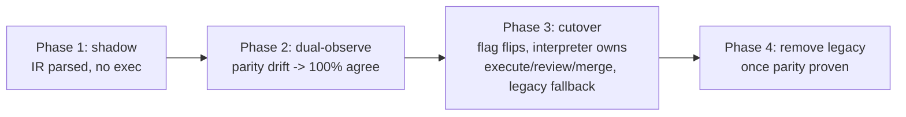

# feat: Executable custom workflows + visual node editor

## Summary

Today the only **executable** custom-workflow surface is the `WorkflowStep` engine — a flat, per-task list of prompt/script/gate quality-gate steps that run at the pre-merge and post-merge boundaries around the fixed `execute → review → merge` pipeline. The richer **`WorkflowIr`** graph primitive (`start | prompt | script | gate | end` nodes + conditional edges) exists but is **inert**: it is parsed only in tests, `WorkflowGraphExecutor` is a flag-off no-op, and the parity observer is diagnostic-only.

This plan makes custom workflows *work* and gives them a *visual home*, in a way that respects the **FN-4359 reliability freeze**:

1. **Persist named workflows** as `WorkflowIr` graphs (+ editor layout) in a new core table.
2. **Compile IR → executable `WorkflowStep` set** (a pure function), so authored graphs run on the *already-executable* engine path with **zero changes to the scheduler/executor/merger reliability core**.
3. **Select a workflow per task, with a per-project default**; selection resolves to the task's existing `enabledWorkflowSteps` seam.
4. **Build a graph node editor** on `@xyflow/react` (React Flow) as a lazy-loaded dashboard modal that creates/edits the same `WorkflowIr` and round-trips through `parseWorkflowIr` for validation.
5. **Document — but do not build —** the full interpreter cutover (promoting `WorkflowGraphExecutor` to authoritative) as an explicit deferred track, so the long-term direction is recorded and the MVP IR feeds it without rework.

The MVP delivers a working, visual, executable custom-workflow feature now. The same IR artifact is forward-compatible with a future graph interpreter.

---

## Problem Frame

- **Inert graph primitive.** `WorkflowIr` / `WorkflowGraphExecutor` / `workflow-parity` are a flag-off, observe-only scaffold with no live call sites. There is no way for a user to author a graph, and nothing executes one.
- **No authoring surface.** The dashboard has list/form UIs for individual `WorkflowStep`s (`WorkflowStepManager`) but no graph/canvas editor and no graph library installed.
- **No workflow selection.** Tasks carry `enabledWorkflowSteps?: string[]` (a set of step IDs) but there is no concept of a *named workflow* a task or project can select.
- **Reliability freeze.** FN-4359 blocks changes to scheduler/executor/self-healing/merger reliability behavior without an explicit carve-out. A naive "make the graph authoritative" approach trips this gate immediately.

**The opportunity:** the IR's `prompt` / `script` / `gate` node kinds are *exactly* the `WorkflowStep` primitives. A graph that reduces to an ordered set of pre-merge/post-merge steps around the fixed `execute → review → merge` seams can be compiled onto the existing executable engine — delivering real execution without touching frozen code.

---

## Scope Boundaries

### In scope (MVP)
- New persisted `workflows` entity: `WorkflowIr` body + editor layout + metadata, with CRUD.
- A pure `compileWorkflowToSteps(ir)` function mapping IR nodes → `WorkflowStep` records with phase/gate/order, plus a **linearity validator** that flags graphs the WorkflowStep engine cannot honor.
- Per-task workflow selection (`Task.selectedWorkflowId`) and a per-project default workflow; selection resolves to `enabledWorkflowSteps` at selection time (not in the executor).
- A `@xyflow/react`-based node editor modal for creating/editing workflows, round-tripped through `parseWorkflowIr`.
- Dashboard API endpoints + client functions for workflow CRUD, compile-preview, and selection.
- Surfacing the selected workflow + its compiled steps in the task detail view.

### Deferred to Follow-Up Work
- **Full IR interpreter cutover** (`### Deferred Track: Interpreter Cutover` below) — promoting `WorkflowGraphExecutor` to authoritative. Multi-milestone, FN-4359-gated.
- **Non-linear graph execution** (true branching beyond the linear success/failure chain the WorkflowStep engine supports). The MVP compiler *rejects* such graphs with a clear "requires interpreter (deferred)" message rather than mis-executing them.
- Workflow versioning/history, import/export, sharing across projects.
- Plugin-contributed *workflows* (plugin-contributed *steps* already exist and are reused).

### Outside this product's identity
- Replacing the kanban board columns or the fixed `triage → todo → in-progress → in-review → done` progression. Custom workflows configure *what runs at the boundaries*, not the board model.

---

## Key Technical Decisions

### KTD-1 — Compile IR to WorkflowSteps for MVP execution (freeze-safe)
The node editor authors a `WorkflowIr`; a pure compiler maps `prompt`/`script`/`gate` nodes onto the existing executable `WorkflowStep` engine, anchored around the fixed `execute → review → merge` seams. **Rationale:** the executor already reads `enabledWorkflowSteps` and runs `runWorkflowSteps` at pre/post-merge; routing through that seam means **no scheduler/executor/merger reliability change → no FN-4359 carve-out**. The same IR is the artifact a future interpreter would run, so there is no rework. *(User decision: "Both: compile now, cutover later".)*

### KTD-2 — `@xyflow/react` (React Flow) for the editor
Mature node-editor library (drag nodes, edge handles, pan/zoom, minimap, controlled state). Fastest path to a polished editor; its controlled-state model maps cleanly to `WorkflowIr` nodes/edges. **Cost:** a new dependency in the bundled `@runfusion/fusion` CLI (~50kb gzipped) — requires a changeset and a Vite manual-chunk entry. **Rationale over hand-rolled SVG:** drag/connect/zoom/layout is exactly the high-effort, high-bug-surface work React Flow already solves.

### KTD-3 — Selection resolves to `enabledWorkflowSteps` at selection time
Selecting a workflow for a task compiles it and writes the resulting step set into `Task.enabledWorkflowSteps`; a per-project default is inherited by new tasks. **Rationale:** keeps the executor's read path unchanged (it already consumes `enabledWorkflowSteps`), so selection is a store/API-layer concern, not an engine change. *(User decision: "Per-task + per-project default".)*

### KTD-4 — Do not bump the IR schema
Per FN-5769, `start | prompt | script | gate | end` + `edge.condition` is the canonical v1 contract. The editor emits exactly this and validates via `parseWorkflowIr` / `serializeWorkflowIr`. Editor layout (node x/y) is persisted **separately** from the IR (IR v1 deliberately excludes layout).

### KTD-5 — Linearity validation is part of compilation, not an afterthought
The WorkflowStep engine runs an ordered list at pre/post-merge; it cannot honor arbitrary branching. The compiler validates that the authored graph reduces to a linear pre-merge chain → seams → post-merge chain (with only the canonical `success`/`failure` edges around seams). Non-conforming graphs are rejected at save/compile with an actionable message. **Rationale:** honest semantics — never silently drop branches.

---

## High-Level Technical Design

### Architecture: authoring → persistence → compilation → execution

```mermaid
flowchart TD
  subgraph Dashboard[Dashboard - React]
    NE[WorkflowNodeEditor - @xyflow/react]
    SEL[Workflow selector - task + project default]
  end
  subgraph API[Dashboard server - src/routes]
    R1[/workflows CRUD/]
    R2[/workflows/:id/compile preview/]
    R3[/tasks/:id/workflow selection/]
  end
  subgraph Core[@fusion/core]
    ST[(workflows table)]
    IR[parseWorkflowIr / serializeWorkflowIr]
    CMP[compileWorkflowToSteps + validateLinearity]
    WS[(workflow_steps table)]
    TASK[Task.selectedWorkflowId / enabledWorkflowSteps]
  end
  subgraph Engine[@fusion/engine - UNCHANGED reliability core]
    EX[TaskExecutor.runWorkflowSteps]
  end

  NE -->|WorkflowIr + layout| R1 --> ST
  NE -->|validate| IR
  SEL --> R3
  R3 --> CMP
  CMP --> WS
  R3 -->|resolve| TASK
  R2 --> CMP
  TASK -.read unchanged.-> EX
  EX -->|runs| WS
```

The dotted edge is the key safety property: the engine's read of `enabledWorkflowSteps` is **untouched**. Everything new lives upstream of it.

### Compilation: IR node → WorkflowStep mapping (directional)

```
WorkflowIr graph                     compiled WorkflowStep set
─────────────────                    ─────────────────────────
start ─▶ [gate: lint]      ┐
        [prompt: spec-check]│  pre-merge ─▶  WS{mode, phase:pre-merge,
        [script: build]    ┘                    gateMode, order:n}
   ─▶ <execute>  (fixed seam, not emitted as a step)
   ─▶ <review>   (fixed seam)
   ─▶ <merge>    (fixed seam)
        [prompt: changelog] ┐ post-merge ─▶ WS{phase:post-merge,
        [script: notify]    ┘                  readonly-aware, order:n}
   ─▶ end

validateLinearity(ir):
  - exactly one start, one end (parseWorkflowIr already enforces)
  - user nodes partition cleanly into pre-/post-merge relative to seams
  - no branch fan-out except canonical success/failure around seams
  -> else: WorkflowCompileError("graph requires interpreter (deferred)")
```

*Directional guidance, not implementation specification.*

### Deferred Track: Interpreter Cutover (documented, not built)

Recorded so the MVP IR is forward-compatible and the long-term path is legible. Follows the FN-5719 4-phase revertable rollout, gated by an explicit FN-4359 carve-out:



Gating invariants (must not regress): `FileScopeViolationError` / file-scope guard, squash/merge contract, `autoMerge:false` terminal-until-merged (FN-5147), `moveTask(in-progress→todo)` hard-cancel, self-healing/resume-limbo non-oscillation (FN-5704). Parity is machine-checked via the existing `compareWorkflowRunObservations` / `compareWorkflowRunAudits`.

---

## Output Structure

```
packages/core/src/
  workflow-definition-types.ts      # NEW: WorkflowDefinition, layout, input types
  workflow-compiler.ts              # NEW: compileWorkflowToSteps + validateLinearity
  __tests__/workflow-compiler.test.ts          # NEW
  __tests__/workflow-definition-store.test.ts  # NEW
  store.ts                          # MODIFY: workflow CRUD + selection resolution
  db.ts                             # MODIFY: workflows table + migration 103
  types.ts                          # MODIFY: Task.selectedWorkflowId, project default
  index.ts                          # MODIFY: re-exports

packages/dashboard/src/
  routes/register-workflow-routes.ts           # NEW: workflow CRUD + compile + selection
  __tests__/workflow-routes.test.ts            # NEW

packages/dashboard/app/
  components/WorkflowNodeEditor.tsx             # NEW: React Flow modal
  components/WorkflowNodeEditor.css             # NEW: token-only
  components/nodes/WorkflowNodeTypes.tsx        # NEW: custom node renderers
  components/WorkflowSelector.tsx               # NEW: task + project default selector
  components/WorkflowSelector.css               # NEW
  api/legacy.ts                                 # MODIFY: workflow client fns
  components/AppModals.tsx                      # MODIFY: mount lazy editor
  App.tsx                                       # MODIFY: prefetchLazyViews entry
  components/TaskDetailModal.tsx                # MODIFY: surface selected workflow
  __tests__/workflow-node-editor.test.tsx       # NEW
```

---

## Requirements

- **R1** — A user can create, rename, edit, and delete named workflows that persist per project.
- **R2** — A workflow is authored as a graph (nodes + edges) in a visual editor and validated against the v1 IR contract before saving.
- **R3** — A saved workflow compiles to an ordered, executable `WorkflowStep` set; non-linear graphs are rejected with an actionable message.
- **R4** — A task can select a workflow; the selection drives what runs at the pre/post-merge boundaries via the existing engine path (no reliability-core change).
- **R5** — A project can set a default workflow that new tasks inherit, overridable per task.
- **R6** — The task detail view shows the selected workflow and its compiled steps/results.
- **R7** — The MVP introduces no scheduler/executor/merger reliability changes (smallest correct blast radius); the interpreter cutover, where such changes live, is documented as a deferred track. (The FN-4359 freeze is waived for this work, so this is a scoping choice, not a hard gate.)

---

## Implementation Units

### U1. Persist named workflow definitions
**Goal:** Store named workflows (IR + editor layout + metadata) per project.
**Requirements:** R1, R2.
**Dependencies:** none.
**Files:**
- `packages/core/src/workflow-definition-types.ts` (new) — `WorkflowDefinition` (`id`, `name`, `description`, `ir: WorkflowIr`, `layout: Record<nodeId,{x,y}>`, timestamps), `WorkflowDefinitionInput`.
- `packages/core/src/db.ts` (modify) — `CREATE TABLE IF NOT EXISTS workflows` (snake_case, TEXT ids `WF-001` via counter, IR + layout as TEXT JSON, ISO timestamps); bump `SCHEMA_VERSION` 102 → 103; add `if (version < 103) applyMigration(103, …)` block.
- `packages/core/src/store.ts` (modify) — `createWorkflowDefinition`, `listWorkflowDefinitions`, `getWorkflowDefinition`, `updateWorkflowDefinition`, `deleteWorkflowDefinition`; validate `ir` via `parseWorkflowIr` on write.
- `packages/core/src/index.ts` (modify) — re-export new types.
- `packages/core/src/__tests__/workflow-definition-store.test.ts` (new).
**Approach:** Mirror the `workflow_steps` table + CRUD convention exactly (DDL inline in `db.ts`, ID counter in `config`, store methods alongside the existing `*WorkflowStep` methods). Layout persisted separately from IR per KTD-4. Additive, forward-only migration.
**Patterns to follow:** `workflow_steps` table (`db.ts` ~line 371) and `createWorkflowStep`/`listWorkflowSteps` (`store.ts` ~10479+); migration runner `migrate()` (`db.ts` ~1997).
**Test scenarios:**
- Create → list returns the workflow with parsed IR and layout intact (round-trip).
- Create with malformed IR (missing start/end) → rejected with `WorkflowIrError`.
- Update name/IR/layout persists; `updatedAt` advances.
- Delete removes it; subsequent `getWorkflowDefinition` returns null/throws per store convention.
- ID sequence increments (`WF-001`, `WF-002`); counter survives reopen.
- Migration applies on a `version < 103` DB and is idempotent on re-run (`IF NOT EXISTS`).

### U2. Workflow compiler (IR → WorkflowStep set) + linearity validation
**Goal:** Turn a `WorkflowIr` into an ordered, executable `WorkflowStep` set, rejecting graphs the engine cannot honor.
**Requirements:** R3, R7.
**Dependencies:** U1.
**Files:**
- `packages/core/src/workflow-compiler.ts` (new) — `compileWorkflowToSteps(ir): WorkflowStep[]`, `validateLinearity(ir): WorkflowCompileError | null`, `WorkflowCompileError`.
- `packages/core/src/index.ts` (modify) — re-export.
- `packages/core/src/__tests__/workflow-compiler.test.ts` (new).
**Approach:** Pure function, no I/O. Walk the IR from `start`; partition user `prompt`/`script`/`gate` nodes into pre-merge vs post-merge by their position relative to the fixed `execute`/`review`/`merge` seam nodes (seams are not emitted as steps). Map each node → `WorkflowStepInput`-shaped record: `mode` from kind, `phase` from partition, `gateMode` from `gate` vs advisory, `order` from topological position, prompt/script from `node.config`. Reject (via `WorkflowCompileError`) graphs with branch fan-out beyond canonical `success`/`failure` seam edges, or user nodes that cannot be cleanly partitioned. Keep `parseWorkflowIr` as the structural pre-check.
**Technical design:** see "Compilation" sketch in HTD — directional only.
**Patterns to follow:** `BUILTIN_CODING_WORKFLOW_IR` seam encoding (`builtin-coding-workflow-ir.ts`); `WorkflowStepInput` shape (`types.ts` ~573).
**Test scenarios:**
- Linear pre-merge gate + prompt → two pre-merge steps in authored order with correct `gateMode`.
- Post-merge node after `merge` seam → one post-merge step.
- Mixed pre/post around seams → correct partition and ordering.
- `gate` node → `gateMode: "gate"`; non-gate → advisory.
- Branching graph (fan-out other than success/failure) → `WorkflowCompileError("requires interpreter (deferred)")`.
- IR missing a required seam → compile error, not silent drop.
- Round-trip stability: `compileWorkflowToSteps(parseWorkflowIr(serializeWorkflowIr(ir)))` is deterministic.
- Empty user-node graph (just start→seams→end) → empty step set, no error.

### U3. Workflow selection + project default (resolve to `enabledWorkflowSteps`)
**Goal:** Let a task select a workflow and a project set a default; resolve selection into the existing executable seam without touching the engine.
**Requirements:** R4, R5, R7.
**Dependencies:** U2.
**Files:**
- `packages/core/src/types.ts` (modify) — add `Task.selectedWorkflowId?: string`; add project-default workflow field to the project/settings shape.
- `packages/core/src/db.ts` (modify) — `addColumnIfMissing` for `selected_workflow_id` on tasks (additive, self-healing); project default storage.
- `packages/core/src/store.ts` (modify) — `selectTaskWorkflow(taskId, workflowId)` that compiles (U2), upserts the resulting `WorkflowStep` records, and sets `task.enabledWorkflowSteps` + `selectedWorkflowId`; project default getter/setter; new-task inheritance of the project default.
- `packages/core/src/__tests__/workflow-definition-store.test.ts` (extend).
**Approach:** Selection is a **store-layer** operation. Compiling on selection produces step records (reuse the `workflow_steps` table) and writes their IDs into `enabledWorkflowSteps`. The executor's read path (`runWorkflowSteps` reading `enabledWorkflowSteps`) is unchanged — **explicitly no edits to `executor.ts`/`scheduler.ts`/`merger.ts`**. New tasks read the project default at creation and apply the same resolution.
**Execution note:** Add a guard test asserting no engine reliability files are imported/modified by this unit (surface-enumeration discipline).
**Patterns to follow:** `Task.enabledWorkflowSteps` consumption (`executor.ts` ~7756); `addColumnIfMissing` (`db.ts` ~1927); project/settings persistence in `store.ts`.
**Test scenarios:**
- Selecting a workflow sets `selectedWorkflowId` and populates `enabledWorkflowSteps` with the compiled step IDs.
- Re-selecting a different workflow replaces the prior compiled steps (no orphan accumulation).
- Clearing selection empties `enabledWorkflowSteps` (back to no custom steps).
- New task in a project with a default workflow inherits it; per-task override wins.
- Selecting a non-linear workflow surfaces the `WorkflowCompileError` (no partial write).
- Guard: this unit does not modify `executor.ts`/`scheduler.ts`/`merger.ts` (assert via import/static check).

### U4. Dashboard API: workflow CRUD + compile-preview + selection
**Goal:** HTTP surface for managing workflows and applying selection.
**Requirements:** R1, R3, R4, R5.
**Dependencies:** U1, U2, U3.
**Files:**
- `packages/dashboard/src/routes/register-workflow-routes.ts` (new) — `GET/POST /workflows`, `GET/PATCH/DELETE /workflows/:id`, `POST /workflows/:id/compile` (preview → steps or 422 with compile error), `PUT /tasks/:taskId/workflow` (select), `GET/PUT /project/default-workflow`.
- `packages/dashboard/src/routes.ts` (modify) — register the new route module.
- `packages/dashboard/src/__tests__/workflow-routes.test.ts` (new).
**Approach:** Mirror the WorkflowStep endpoints exactly: resolve `getProjectContext(req)` → scoped store, validate body, call core store methods, `rethrowAsApiError`. Compile-preview returns the step set or `422` with the `WorkflowCompileError` message. Illegal selection (unknown workflow) → `409`/`404` per existing conflict semantics.
**Patterns to follow:** `register-task-workflow-routes.ts`; the `/workflow-steps` handlers in `routes.ts` (~2772+); `409`-on-illegal-transition convention from the DAG Milestone-C plan.
**Test scenarios:**
- `POST /workflows` with valid IR → 201 + body; with malformed IR → 400.
- `GET /workflows` returns project-scoped list only.
- `POST /workflows/:id/compile` on linear graph → 200 + steps; on branching graph → 422 + message.
- `PUT /tasks/:taskId/workflow` → task reflects `selectedWorkflowId` + populated `enabledWorkflowSteps`.
- `PUT /project/default-workflow` then create task → task inherits default.
- Unknown workflow id on select → 404; cross-project id → not found (scoping enforced).

### U5. API client functions
**Goal:** Typed client wrappers for the new endpoints.
**Requirements:** R1, R4, R5.
**Dependencies:** U4.
**Files:**
- `packages/dashboard/app/api/legacy.ts` (modify) — `fetchWorkflows`, `createWorkflow`, `updateWorkflow`, `deleteWorkflow`, `compileWorkflow`, `selectTaskWorkflow`, `fetchProjectDefaultWorkflow`, `setProjectDefaultWorkflow`; `WorkflowDefinition` client types.
**Approach:** Follow the `fetchWorkflowSteps`/`createWorkflowStep` template (`api<T>`, `withProjectId`, `dedupe` for GETs).
**Patterns to follow:** WorkflowStep client fns (`app/api/legacy.ts` ~4862+).
**Test scenarios:** `Test expectation: none — thin pass-through wrappers; covered indirectly by U4 route tests and U7 editor tests.` (Add one happy-path fetch/parse assertion if the file has existing client-fn unit tests to extend.)

### U6. Add React Flow + node editor scaffold
**Goal:** Lazy-loaded editor modal that renders a `WorkflowIr` as a React Flow graph and saves changes back.
**Requirements:** R2.
**Dependencies:** U5.
**Files:**
- `packages/dashboard/package.json` (modify) — add `@xyflow/react`.
- `packages/dashboard/vite.config.ts` (modify) — add a `vendor-reactflow` manual chunk.
- `.changeset/*.md` (new) — feature changeset (published CLI bundles the dashboard).
- `packages/dashboard/app/components/WorkflowNodeEditor.tsx` (new) — modal shell (`isOpen/onClose/addToast/projectId`), `useOverlayDismiss`, `useModalResizePersist`, React Flow canvas; IR ↔ React Flow node/edge mapping (apply persisted `layout`).
- `packages/dashboard/app/components/WorkflowNodeEditor.css` (new) — token-only (semantic graph tokens, e.g. `--workflow-node-bg`, `--workflow-edge`); no raw px/hex.
- `packages/dashboard/app/components/AppModals.tsx` (modify) — mount via `React.lazy` + `<Suspense fallback={null}>`.
- `packages/dashboard/app/App.tsx` (modify) — add to `prefetchLazyViews()`; update the lazy-view inventory doc/test.
**Approach:** Controlled React Flow state derived from the loaded `WorkflowDefinition`. On save, project nodes/edges back to `WorkflowIr`, validate via a `compileWorkflow` preview call, persist via `updateWorkflow` (IR + layout). Respect **Buttons Frozen** — no `.btn` mobile-reflow changes.
**Patterns to follow:** `WorkflowStepManager.tsx` modal conventions; lazy-load + `prefetchLazyViews` (per AGENTS.md inventory + `app/__tests__/lazy-loaded-views-docs.test.ts`); CSS token rules + `app/test/cssFixture.ts`.
**Test scenarios:**
- Loading a workflow renders one node per IR node at its persisted layout position.
- Editing a node label and saving round-trips through serialize→parse without contract drift.
- Saving a branching graph surfaces the compile `422` as a toast and blocks save.
- Modal open/close persists size (resize-persist) and dismisses correctly (overlay-dismiss).
- CSS uses only design tokens (cssFixture assertion).
- Lazy-view inventory test stays green (editor registered).

### U7. Node editor authoring interactions
**Goal:** Full create/edit UX — node palette, per-kind config panels, edge conditions, validation.
**Requirements:** R2, R3.
**Dependencies:** U6.
**Files:**
- `packages/dashboard/app/components/WorkflowNodeEditor.tsx` (modify) — palette to add `prompt`/`script`/`gate` nodes; connect edges with `success`/`failure` conditions; inline validation banner from compile-preview.
- `packages/dashboard/app/components/nodes/WorkflowNodeTypes.tsx` (new) — custom node renderers per kind (icon, gate badge, model/script selector) reusing `CustomModelDropdown`/script pickers from `WorkflowStepManager`.
- `packages/dashboard/app/components/WorkflowNodeEditor.css` (modify).
- `packages/dashboard/app/__tests__/workflow-node-editor.test.tsx` (new).
**Approach:** Each node kind opens a config panel mirroring the `WorkflowStep` form fields (prompt text + model for `prompt`; script picker for `script`; gate/advisory toggle for `gate`). Start/end are fixed, non-deletable. Live-validate by debounced compile-preview; show the seam anchors (`execute`/`review`/`merge`) as fixed, read-only nodes so users author *around* them.
**Patterns to follow:** `WorkflowStepManager.tsx` form fields, `CustomModelDropdown`, script fetching; `ConfirmDialog` for node deletion.
**Test scenarios:**
- Add a `gate` node, connect into pre-merge chain, save → compiles to a gate step.
- Attempt to delete `start`/`end` → blocked.
- Add a node with no prompt/script → validation banner, save disabled.
- Connect two outgoing `success` edges from one node → "requires interpreter (deferred)" banner.
- Prompt node model selection persists into the compiled step.
- Covers R3 — branching rejection surfaced in-editor before save.

### U8. Surface workflow selection in task + project UI
**Goal:** Let users pick a workflow on a task and set a project default, and see compiled steps/results.
**Requirements:** R4, R5, R6.
**Dependencies:** U5, U7.
**Files:**
- `packages/dashboard/app/components/WorkflowSelector.tsx` (new) + `.css` (new) — dropdown of workflows + "edit in node editor" affordance; used in task detail and project settings.
- `packages/dashboard/app/components/TaskDetailModal.tsx` (modify) — show selected workflow + compiled steps in the existing workflow tab (alongside `WorkflowResultsTab`).
- `packages/dashboard/app/components/SettingsModal.tsx` (modify) — project default workflow selector.
- `packages/dashboard/app/__tests__/workflow-node-editor.test.tsx` (extend) or a new selector test.
**Approach:** Reuse the existing workflow tab in `TaskDetailModal` (where `WorkflowResultsTab` mounts) to show the selected workflow name + its compiled, ordered steps; selecting calls `selectTaskWorkflow`. Project default lives in settings.
**Patterns to follow:** `WorkflowResultsTab` mount in `TaskDetailModal` (~line 2738); settings field patterns in `SettingsModal.tsx`.
**Test scenarios:**
- Selecting a workflow on a task shows its compiled steps and persists selection.
- Clearing selection returns the task to no custom steps.
- Setting a project default and creating a task → task shows the inherited workflow.
- Per-task override of the project default is reflected and persisted.
- Task with a selected workflow shows results in the workflow tab after a run (integration with existing `WorkflowResultsTab`).

---

## Risks & Dependencies

- **R-RISK-1 — Engine reliability regressions.** The FN-4359 freeze is explicitly waived for this work, so engine changes are *permitted* if needed. The MVP still deliberately routes through the existing `enabledWorkflowSteps` read path because it's the simplest correct seam — not because it's forced to. *Mitigation:* keep the MVP's blast radius small (no executor edits in U1–U8); reserve engine changes for the deferred interpreter-cutover track, where the parity invariants below still matter for correctness even though the freeze no longer gates them.
- **R-RISK-2 — Honest graph semantics.** Users may author branches the WorkflowStep engine can't run. *Mitigation:* compiler-level linearity validation (U2) + in-editor banner (U7); reject, never mis-execute. The deferred interpreter track is where true branching lands.
- **R-RISK-3 — Bundle size / dependency in published CLI.** React Flow adds ~50kb to the bundled CLI. *Mitigation:* manual Vite chunk + lazy load; add a changeset; confirm `pnpm build` chunk sizes.
- **R-RISK-4 — CSS consistency.** Buttons-Frozen is waived for this work, so button styling may be touched if the editor genuinely needs it. *Mitigation:* still prefer semantic design tokens (verified via `cssFixture`) for visual consistency with the rest of the dashboard — a convention worth keeping even when not enforced.
- **R-RISK-5 — Schema migration safety.** `fusion.db` corruption has recurred historically. *Mitigation:* additive, forward-only migration 103 + `addColumnIfMissing`; idempotent `IF NOT EXISTS`; non-blocking at startup; never touch the central DB.
- **R-RISK-6 — Orphaned compiled steps.** Re-selecting workflows could accumulate dead `WorkflowStep` rows. *Mitigation:* U3 replace-on-reselect semantics + a test asserting no orphan accumulation.

**External dependency:** `@xyflow/react` (new). **Internal:** reuses `WorkflowStep` engine, `parseWorkflowIr`, `CustomModelDropdown`, script fetching, modal/lazy infrastructure.

---

## System-Wide Impact

- **Engine:** none to reliability behavior (by design). The interpreter cutover remains flag-off and deferred.
- **Core schema:** +1 table (`workflows`), +1 task column (`selected_workflow_id`), +1 project default field; `SCHEMA_VERSION` 102 → 103.
- **Published CLI:** new dependency + behavior reaches `@runfusion/fusion` → changeset required.
- **Affected parties:** end users gain a visual workflow authoring surface; existing flat `WorkflowStep` users are unaffected (the manager remains; workflows are an additive layer over the same primitives).

---

## Sources & Research

- `packages/core/src/workflow-ir-types.ts`, `workflow-ir.ts`, `builtin-coding-workflow-ir.ts` — v1 IR contract (frozen per FN-5769).
- `packages/core/src/workflow-parity.ts`, `packages/engine/src/workflow-graph-executor.ts`, `workflow-parity-observer.ts` — inert, flag-off interpreter + parity scaffold.
- `packages/engine/src/executor.ts` (`runWorkflowSteps` ~7747, reads `enabledWorkflowSteps` ~7756), `merger.ts`, `scheduler.ts` — the executable WorkflowStep path and the frozen reliability core.
- `packages/core/src/types.ts` (`WorkflowStep` ~449, `WorkflowStepInput` ~573), `store.ts` (`*WorkflowStep` ~10479+), `db.ts` (`workflow_steps` ~371, `migrate()` ~1997, `SCHEMA_VERSION = 102` line 152).
- `packages/dashboard/src/routes.ts` (`/workflow-steps` ~2772+), `app/api/legacy.ts` (~4862+), `WorkflowStepManager.tsx`, `WorkflowResultsTab.tsx`, `AppModals.tsx`, `vite.config.ts`.
- `docs/workflow-steps.md`, `docs/rfcs/FN-5719-decouple-executor-merger.md`, `docs/dag/adr-0001-dag-orchestration.md`, `docs/dag/milestone-b-*.md`, `docs/dag/milestone-c-dashboard-plan.md`, `docs/custom-workflows-mvp-spec.md`, `docs/incidents/2026-05-23-lost-work-tasks.md` — prior art, parity/cutover patterns, reliability invariants, Buttons-Frozen + token-only CSS conventions.
- `AGENTS.md` — test layout (`__tests__/` siblings), fast-test rule (FN-5048), Surface Enumeration (FN-5893), FN-4359 reliability freeze, Buttons Frozen, changeset policy.
- `STRATEGY.md` — aligns with the "evolving workflows" item of the Ecosystem & adaptability track.
