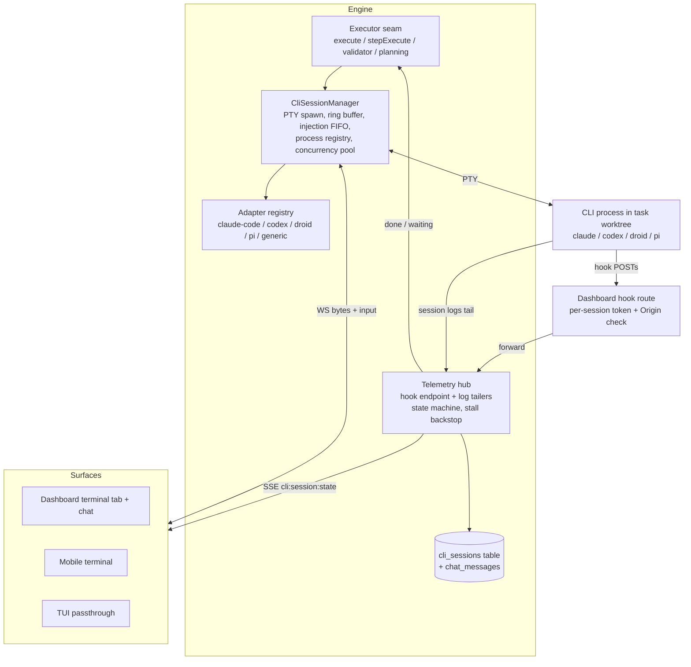
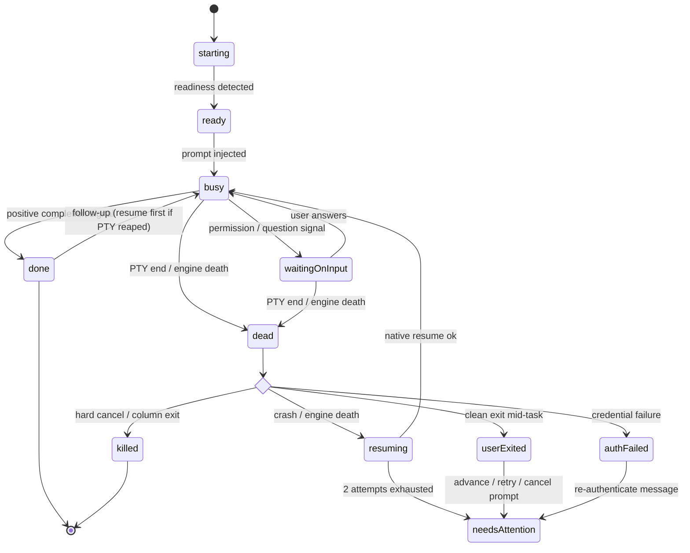
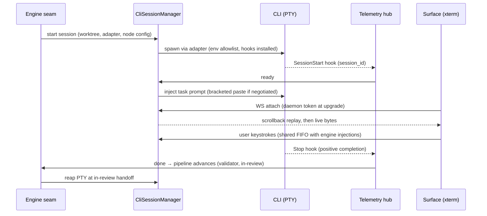

# feat: Add cli-agent executor with interactive PTY sessions

## Summary

Add a new executor kind, `cli-agent`, that runs Fusion agent sessions inside engine-owned PTYs running interactive CLI coding agents (Claude Code, Codex, Droid, Pi). The engine injects prompts, tracks agent state through per-CLI native telemetry adapters, captures native session IDs for resume, and drives the full task pipeline; users co-drive through live terminals on the dashboard, mobile, and TUI, and chat gains a hybrid transcript mode.

---

## Problem Frame

Fusion drives agents only through API-backed runtimes today, but the primary persona lives in CLI coding agents — their subscriptions, auth, config, and skills are attached to the CLI tools. There is no way to make a board task's execution *be* a Claude Code or Codex session: visible, steerable, co-drivable, and resumable. Orca demonstrates the target model (hooks-based telemetry, session-id capture, resume); the origin doc pins the product behavior. This plan defines how it lands in the Fusion codebase.

---

## Requirements

Carried from origin (see origin: docs/brainstorms/2026-06-04-cli-executor-requirements.md); the origin's R-IDs are authoritative and referenced by units below.

**Executor model** — origin R1–R3: `cli-agent` selectable on the task execute step, planning, validator, CE plugin sessions, and chat; workflow-node configuration for task surfaces with per-task override, per-session for chat/CE; adapter registry with Claude Code verified native, Codex/Droid/Pi gated, generic PTY fallback.

**Session management** — origin R4–R9, R17–R19: server-owned reattachable PTYs; safe readiness-gated injection; telemetry-driven state machine; native session-id capture and resume with worktree reconciliation; designed injection/keystroke serialization; attach auth; per-node concurrency limit; stall backstop.

**Pipeline integration** — origin R10–R12, R20: full task lifecycle; waiting-on-input notifications per workflow-node config; validator verdict contract preserved; positive-completion-signal gating before merge-bearing advancement.

**Per-CLI configuration** — origin R13, R21–R22: adapter-level launch config with shipped defaults; privileged autonomy flags with visible posture; per-adapter env allowlist.

**Surfaces** — origin R14–R16: interactive terminal on dashboard, mobile, TUI; chat hybrid transcript with raw-terminal toggle; transcript persistence reusing chat history storage.

The CLI verification gate origin R3 requires has been run (see Sources): all four CLIs pass for the native tier — Codex with a hybrid caveat (no native waiting-on-input signal), Droid with message-parsing on its `Notification` hook.

---

## Key Technical Decisions

- **Engine-owned `CliAgentAdapter` abstraction, not an `AgentRuntime` plugin.** The existing runtime contract (`packages/engine/src/agent-runtime.ts`: `createSession`/`promptWithFallback`/`describeModel`) is API-shaped and cannot model a PTY stream, two-way co-driving, or resume. A new adapter interface (spawn command/args, telemetry wiring, state classification, resume invocation, injection formatting) lives in the engine; the four launch adapters ship as engine code. A plugin contribution point for third-party adapters is deferred to follow-up — this avoids the 5-list bundled-plugin registration burden (see `docs/solutions/integration-issues/bundled-plugin-registration-drift.md`) while keeping the registry shape open.
- **Executor identifier is `cli-agent`.** `executorKind === "cli"` already exists in `packages/engine/src/executor.ts` (`runGraphCustomNode`) as the non-interactive script runner. The new kind branches alongside `model`/`agent`/`skill`/`cli` and routes to the PTY session path — never into `executeWorkflowStep`.
- **Resume-the-CLI architecture; SIGKILL registry is the authoritative teardown.** PTYs cannot survive engine process death (no detached broker in v1). Recovery is relaunching the CLI with its native resume mechanism (`claude --resume`, `codex resume`, `droid exec -s`, `pi --session`) in the same worktree. Teardown follows the ACP precedent: process registry with scoped SIGKILL on engine exit, graceful close opportunistic, never targeting port 4040.
- **Termination taxonomy and resume-eligibility predicate.** Every PTY end is classified — `completed` (positive done signal), `userExited` (clean child exit mid-task), `killed` (hard cancel / column exit), `crashed` (signal/nonzero exit), `authFailed` (credential pattern), `engineDeath` (found dead on restart). Only `engineDeath` and `crashed` are resume-eligible, capped at 2 attempts with backoff; `killed` and `userExited` never auto-resume; `authFailed` goes straight to needs-attention with a re-authenticate message. The classification persists on the session record so self-healing sweeps cannot resurrect a cancelled session.
- **Telemetry tiering with per-adapter capability flags.** Adapters declare which states they detect natively. Claude Code: full hooks (`Stop`, `Notification`, `PermissionRequest`, `session_id` in every payload). Codex: native turn-complete via `notify` config only — waiting-on-input falls back to PTY prompt-pattern detection (hybrid tier). Droid: Claude-style hooks, but `Notification` conflates permission/idle and requires message parsing. Pi: event stream / session JSONL. Generic adapter: output-quiet heuristics, raw-terminal-only. Hook scripts POST to a **dashboard-served localhost endpoint that forwards to the engine telemetry hub** (the engine has no HTTP server — only the dashboard serves HTTP; the Orca pattern, adapted). The engine mints a high-entropy per-session hook token at spawn; the dashboard route validates it against the engine-held registry and rejects Origin/Host headers from browser contexts — localhost is not a trust boundary, and a forged completion event would otherwise drive pipeline advancement (see Risks).
- **PTY ownership: node-pty becomes an engine dependency, with the native-asset machinery extracted to a shared utility living in the engine.** The PTY-fragility apparatus in `packages/dashboard/src/terminal-service.ts` (prebuild path resolution, dlopen fallback, permission repair for packaged binaries) is extracted into a shared module **in `@fusion/engine`** consumed by both the engine's `CliSessionManager` and the dashboard terminal service (the dashboard already depends statically on `@fusion/engine`; `@fusion/core` never takes node-pty — a native dep in core would transitively reach every core consumer). Binary-release validation of engine-side PTY spawn is an explicit acceptance item (U16), not deferred polish. Alternative rejected: dashboard-injected PTY service — it would invert the ownership the whole design rests on (engine owns sessions).
- **The engine `CliSessionManager` exposes an explicit async interface, not EventEmitter callbacks.** Attach returns scrollback + an async byte stream; write/resize/requestPause/requestResume are methods. The engine is the sole owner of the scrollback ring buffer and of watermark-driven PTY pause/resume; the dashboard WS layer forwards ACK credit and never buffers bytes itself. This keeps the engine↔dashboard seam process-split-credible (today's terminal-service EventEmitter shape would not survive a split).
- **Positive completion signal gates pipeline advancement (origin R20).** Idle never advances a task. Native adapters advance on their done event; the generic tier surfaces an idle-based "looks done — confirm to advance" affordance; idle without signal beyond the stall threshold → needs-attention. waiting-on-input suppresses the existing stuck-task detector (expected idleness).
- **Separate per-node PTY concurrency pool.** CLI sessions hold slots for human-paced durations; they get their own configurable ceiling (default modest, reject-with-error at ceiling) instead of consuming `AgentSemaphore` execute slots, so a watched terminal never starves model-executor throughput. Resume-on-restart respects the same ceiling (queue beyond it).
- **Transport: WebSocket for terminal bytes, SSE for state.** Terminal I/O extends the existing `/api/terminal/ws` upgrade path (JSON-framed scrollback/data messages, daemon-token authenticated at upgrade, project-scoped) with CLI-session attach; agent-state transitions (`cli:session:state`) ride the existing SSE event bus so cards/banners update without touching the byte stream. Attach auth rides the existing single daemon-token model + project scoping — a per-user/workspace-member model does not exist in the codebase and is explicitly deferred; origin R17's intent (session ID alone is never authorization) is satisfied by token-gated upgrade.
- **Privileged autonomy flags map to the approval-gate precedent, not a new role system.** Launch configs above an adapter's shipped baseline (e.g. `--dangerously-skip-permissions`, `codex --full-auto`) require an explicit stored approval per project — same shape as `isWorkflowCliCommandApproved` for raw workflow commands — and the active posture renders as a visible chip wherever the terminal renders (origin R21). A real admin role is out of scope.
- **Validator and planning run the CLI's non-interactive one-shot mode with a read-only terminal.** One-shot invocations (`claude -p`, `codex exec --json`, `droid exec`, pi headless) yield deterministic output for the pass/fail/blocked/error verdict contract (origin R12) while the PTY output still streams to a read-only terminal view for observability. Interactive co-driving is execute-step and chat only.
- **Chat transcripts reuse `chat_sessions`/`chat_messages`.** The structured transcript is parsed from native telemetry (transcript JSONL tail / event stream) into `chat_messages` rows; the native session id persists on the session record (the `chat_sessions.cliSessionFile` column is existing precedent). Injection from the composer and raw keystrokes share one FIFO per session; the composer shows a queued state while the agent is busy.
- **UI placements (resolves the origin's deferred design questions).** Task detail: a new `terminal` tab in `TaskDetailModal`'s `TabId` union (Logs tab unchanged). Chat: raw-terminal mode replaces the message list and hides the composer (the terminal owns input; a toggle returns to transcript view). waiting-on-input / needs-attention surface as a task-card badge plus the existing `SessionNotificationBanner` — distinct from staleness/stall badges, which are suppressed while waiting. Generic-adapter sessions render terminal-only (no transcript pane, no toggle). Mobile ships the interactive terminal with a visible input field + accessory key bar (Esc/Tab/Ctrl/arrows) — xterm's hidden-textarea input is unreliable on mobile; if interactivity slips during implementation, the defined fallback is read-only stream + input field.
- **Client terminal stack: `@xterm/xterm` 6.x** with fit, webgl (with context-loss fallback to DOM renderer), unicode11 addons; custom WS bridge (not `addon-attach` — no flow control); server-side byte ring buffer replay on attach; resize policy: latest-active-client wins (single-developer multi-surface), debounced. ACK-based backpressure (pause/resume PTY on watermarks).
- **No web-push in v1.** Origin R11's notification fires through the existing in-app surfaces (SSE-driven banner/badge + OS-level notification where the desktop shell supports it); workflow-node config selects banner-only vs. banner+notify. Push infra is a deferred follow-up.

---

## High-Level Technical Design

Component topology:

Session state machine with termination taxonomy (extends the origin's R6 diagram; prose in Key Technical Decisions is authoritative):

Attach + injection sequence (execute-step happy path):

---

## Implementation Units

Phased: A (engine core) → B (pipeline) → C (transport & surfaces) → D (config & polish). Units are dependency-ordered within phases; Phase A order is U16 → U1 → U2 → U3 → U17 → U4 → U5 → U6.

### U16. Shared PTY native-asset utility and redactSecrets extraction

**Goal:** Extract the node-pty loading/permission-repair machinery into an engine-owned shared module consumed by engine and dashboard; extract `redactSecrets` into core; validate engine-side PTY spawn in packaged binaries.
**Requirements:** prerequisite for origin R4 (engine-owned PTYs) and the R16 transcript-redaction mitigation.
**Dependencies:** none. (U16 and U1 are independent and parallelizable; the stated Phase A order is a suggested sequence, not a dependency chain.)
**Files:** `packages/engine/src/pty-native.ts` (new — extracted from `packages/dashboard/src/terminal-service.ts` lines ~21–178), `packages/dashboard/src/terminal-service.ts` (consume the shared module via its existing static `@fusion/engine` dependency), `packages/engine/package.json` (node-pty dependency), `packages/core/src/redact-secrets.ts` (new — extracted from `plugins/fusion-plugin-acp-runtime/src/process-manager.ts`, with the plugin re-importing it), `packages/engine/src/__tests__/pty-native.test.ts`, `packages/core/src/__tests__/redact-secrets.test.ts`.
**Approach:** Move the lazy-load, prebuild path resolution, dlopen fallback, and native-permission repair into one engine utility; the dashboard terminal service keeps identical behavior; node-pty is declared in the engine (never in core — a native dep there would reach every core consumer). `redactSecrets` moves to `@fusion/core` (pure string logic, no native deps) so U12's transcript persistence can import it; the ACP plugin re-imports the shared function. Binary-release validation (Bun-compiled binary spawns a PTY from engine code) is part of this unit's acceptance, exercised via the release-branch `workflow_dispatch` path noted in the release-pipeline learnings.
**Patterns to follow:** existing terminal-service loader; release-pipeline gotchas (never cache node_modules on Windows, native asset staging).
**Test scenarios:**
- Loader resolves node-pty in dev (workspace) mode and packaged-binary mode (fixture paths).
- Dashboard terminal service behavior unchanged (existing terminal tests stay green).
- Permission-repair path exercised on a fixture with broken modes.
- `redactSecrets` parity: shared function produces identical output to the plugin's previous local copy on its existing fixtures; the ACP plugin's tests stay green against the re-import.
**Verification:** existing dashboard terminal tests green against the shared module; packaged-binary PTY smoke recorded as a release-validation checklist item.

### U1. cli_sessions persistence and session records

**Goal:** Durable session records carrying identity, state, termination classification, and resume bookkeeping.
**Requirements:** origin R4, R6, R7, R8.
**Dependencies:** none.
**Files:** `packages/core/src/db.ts` (schema v109), `packages/core/src/cli-session-store.ts` (new), `packages/core/src/cli-session-types.ts` (new), `packages/core/src/__tests__/cli-session-store.test.ts`, `packages/core/src/__tests__/db-migrate.test.ts` (extend).
**Approach:** New `cli_sessions` table following the `ai_sessions`/`chat_sessions` patterns: TEXT PK, owning entity (taskId | chatSessionId | purpose), projectId, adapterId, agent state, termination reason, native session id, resume attempt count, autonomy posture, worktree path, timestamps. Store class follows `ChatStore` (EventEmitter + SQLite). Migration as an `applyMigration(109, ...)` block.
**Patterns to follow:** `chat_sessions` table + `ChatStore`; `addColumnIfMissing`/`CREATE TABLE IF NOT EXISTS` migration idiom; DB-corruption-resilience posture (integrity-checked, recoverable).
**Test scenarios:**
- Happy path: create/read/update a session record; state transitions persist; native session id round-trips.
- Migration: v108 → v109 migrates cleanly on an existing DB fixture; fresh DB creates the table.
- Edge: termination reason and resume attempt count update atomically with state; querying sessions by task and by chat entity.
- Error: invalid state value rejected at the store boundary.
**Verification:** store tests green; migration test proves both upgrade and fresh-create paths.

### U2. CliSessionManager and CliAgentAdapter interface

**Goal:** Engine-owned PTY lifecycle: spawn, ring-buffer scrollback, injection FIFO, resize, process registry teardown, concurrency pool.
**Requirements:** origin R4, R5, R9, R18, R22.
**Dependencies:** U1, U16.
**Files:** `packages/engine/src/cli-agent/adapter.ts` (new — interface + registry), `packages/engine/src/cli-agent/session-manager.ts` (new), `packages/engine/src/cli-agent/__tests__/session-manager.test.ts`, `packages/engine/src/cli-agent/__tests__/adapter-registry.test.ts`.
**Approach:** Adapter interface declares: launch command/args builder (from settings + autonomy posture), env allowlist, capability flags (native done / native waiting / transcript source / resume), readiness detection, injection formatter, resume command builder, telemetry wiring. Injection formatting: bracketed paste only when `?2004h` observed (interleaving safety), and control characters (`\r` beyond intended submits, `\x03`, `\x04`, ESC-prefixed sequences) are stripped/escaped **unconditionally** on the raw fallback path — control-char neutralization is the security control and must hold when paste mode is off. Session manager owns node-pty processes via the U16 shared loader, is the **sole owner** of the byte-bounded scrollback ring and watermark-driven PTY pause/resume (exposing `requestPause`/`requestResume` for transport-layer ACK credit), a single serialized write queue (engine injections + user input share it; injections wait for ready/quiet windows), resize with latest-active-client policy, and a process registry with `process.on("exit")` scoped SIGKILL (never port 4040). Attach surface is an explicit async interface (scrollback fetch + async byte stream + write/resize methods), not EventEmitter callbacks. Separate PTY concurrency pool with configurable ceiling, reject-with-error at ceiling.
**Patterns to follow:** `plugins/fusion-plugin-acp-runtime/src/process-manager.ts` (env allowlist, scoped SIGKILL, self-cleaning registry); `terminal-service.ts` scrollback/throttle machinery; `superviseSpawn` policy from AGENTS.md (route PTY spawn through the sanctioned path or explicit allowlist).
**Test scenarios:**
- Happy path: spawn a fake CLI (scripted PTY child), readiness detected, prompt injected once ready, output lands in ring buffer, clean teardown kills the child.
- Injection serialization: user write queued mid-injection never interleaves bytes; two queued injections deliver in FIFO order; injection deferred while output is streaming.
- Bracketed paste: wrapped only when the child enabled `?2004h`; raw otherwise.
- Control-char neutralization: injected message containing `\x03`, `\x04`, and an ESC sequence is neutralized on the raw (non-paste) path — never reaches the PTY as control input.
- Concurrency: (ceiling = 2) third session rejected with a clear error; slot released on teardown.
- Env: child env contains only the allowlist — assert `FUSION_*` tokens and service credentials absent.
- Teardown: process-registry kill on simulated engine exit leaves no orphans (two-turns-through-one-session test for latched state).
**Verification:** all session-manager tests green with a scripted PTY fixture; no orphan processes after suite run.

### U3. Telemetry hub and session state machine

**Goal:** Authoritative agent-state machine with completion gating, stall backstop, and termination classification — pure engine code, fixture-driven, no HTTP.
**Requirements:** origin R6, R19, R20; flows F1, F2.
**Dependencies:** U1, U2.
**Files:** `packages/engine/src/cli-agent/telemetry-hub.ts` (new — ingestion contract + per-session token registry), `packages/engine/src/cli-agent/state-machine.ts` (new), `packages/engine/src/cli-agent/__tests__/state-machine.test.ts`, `packages/engine/src/cli-agent/__tests__/telemetry-hub.test.ts`.
**Approach:** The hub exposes an in-process ingestion contract consumed by the U17 route and by adapters that tail logs (Codex rollout, Pi JSONL). It mints high-entropy per-session hook tokens at spawn (registry keyed by session id, invalidated on session end; on engine restart the registry is rebuilt only from sessions still live in `cli_sessions`, so stale on-disk tokens never validate) that U17 validates. State machine implements the HTD diagram including the dead-classification choice and resume-attempt caps; emits `cli:session:state` SSE events (throttled) and persists transitions via U1. Positive-completion distinct from idle; stall backstop (no output progress past configurable threshold without done/waiting) → needsAttention. Inactivity watchdog re-armed by telemetry/output events — no fixed turn timeout. Bound and sanitize everything ingested: per-chunk and per-turn caps, ANSI/control stripping before pattern matching, redaction across chunk boundaries.
**Patterns to follow:** `docs/solutions/architecture-patterns/observable-long-running-agent-turns-through-blocking-plugin-route-seam.md` (push channel additive, deltas not snapshots, never-reject detached turns, inactivity watchdog, throttled SSE); ACP event-bridge bounding rules.
**Test scenarios:**
- Covers AE1. Native done signal advances state to done; idle alone never does.
- Covers AE2. Permission-prompt signal → waitingOnInput; notification dispatch invoked per node config; state does not advance or fail.
- Stall backstop: quiet session with no signals past threshold → needsAttention; busy session streaming output never trips it.
- Termination classification: clean exit-0 mid-task → userExited; SIGKILL from hard cancel → killed (no resume); nonzero exit → crashed (resume-eligible); credential-failure pattern in output → authFailed.
- Resume caps: two failed resumes → needsAttention, third never attempted.
- Token registry: token validates only for its own session; invalidated after session end; a forged completion for session A using session B's token is rejected.
- Two-turns-through-one-handler: per-turn latches/budgets reset between turns.
**Verification:** state-machine tests cover every edge in the HTD diagram, with no HTTP involved.

### U17. Hook ingestion route and token lifecycle

**Goal:** Dashboard-served localhost endpoint that authenticates hook POSTs and forwards them to the engine telemetry hub.
**Requirements:** origin R6 (telemetry delivery), R17 principle applied to the hook channel.
**Dependencies:** U3.
**Files:** `packages/dashboard/src/routes/cli-agent-hooks.ts` (new), Fusion-provided hook scripts/notify shim under `packages/engine/src/cli-agent/hook-scripts/` (new), `packages/dashboard/src/routes/__tests__/cli-agent-hooks-route.test.ts`.
**Approach:** Route validates the per-session token against the U3 engine-held registry (session id alone never sufficient), rejects browser-context requests (Origin/Host header check — localhost is not a trust boundary; a page must not be able to CSRF the endpoint), caps payload size, and forwards validated payloads in-process to the hub. Hook scripts (Orca `~/.orca/agent-hooks/*.sh` shape) carry the token via session-scoped env/config; **the session-scoped hook config directory is deleted on session end**, and tokens are registry-invalidated at the same moment, so the at-rest exposure is bounded to the session's lifetime.
**Test scenarios:**
- Valid token + session → forwarded to hub; state visible downstream.
- Missing/wrong/expired token → 401; valid-format token for the wrong session → rejected.
- Request with a browser `Origin` header → rejected; oversized payload → capped/rejected.
- Unknown session key is a no-op, not a crash.
- Lifecycle: session end deletes the hook config dir and invalidates the token; a replayed POST with the old token is rejected; after engine restart, tokens for non-live sessions are rejected.
**Verification:** route tests prove auth, CSRF rejection, lifecycle cleanup, and bounding against a stub hub.

### U4. Claude Code adapter (native tier)

**Goal:** Reference native adapter: hooks installed per session, JSONL transcript tail, session-id capture, resume.
**Requirements:** origin R3, R5–R8; AE3.
**Dependencies:** U2, U3.
**Files:** `packages/engine/src/cli-agent/adapters/claude-code.ts` (new), `packages/engine/src/cli-agent/adapters/__tests__/claude-code.test.ts`.
**Approach:** Launch with per-session hook config (settings-dir scoped to the session, never mutating the user's global `~/.claude` hooks — additive project/local hook config) wiring `Stop`, `Notification`, `PermissionRequest`, `SessionStart` to the U17 endpoint with the U3-minted session token; capture `session_id` from the first payload; transcript content from the JSONL at `transcript_path` for chat transcripts; resume via `--resume <session-id>` (confirm `SessionStart.source === "resume"`); waiting-on-input from `PermissionRequest`/`Notification` types. Verify actual hook roster against the installed version at scaffold time (smoke test), per the SDK-authoritative learning.
**Patterns to follow:** ACP `cli-spawn.ts` settings resolution; the plugin-skills learning's `assertPluginLocalTarget` posture (never write to global agent config dirs).
**Test scenarios:**
- Happy path: simulated hook payload sequence (SessionStart → PreToolUse → Stop) drives ready→busy→done; session_id persisted on first payload.
- Covers AE3. Kill PTY, resume builder produces `--resume <id>`, simulated `SessionStart{source:resume}` re-attaches telemetry; state returns to busy.
- Waiting: `PermissionRequest` payload → waitingOnInput; `Notification{idle_prompt}` → waitingOnInput.
- Edge: hook payload missing optional fields tolerated; hooks config written only to session-scoped location.
**Verification:** adapter tests green against recorded payload fixtures; a manual smoke run against a real `claude` binary is an explicit implementation-time checklist item (not CI).

### U5. Codex, Droid, and Pi adapters

**Goal:** Remaining launch adapters at their verified tiers.
**Requirements:** origin R3, R5–R8.
**Dependencies:** U2, U3, U4 (patterns).
**Files:** `packages/engine/src/cli-agent/adapters/codex.ts`, `packages/engine/src/cli-agent/adapters/droid.ts`, `packages/engine/src/cli-agent/adapters/pi.ts` (new), with sibling `__tests__/` files per adapter.
**Approach:** Codex (hybrid tier): `notify` config invokes a Fusion-provided program POSTing `agent-turn-complete` (carries `thread-id` as session id); waiting-on-input via PTY prompt-pattern detection (ANSI-stripped, spinner-aware); resume via `codex resume <thread-id>`; rollout JSONL path treated as version-sensitive (probe, don't hardcode). Droid: Claude-style hooks; parse `Notification.message` to split permission vs idle (documented gap); resume interactive `--resume <id>` / headless `exec -s <id>` (never `-r` in exec mode). Pi: `--mode json` event stream or session-JSONL tail; session file/id via session dir; resume `--session <id>`. Each adapter declares honest capability flags so the UI can render tier differences.
**Test scenarios (per adapter):**
- Done signal: simulated native event → done.
- Waiting: Codex prompt-pattern fixture (ANSI noise included) → waitingOnInput; Droid permission-vs-idle message fixtures classified correctly; Pi `input` event → waitingOnInput.
- Resume: builder produces the correct CLI invocation per mode; Droid exec-mode `-r` footgun explicitly asserted absent.
- Session-id capture from each CLI's native source.
- Covers AE4 (boundary): an adapter with native flags disabled behaves identically to the generic tier.
**Verification:** fixture-driven tests per adapter; per-CLI manual smoke runs are implementation-time checklist items.

### U6. Generic PTY adapter (heuristic tier)

**Goal:** Any CLI command runs with output-quiet idle heuristics and raw-terminal-only presentation.
**Requirements:** origin R3, R6, R20; AE4.
**Dependencies:** U2, U3.
**Files:** `packages/engine/src/cli-agent/adapters/generic.ts` (new), `packages/engine/src/cli-agent/adapters/__tests__/generic.test.ts`.
**Approach:** ANSI-stripped last-screen analysis: prompt-glyph + spinner-override busy detection, configurable quiet-window idle; no native done — idle yields a "confirm to advance" affordance per the R20 decision; no transcript source (capability flags all false). No resume (fresh launch only) — surfaced honestly in UI.
**Test scenarios:**
- Covers AE4. Generic session exposes raw terminal only; no transcript; heuristic idle state reported as idle, never as done.
- Spinner override: prompt visible + spinner animating → busy.
- Quiet window: output silence past threshold → idle; resumed output flips back to busy.
**Verification:** heuristic fixtures (recorded PTY byte streams) classify correctly.

### U7. Executor seam wiring and task lifecycle integration

**Goal:** `cli-agent` selectable on workflow nodes; execute step runs through a CLI session honoring cancel/abort/re-entry semantics and pipeline advancement.
**Requirements:** origin R1, R2, R10, R20; F1; AE1, AE5.
**Dependencies:** U1–U4.
**Files:** `packages/engine/src/executor.ts` (seam branch in `runGraphCustomNode` + execute/stepExecute seams), `packages/engine/src/cli-agent/task-session.ts` (new — task↔session orchestration), `packages/core/src/workflow-ir-types.ts` (node config additions), `packages/engine/src/__tests__/cli-agent-executor.test.ts`, `packages/engine/src/cli-agent/__tests__/task-session.test.ts`.
**Approach:** Node config gains `executor: "cli-agent"`, adapter id, autonomy posture ref, and attention/notification settings (origin R2, R11); per-task override follows existing per-task settings precedent. Live sessions snapshot their resolved executor at launch — node-config edits apply to the next run only. Hard cancel (`moveTask(in-progress→todo)`) and column-exit abort SIGKILL the PTY tree, mark `killed`, release the pool slot, and never resume. Done (per R20 gating) advances the normal pipeline; PTY is reaped at the execute→in-review handoff (autoMerge:false tasks don't hold slots). Re-plan/RETHINK re-entry launches fresh (context reset); follow-up to a done-but-reaped session resumes first, then injects.
**Patterns to follow:** existing `agent`/`skill`/`cli` kind branches in `runGraphCustomNode`; `active-session-registry` worktree-keyed ownership; `moveTask` hard-cancel contract (AGENTS.md).
**Test scenarios:**
- Covers AE1 / F1. Execute step with cli-agent node: worktree session spawns, prompt injected, simulated done advances task to validator/in-review; PTY reaped at handoff.
- Covers AE5. Simulated user input mid-busy: state tracking continues; subsequent done still advances.
- Hard cancel: moveTask in-progress→todo kills PTY, session `killed`, no resume on next self-healing sweep, slot released.
- Re-entry: needs-replan re-entering execute starts a fresh session; follow-up on done task resumes the recorded session id.
- Node-config edit mid-run: live session keeps launch-time executor; next run uses the new config.
- Ceiling: execute step at PTY-pool ceiling surfaces a clear queued/rejected state, task does not silently stall.
**Verification:** engine integration tests with scripted adapters prove the full lifecycle without real CLIs.

### U8. Resume, restart recovery, and self-healing integration

**Goal:** Engine restart finds dead sessions and resumes per the eligibility predicate; failures surface as needs-attention; existing sweeps respect CLI semantics.
**Requirements:** origin R7, R8, R19; F4; AE3.
**Dependencies:** U1–U4, U7.
**Files:** `packages/engine/src/cli-agent/resume-coordinator.ts` (new), `packages/engine/src/self-healing.ts` (CLI-session awareness), `packages/engine/src/stuck-task-detector.ts` (suppress while waitingOnInput), `packages/engine/src/cli-agent/__tests__/resume-coordinator.test.ts`, `packages/engine/src/__tests__/self-healing-cli-sessions.test.ts`.
**Approach:** On engine start, sessions persisted as live are classified `engineDeath` and queued for resume (respecting the pool ceiling); resume relaunches via the adapter's resume builder in the recorded worktree, reconciles worktree state (dirty-tree detection logged, surfaced on the session), re-attaches telemetry, and re-injects nothing (replay-suppression: scrollback replays to viewers, but no prompt re-injection). **Worktree-existence precondition:** the resume coordinator verifies the recorded worktree still exists before relaunch — a missing worktree routes to needsAttention, never a CLI spawned into a vanished directory; conversely, self-healing's idle-worktree sweeps (`enforceWorktreeCap`, `scanIdleWorktrees`) must treat a worktree backing a resume-eligible `cli_sessions` record as in-use, so a reaped-but-resumable session (e.g. done task awaiting a follow-up) cannot have its worktree reclaimed out from under it. Eligibility predicate per the termination-taxonomy KTD; attempt cap 2 with backoff; exhaustion or missing vendor session store → needsAttention. waitingOnInput suppresses stuck/inactivity detection; R19's stall backstop is the only escalation path while waiting.
**Test scenarios:**
- Covers AE3 / F4. Simulated engine restart with a live session record: resume invoked with the recorded native id; state returns busy; task stays in-progress.
- Eligibility: `killed` and `userExited` records are never resumed by sweeps; `authFailed` goes to needs-attention without a resume attempt.
- Cap: two consecutive resume failures → needsAttention; no third spawn across multiple sweep cycles.
- Missing vendor store: resume command fails immediately → permanent-failure path, not retry loop.
- Suppression: waitingOnInput session not flagged by stuck-task detector; same session trips the stall backstop only when genuinely quiet.
- Dirty worktree at resume: flagged on the session record, resume proceeds, flag visible to UI.
- Missing worktree at resume: routes to needsAttention without spawning; idle-worktree sweep skips a worktree backing a resume-eligible session record.
**Verification:** restart-shaped integration test (new engine instance over the same DB fixture) proves recovery without duplicate sessions.

### U9. Validator, planning, and CE plugin session support

**Goal:** The remaining v1 surfaces run on CLI executors in one-shot mode with read-only terminals.
**Requirements:** origin R1, R12.
**Dependencies:** U2–U5, U7, U10 (read-only terminal attach).
**Files:** `packages/engine/src/cli-agent/one-shot-session.ts` (new), validator/planning resolution touchpoints in `packages/engine/src/executor.ts` and `packages/engine/src/interactive-ai-session.ts`, CE plugin seam in `plugins/fusion-plugin-compound-engineering` (session factory option), `packages/engine/src/cli-agent/__tests__/one-shot-session.test.ts`, `packages/engine/src/__tests__/cli-agent-validator.test.ts`.
**Approach:** One-shot mode invokes the adapter's non-interactive form (`claude -p`, `codex exec --json`, `droid exec --output-format json`, pi headless), streams output to a read-only terminal view (same WS channel and attach-ticket route as interactive sessions, with input disabled **server-side**, not just in the client), and parses the structured result. Validator maps the parsed result into the existing pass/fail/blocked/error verdict contract — a malformed/unparseable result is `error`, never a silent pass. Planning sessions persist their output through the existing planning flow. CE plugin sessions thread the executor choice through the session-factory option seam (per the plugin-skills learning: thread options end-to-end, prove with a real loader).
**Test scenarios:**
- Validator verdict mapping: fixtures for pass/fail/blocked outputs per adapter shape; malformed output → error verdict (never pass).
- One-shot lifecycle: session record created, read-only flag set, terminal stream available, reaped on completion.
- Planning: one-shot output lands in the planning flow as a model-backed run would.
- Error path: one-shot CLI nonzero exit → verdict error with stderr (bounded) on the record.
**Verification:** validator integration test proves the verdict contract is indistinguishable from model-executed runs downstream.

### U10. Transport: WS attach, SSE state events, injection API

**Goal:** Surfaces attach to live sessions (authenticated), receive scrollback + live bytes, send input; state events stream over SSE; chat composer injects via API.
**Requirements:** origin R4, R9, R14, R17; F5; AE6.
**Dependencies:** U2, U3.
**Files:** `packages/dashboard/src/server.ts` (WS upgrade routing for cli-agent sessions), `packages/dashboard/src/routes/cli-sessions.ts` (new — list/attach-ticket/inject/confirm-advance routes), `packages/dashboard/src/sse.ts` (new `cli:session:state` event), `packages/dashboard/src/__tests__/cli-sessions-routes.test.ts`, `packages/dashboard/src/__tests__/cli-session-ws.test.ts`.
**Approach:** cli-agent attach is a **distinct connection handler** keyed off session kind, sharing only the upgrade gate with the existing terminal WS — the connection body resolves sessions from the engine's `CliSessionManager` (via U2's explicit async interface), not the dashboard-local terminal service. Attach auth: the daemon-token upgrade gate plus a **short-lived, single-use, session-scoped attach ticket** minted by an authenticated route (the long-lived daemon token never authorizes PTY write access by itself), and an **Origin allowlist check** on the upgrade — the existing terminal WS's weaker posture is insufficient for a channel carrying keystroke injection into privileged agent PTYs. Scrollback replay on connect, JSON-framed data/resize/input messages; flow control forwards ACK credit to U2's `requestPause`/`requestResume` (the dashboard never buffers bytes). Outbound hardening: the terminal byte stream is untrusted (see Risks) — the server-side bridge neutralizes clipboard-write (`OSC 52`), constrains `OSC 8` hyperlink schemes, and strips device-query sequences whose auto-responses would forge input. Input frames and engine injections converge on U2's FIFO, and each input frame's source (attach-ticket identity) is logged on the session record for post-incident attribution — v1 has no per-user arbitration, so attribution is the accountability floor. SSE event carries state transitions + bounded last-output preview; clients merge (never wholesale-replace enriched fields — the stale-`isGenerating` learning). Inject route powers the chat composer and any non-WS surface; confirm-advance route powers the generic-tier R20 affordance (UI pinned in U11: a persistent action strip below the terminal viewport — "This session looks idle — advance to review?" with Advance / Not yet; dismissing stays in execute and re-arms the idle timer).
**Patterns to follow:** existing terminal WS handler (`server.ts` upgrade + scrollback frames); `sse-buffer.ts` ring replay; queued-chat-message learning (re-fetch authoritative state before side-effecting actions).
**Test scenarios:**
- Covers AE6 / F5. Two concurrent attaches to one session both receive live bytes; input from either reaches the PTY; detach of one never kills the session.
- Auth: attach without daemon token rejected at upgrade; cross-project session id rejected by scope check; foreign/absent `Origin` rejected; replayed attach ticket rejected; ticket for session A cannot attach session B.
- Output hardening: recorded byte stream containing `OSC 52`, an `OSC 8` `javascript:` link, and a device-status query is neutralized — clipboard untouched, link scheme rejected, no synthetic input frame emitted.
- Replay: late attacher receives ring-buffer scrollback then live stream, no duplicated bytes.
- Flow control: slow consumer triggers pause at high watermark; resume at low watermark; fast consumer unaffected.
- Resize: latest-active-client policy applied; both viewers reflow to broadcast size.
- SSE: state transition emits one throttled event; reconnect with lastEventId replays missed transitions.
**Verification:** WS tests run against a real server instance on an ephemeral port (never 4040), per the worktree-testing learning.

### U11. Dashboard terminal UI and task-card states

**Goal:** Terminal tab on the task detail view, live xterm terminal, posture chip, waiting/needs-attention badges and banner.
**Requirements:** origin R6 (visibility), R11, R14, R21 (posture surfacing); F2.
**Dependencies:** U10.
**Files:** `packages/dashboard/app/components/SessionTerminal.tsx` (new shared component + CSS), `packages/dashboard/app/components/TaskDetailModal.tsx` (`terminal` TabId), `packages/dashboard/app/components/TaskCard.tsx` (state badge), `packages/dashboard/app/components/SessionNotificationBanner.tsx` (waiting-on-input entries), `packages/dashboard/app/components/__tests__/SessionTerminal.test.tsx`, `packages/dashboard/app/components/__tests__/TaskDetailModal.terminal-tab.test.tsx`, `packages/dashboard/app/components/__tests__/TaskCard.cli-states.test.tsx`.
**Approach:** `@xterm/xterm` 6.x + fit/webgl/unicode11 addons, lazy-loaded (keep it out of the main bundle); custom WS bridge with ACK flow control; WebGL context-loss fallback to DOM renderer. xterm configured defensively (no clipboard-write handling for `OSC 52`, link handler restricted to http/https) as the client-side layer of the U10 output hardening.

Tab visibility matrix: starting/execute-active → live terminal; execute-done but session resumable → scrollback replay with a "session idle" header; validator/planning one-shot → read-only live stream with a visible Read-only badge in the terminal header; in-review/done (PTY reaped) → scrollback replay with a "session ended" state; no recorded session → tab hidden. needsAttention variants carry pinned copy and actions: `userExited` → "Agent exited before completing — Advance / Retry / Cancel task"; `authFailed` → "CLI authentication failed — Re-authenticate (opens adapter settings) / Retry"; resume-exhausted → "Couldn't resume the session — Relaunch fresh / Cancel task". `SessionNotificationBanner` is explicitly extended: its closed `TYPE_ICONS`/`TYPE_LABEL_KEYS` union gains a `cli-agent` session type (single Terminal icon for all adapters) and the new action verbs — reusing the banner without this extension crashes on the unknown type. Confirm-to-advance strip per U10. Posture chip states: baseline = neutral chip with adapter name + mode; elevated = warning-color chip with shield icon naming the elevated flag; clicking opens a tooltip listing the resolved posture with a link to adapter settings (chip spec shared by U12 chat header and U13 mobile). Task card shows waiting-on-input / needs-attention badges distinct from staleness/stall badges (which are suppressed in these states per U8). All strings through the i18n layer (namespaces.json, app-relative catalog imports, canonical CSS tokens).
**Patterns to follow:** plugin-tab injection precedent in `TaskDetailModal` for tab plumbing; `SessionNotificationBanner` shape; i18n foundation learning.
**Test scenarios:**
- Covers F2. waitingOnInput SSE event → card badge + banner entry; answering (state→busy) clears both.
- Terminal tab appears only for cli-agent tasks; read-only flag disables input for one-shot sessions.
- Posture chip reflects the session's recorded autonomy posture, including elevated-flag styling.
- needs-attention state renders the pinned per-variant copy and actions (userExited / authFailed / resume-exhausted); banner renders the cli-agent type without crashing (union extension).
- Tab visibility matrix: each lifecycle phase renders its specified state (live / replay / read-only badge / session-ended / hidden).
- Confirm-to-advance strip renders for generic-tier idle; Advance moves the task on; Not yet re-arms the idle timer.
- i18n: new strings resolve through catalogs (missing-key guard).
**Verification:** component tests green; manual cross-browser smoke (WebGL fallback) is an implementation-time checklist item.

### U12. Chat hybrid transcript and raw-terminal toggle

**Goal:** CLI-backed chat sessions: structured transcript from native telemetry persisted as chat history, composer injection with queueing, raw-terminal toggle.
**Requirements:** origin R15, R16; F3; AE7.
**Dependencies:** U3, U4, U10.
**Files:** `packages/dashboard/src/chat.ts` (CLI-backed session path), `packages/core/src/chat-store.ts` (native session linkage), `packages/dashboard/app/components/ChatView.tsx` + chat hooks (transcript/terminal toggle, composer queue state), `packages/dashboard/src/__tests__/chat-cli-sessions.test.ts`, `packages/dashboard/app/components/__tests__/ChatView.cli-toggle.test.tsx`.
**Approach:** A chat session selecting a CLI executor spawns (or resumes) a session in a configured working directory; adapter transcript events map to `chat_messages` rows (user/assistant/tool-summary granularity — fine-grained tool events stay in the terminal, not the transcript), with the shared `redactSecrets` pass (extracted to `@fusion/core` in U16) applied to transcript text before persistence — durable chat rows must not become a secret store (see Risks). Characterize what the pass covers as part of this unit (its known patterns vs gaps) so the deferral of deeper heuristics is scoped against a measured baseline. SSE `chat:message:added` streams them as today. Composer sends route through the inject API; while busy, sends queue with visible state (flush decisions re-fetch authoritative session state — never a cached flag). Raw-terminal mode swaps the message list for the SessionTerminal component and hides the composer; toggle restores transcript. Generic-tier sessions render terminal-only with no toggle (the transcript affordance is absent, not empty).
**Patterns to follow:** `ChatStore`/`chat_messages` persistence; Generation/Queued-message concepts (CONCEPTS.md); queued-chat-flush learning.
**Test scenarios:**
- Covers AE7 / F3. Toggle between transcript and terminal reflects one underlying session; transcript rows persist and reload after session end.
- Transcript mapping: adapter transcript fixture produces expected chat_messages sequence; tool noise excluded.
- Composer queue: send while busy → queued indicator; flush on done; flush decision uses re-fetched state.
- Generic tier: no transcript pane, no toggle, terminal renders directly.
- Redaction: transcript fixture containing a bearer/API token is redacted before landing in chat_messages; a token spanning a chunk split (prefix in one chunk, value in the next) is still caught; an env-dump fixture (KEY=VALUE lines) is redacted.
- Mobile viewport: composer/keyboard behavior keeps existing mobile chat tests green.
**Verification:** chat integration tests prove transcript persistence reuses chat history storage (no parallel store).

### U13. Mobile terminal interaction

**Goal:** Interactive terminal on the mobile surface with a usable input model.
**Requirements:** origin R14; AE6.
**Dependencies:** U11.
**Files:** `packages/dashboard/app/components/SessionTerminal.mobile.css` (or co-located mobile styles), mobile input bar component within `SessionTerminal.tsx`, `packages/dashboard/app/components/__tests__/SessionTerminal.mobile.test.tsx`.
**Approach:** Same web component (mobile is the Capacitor-wrapped dashboard). xterm's hidden-textarea input is unreliable on mobile: render a visible input field + accessory key bar that forwards into the session, applying the established iOS patterns (pointerdown/mousedown preventDefault on bar keys, fixed-footer behavior when the keyboard opens, visualViewport scale guard). Accessory bar semantics: Esc (`0x1B`), Tab (`0x09`), arrows (ANSI cursor sequences), and a **sticky Ctrl modifier** — tap Ctrl, then the next key tapped combines (Ctrl-C `0x03`, Ctrl-D `0x04`, Ctrl-Z `0x1A`); a dedicated Ctrl-C shortcut also sits on the bar. Bar keys write directly to the session input path as deliberate control input (exempt from U2's injected-text neutralization, which governs composed/injected strings, not user keystrokes). Mobile defaults to read-mostly with the input bar; full inline xterm typing is progressive enhancement. If interactive input proves unshippable within the unit, the defined fallback is read-only stream + input field (decision pre-made in origin's open question resolution).
**Patterns to follow:** `useMobileKeyboard` + iOS composer survival patterns; mobile breakpoint conventions.
**Test scenarios:**
- Accessory bar keys emit correct control sequences into the session.
- Keyboard-open does not occlude the input bar (fixed-footer behavior); pinch-zoom guard respected.
- Covers AE6 (mobile leg): mobile attach renders the same live session bytes as desktop.
**Verification:** mobile-viewport component tests green; on-device smoke is an implementation-time checklist item.

### U14. TUI terminal attach

**Goal:** The Ink TUI can open a task's CLI session as a full-screen passthrough.
**Requirements:** origin R14.
**Dependencies:** U10.
**Files:** `packages/cli/src/commands/dashboard-tui/terminal-attach.ts` (new — WS client + passthrough), wiring in `packages/cli/src/commands/dashboard-tui/app.tsx`, `packages/cli/src/commands/dashboard-tui/__tests__/terminal-attach.test.ts`.
**Approach:** Suspend-and-handoff, not embedding: on opening a session, suspend Ink rendering, enter the alternate screen, run a raw passthrough loop (stdin raw mode → WS input frames; WS data frames → stdout; SIGWINCH → resize frames); on exit keystroke (e.g. a documented detach chord), leave alt-screen and remount Ink. The passthrough applies the same U10 output-neutralization set before writing to the host TTY — the host terminal honors more sequences than xterm.js and verbatim passthrough of an untrusted stream is the riskiest leg (see Risks). WS client is net-new for the TUI (HTTP-only today) — minimal client with the daemon token. CJK double-width and raw-mode ref-counting handled per the i18n/Ink learnings.
**Patterns to follow:** Ink `useStdin().setRawMode` conventions; alt-screen handoff pattern (vim/less model) from research.
**Test scenarios:**
- Passthrough loop frames stdin bytes into WS input messages and writes data frames to stdout verbatim (fixture transport).
- Detach chord restores Ink rendering and leaves alt-screen; raw-mode refcount returns to baseline.
- Resize propagates as a resize frame.
- Output neutralization (full U10 set): data frames containing `OSC 52` clipboard-write, `OSC 8` with a non-http/https scheme, and device-status queries are all sanitized before reaching stdout — parallel assertions to U10's.
- Error path: WS drop mid-attach surfaces a message and restores the TUI cleanly.
**Verification:** unit tests on the passthrough loop with a fake transport; manual TTY smoke is an implementation-time checklist item.

### U15. Adapter settings, autonomy approval gate, and node editor config

**Goal:** Settings surfaces for adapter launch config and autonomy posture; workflow node editor support for cli-agent executor selection and attention behavior.
**Requirements:** origin R2, R11, R13, R21, R22.
**Dependencies:** U2, U7.
**Files:** `packages/core/src/global-settings.ts` (cliAgents settings shape), `packages/dashboard/app/components/SettingsModal.tsx` (adapter settings section), `packages/dashboard/app/components/WorkflowNodeEditor.tsx` (executor: cli-agent + adapter + notification config), `packages/dashboard/src/routes/cli-agent-settings.ts` (new, incl. approval route), `packages/core/src/__tests__/global-settings-cli-agents.test.ts`, `packages/dashboard/app/components/__tests__/WorkflowNodeEditor.cli-agent.test.tsx`, `packages/dashboard/src/routes/__tests__/cli-agent-settings-route.test.ts`.
**Approach:** Per-adapter settings (command override, extra args, autonomy mode, env allowlist additions) in `GlobalSettings` with shipped defaults defined by each adapter. Autonomy modes above the adapter baseline require a stored per-project approval (route + confirmation UI), mirroring the workflow raw-command approval precedent. The gate covers the adjacent free-form channels, not just the autonomy-mode field: each adapter defines an elevation detector over the **fully resolved argv + env** (e.g. `--dangerously-skip-permissions` smuggled via extra args, autonomy-toggling env vars via allowlist additions), and command override to an arbitrary path is itself a privileged setting — elevation expressed through any channel routes through the same approval or is rejected at the write boundary. The posture chip derives from the resolved argv+env, never from the autonomy-mode field alone, and the effective posture is denormalized onto session records at launch (U1). Approving principal in v1: the holder of the daemon token (the single workspace owner) grants approvals; a role-based check is deferred with the rest of the authz model (see Scope Boundaries). Node editor exposes executor kind, adapter picker (with tier labels: native/hybrid/generic), and waiting-on-input notification behavior. Validation at the settings write boundary (Global Settings convention). i18n for all new strings.
**Test scenarios:**
- Settings round-trip: adapter config persists, merges with defaults, invalid values dropped at the write boundary.
- Approval gate: elevated autonomy mode without approval fails launch with a clear error; approved project launches and records posture.
- Bypass closure: `--dangerously-skip-permissions` added via extra args (not the autonomy field) trips the gate; an autonomy-toggling env var via allowlist addition is rejected/gated; posture chip reflects effective argv+env posture.
- Node editor: selecting cli-agent surfaces adapter + notification fields; config lands in node config; per-task override path verified.
- Env additions: user-added allowlist entries reach the child env; service credentials still excluded.
**Verification:** settings/route/editor tests green; the approval gate is exercised by a U7 integration test variant.

---

## Scope Boundaries

Carried from origin — deferred for later:
- Agent-side completion protocol ("run this command when done") — reliability layer on top of telemetry.
- CLI executors for arbitrary workflow script/prompt nodes.
- Structured transcripts for generic-tier CLIs (screen-output parsing).
- Multi-user collaborative co-driving semantics (presence, input arbitration beyond FIFO serialization).

### Deferred to Follow-Up Work

- Plugin-contributed CLI adapters via plugin-sdk (the registry interface is designed for it; the contribution point + registration checklist ships separately).
- Per-user / workspace-member authorization and a real admin role. **This is an explicit narrowing of origin R17/R21**: the origin commits access scoped to the "owning authenticated user or workspace member" and "workspace-administrator editable" flags; v1's single daemon-token + approval-gate model satisfies neither for multi-user workspaces — it is adequate for the single-developer deployment the persona targets, and inadequate where multiple people share a daemon token (any token holder can attach and inject into any session). Input-frame attribution (U10) is the v1 accountability floor until per-user auth ships.
- Web/OS push notifications for waiting-on-input (in-app banner + badge in v1).
- Headless-xterm serialize-addon snapshot replay (v1 uses raw byte ring-buffer replay; revisit if mid-sequence truncation artifacts appear).
- tmux/broker-based PTY liveness across engine restarts (v1 is resume-the-CLI by design).
- Advanced transcript redaction heuristics and retention policy enforcement (v1 applies the existing `redactSecrets` pass before persistence and inherits session access controls; deeper detection and retention are settings follow-ups).

---

## System-Wide Impact

- **Scheduler/self-healing semantics:** new session states interact with stuck detection, hard-cancel, and restart recovery (U7/U8); regressions here affect non-CLI tasks too — the suppression and eligibility predicates are additive guards, not rewrites.
- **Packaged binaries:** node-pty native modules already ship for the dashboard; engine-side PTY use must keep the Bun-binary native-asset handling intact (release pipeline gotchas learning). `@xterm/*` additions are lazy-loaded client code.
- **Auth surface:** one new localhost hook endpoint and CLI-session WS attach. This is **new local attack surface — localhost is not a trust boundary**: any local process or browser page can reach 127.0.0.1, so the hook endpoint requires per-session high-entropy tokens + Origin/Host rejection, and PTY attach requires single-use tickets + Origin allowlisting (see Risks).
- **i18n:** new namespaces/strings across dashboard and TUI; CI catalog guards apply.
- **Changesets:** published CLI surface changes (TUI attach) require a changeset; private packages do not.

---

## Risks & Dependencies

- **Untrusted terminal output rendering (high):** CLI PTY output is attacker-influenceable (the agent renders repo content, tool output, web fetches) and reaches three terminal emulators — xterm web/mobile and the host TTY via TUI passthrough. Hostile sequences can write the clipboard (`OSC 52`), plant `javascript:`/`file:` hyperlinks (`OSC 8`), or trigger device-query auto-responses that forge input into the shared FIFO. Mitigation: server-side neutralization in the WS bridge (U10), defensive xterm config (U11), and the same neutralization set on the TUI passthrough (U14) — the host-TTY leg is the riskiest and is never verbatim.
- **Local hook-endpoint spoofing (high):** telemetry drives pipeline advancement toward merge (origin R20), so a forged `Stop`/completion POST from any local process or a CSRF-ing browser page could advance incomplete work, suppress the stall detector, or wedge sessions. Mitigation: high-entropy per-session tokens bound server-side and invalidated on session end (U3), Origin/Host rejection and payload caps on the route (U17). The token's at-rest exposure in session-scoped hook config is an accepted, lifetime-bounded risk.
- **PTY input from a hostile browser tab (high):** an origin-unchecked WS upgrade with a URL-borne long-lived token would grant keystroke injection into privileged PTYs (arbitrary command execution in the worktree at the session's autonomy posture). Mitigation: Origin allowlist on the cli-agent upgrade, short-lived single-use session-scoped attach tickets distinct from the daemon token (U10).
- **Autonomy-gate bypass via adjacent settings (high):** extra-args, command override, and env-allowlist additions can encode the very elevation the approval gate controls, leaving the posture chip false-safe. Mitigation: per-adapter elevation detection over resolved argv+env, command-override treated as privileged, chip derived from effective posture (U15).
- **Transcripts as a durable secret sink (medium):** CLI agents routinely print tokens and env dumps; persisting transcripts to queryable chat rows turns transient scrollback into durable storage. Mitigation: the shared `redactSecrets` pass (extracted to `@fusion/core` in U16) runs on transcript text before persistence, with cross-chunk and env-dump coverage characterized in U12; deeper heuristics and retention policy remain follow-ups.
- **CLI version churn (high):** hook rosters, notify payloads, session file layouts are version-sensitive (Claude `PermissionRequest` is newer; Codex `~/.codex/sessions/` layout is community-sourced). Mitigation: adapters probe capabilities at launch, degrade tier honestly, and pin verification smoke-tests per CLI as implementation checklist items.
- **Codex waiting-state detection (medium):** PTY prompt-pattern heuristics may misclassify across Codex UI updates. Mitigation: hybrid tier marks waiting-detection as heuristic in capability flags; stall backstop bounds the failure cost.
- **Mobile interactive input (medium):** xterm mobile input is a known-hard area. Mitigation: visible input field + accessory bar is the primary input model; read-only fallback pre-agreed.
- **Engine/dashboard process boundary (medium):** session manager lives in the engine but HTTP/WS/SSE serve from the dashboard (the engine has no HTTP server); telemetry therefore round-trips CLI → dashboard route → engine hub. The U2 async attach interface and engine-owned flow control keep this seam explicit so a future process split stays credible — the EventEmitter shape of the existing terminal service is deliberately not reused.
- **node:sqlite resilience:** new table inherits the DB-corruption posture; store code must tolerate recovery (existing patterns).

---

## Open Questions

Deferred to implementation (execution-time discovery):
- Exact hook/notify payload field availability per pinned CLI versions — verified by scaffold-time smoke tests against installed binaries, per the SDK-authoritative learning.
- Pi `--mode json` event-line schema and whether it applies to the interactive launch path (fall back to session-JSONL tail if not).
- Generic-tier idle thresholds and prompt-pattern sets — tuned against recorded fixtures during implementation.
- Ring-buffer sizing and ACK watermark values — start at researched defaults (256KB–1MB ring; 128KB/16KB watermarks) and tune.

---

## Sources / Research

- Origin requirements: `docs/brainstorms/2026-06-04-cli-executor-requirements.md` (R1–R22, F1–F5, AE1–AE7, resolved open questions).
- Executor seam: `packages/engine/src/executor.ts` (`runGraphCustomNode` executor kinds; execute/stepExecute seams), `packages/engine/src/runtime-resolution.ts`, `packages/engine/src/agent-runtime.ts` (why the runtime contract doesn't fit), `packages/engine/src/concurrency.ts` (`AgentSemaphore`), `packages/engine/src/active-session-registry.ts`, `packages/engine/src/stuck-task-detector.ts`, `packages/engine/src/self-healing.ts`.
- PTY/transport precedent: `packages/dashboard/src/terminal-service.ts` (scrollback, throttling, node-pty loading), `packages/dashboard/src/server.ts` (terminal WS upgrade + auth), `packages/dashboard/src/sse.ts` / `sse-buffer.ts`, `packages/dashboard/src/auth-middleware.ts`.
- Adapter hardening precedent: `plugins/fusion-plugin-acp-runtime/src/` (process-manager env allowlist + scoped SIGKILL, cli-spawn, event-bridge) and `docs/solutions/architecture-patterns/acp-persistent-jsonrpc-agent-runtime-integration.md`.
- Streaming/resume discipline: `docs/solutions/architecture-patterns/observable-long-running-agent-turns-through-blocking-plugin-route-seam.md`; SSE enrichment trap: `docs/solutions/logic-errors/queued-chat-message-flush-trusts-stale-isgenerating.md`.
- Plugin registration burden: `docs/solutions/integration-issues/bundled-plugin-registration-drift.md`; session-option threading: `docs/solutions/integration-issues/plugin-bundled-skills-not-loading-in-interactive-sessions.md`; i18n: `docs/solutions/architecture-patterns/i18n-foundation-vite-ink-monorepo-code-split-catalogs.md`.
- CLI capability verification (external, mid-2026): Claude Code hooks reference (code.claude.com/docs/en/hooks — Stop/Notification/PermissionRequest, session_id, `--resume`); OpenAI Codex CLI reference + advanced config (developers.openai.com/codex — `notify` agent-turn-complete only, `codex resume`, rollout JSONL under `CODEX_HOME`); Factory Droid hooks reference (docs.factory.ai/reference/hooks-reference — Claude-style hooks, `--resume`/`exec -s`, Notification message parsing); Pi extensions/docs (github.com/earendil-works/pi — event bus, session JSONL tree, `--session` partial-UUID resume).
- Web terminal stack (external): xterm.js 6.x + addons and flow-control guide (xtermjs.org/docs/guides/flowcontrol), node-pty 1.x, tmux `window-size` resize-arbitration model, bracketed-paste spec (invisible-island.net/xterm/xterm-paste64.html), Ink raw-mode/alt-screen handoff issues (vadimdemedes/ink#378).
- Orca behavioral reference: `~/.orca/agent-hooks/*.sh` hook POST shape; per-worktree terminal handles and workspace session restore (inspected locally during brainstorm).
