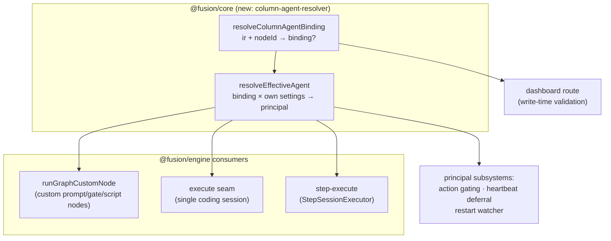
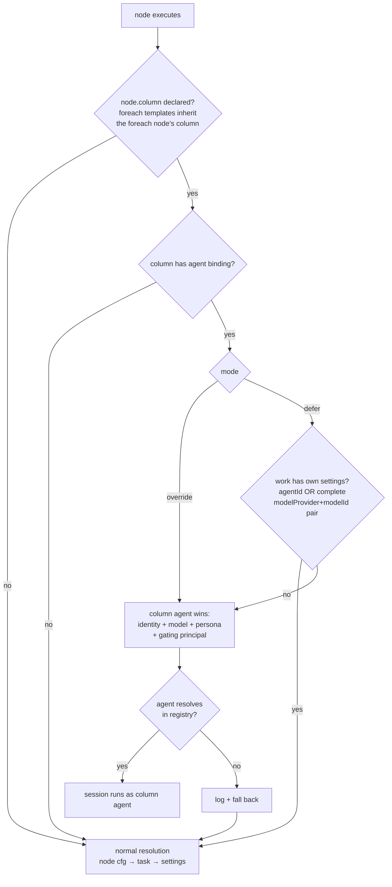

# feat: Per-column agent assignment — permanent agents for workflow columns

## Summary

Let a workflow-defined column name a **permanent agent** from the agent registry, with a per-column mode: **defer** (column agent is the default for work in that column that carries no agent/model settings of its own) or **override** (column agent wins over node-level and task-level agent/model settings). The binding applies to all session-running work attributable to the column — custom prompt/gate/script nodes, the execute seam's coding session, and step-execute sessions — and the column-resolved agent becomes the *principal* for action gating, heartbeat deferral, and session-restart detection, not merely a model source. The built-in default workflow carries no column agents and stays byte-identical (parity oracle).

---

## Problem Frame

The columns/traits track (`docs/plans/2026-06-03-003-feat-workflow-custom-columns-traits-plan.md`, PR #1418) made columns first-class workflow IR entities with composable traits, and the step-inversion track (active on this branch) is making steps workflow-modelable. But **who does the work** in a column is still decided node-by-node or task-by-task: a custom node can set `executor: "agent"` + `agentId` in its config (`packages/engine/src/executor.ts:4546`), and a task can carry `assignedAgentId` / `modelProvider` + `modelId` — there is no way to say "everything that runs in my Review column runs as the senior-reviewer agent."

A user authoring a workflow with specialized columns (planning, implementation, review, docs) wants to staff each column once and have every card flowing through inherit that staffing — while still being able to either respect finer-grained node settings (defer) or enforce the column's agent unconditionally (override).

---

## Requirements

**Binding & precedence**

- R1. A workflow column can optionally name an agent from the agent registry plus a mode, `defer` or `override`.
- R2. Defer: the column agent applies only when the work carries no agent/model settings of its own — for custom nodes, no `cfg.agentId` and no `cfg.modelProvider`+`cfg.modelId` pair; for coding seams, no `task.assignedAgentId` and no `task.modelProvider`+`task.modelId` pair. Granularity is all-or-nothing: any own agent identity or complete model pair suppresses the column agent entirely.
- R3. Override: the column agent supersedes node-level and task-level agent/model settings — identity, model, and persona.
- R4. The binding keys off the node's **declared** IR column (`node.column`), never the task's current board lane. Foreach template nodes inherit the enclosing foreach node's column unless they declare their own. A node with no declared column resolves normally (no column agent), even in override mode.

**Principal semantics**

- R5. Under an effective column agent, action gating (`buildPermanentAgentGatingContext` / `buildActionGateContext`) is computed for the column agent — the agent actually running — not `task.assignedAgentId`.
- R6. Heartbeat deferral (`shouldDeferForHeartbeat`) and resume (`resumeTaskForAgent`) honor the effective column agent: a column agent with `allowParallelExecution=false` is serialized the same way an assigned agent is. This includes `resumeTaskForAgent`'s task-selection query (it must re-dispatch tasks whose *effective* agent matches, not only `assignedAgentId` matches) and the heartbeat scheduler's reverse-direction guards keyed on `agent.taskId`.
- R7. Column-agent-driven changes to the effective model/agent (workflow-definition edit, agent `runtimeConfig` change) hot-swap a running session with the same user-visible effect as a `task.modelProvider` change today, via save-event invalidation feeding the restart watcher (KTD-4). Agent deletion falls back without a restart storm.

**Resilience & parity**

- R8. A missing/deleted agent at resolution time logs and falls back to normal resolution (mirrors the existing best-effort posture at `packages/engine/src/executor.ts:4555`); a live session is never aborted because its column agent was deleted mid-flight.
- R9. The built-in default workflow is untouched: the new IR field is omitted entirely when unset (never serialized as `agent: null` / explicit defaults), v2-only-feature detection registers it, and the existing parity suites stay green.
- R10. Feature behavior requires both `experimentalFeatures.workflowColumns` and `experimentalFeatures.workflowGraphExecutor`; with either off, column agents are inert and the editor surfaces that.

**Authoring surface**

- R11. The workflow editor's column panel gets a per-column agent picker (registry-backed) plus a defer/override mode toggle; agent references are validated at write time with a clear error for unknown agents. Bound columns are visibly indicated, and a node inside an override column shows that its own executor settings are superseded — override must never look like a bug to the author.
- R12. New IR types are re-exported type-only from `@fusion/plugin-sdk` (`WorkflowColumnAgent`; verify whether `WorkflowIrColumn`/`WorkflowIrColumnTrait` are already reachable through the existing core re-export block and add them only if absent).
- R13. Binding an agent whose permission policy is broader than the project default requires explicit confirmation at save time — override cannot silently re-key action gates to a more-privileged agent.

---

## Key Technical Decisions

- **KTD-1 — First-class optional field on `WorkflowIrColumn`, not a trait.** Traits are board-transition policy (flags + lifecycle hooks consumed by the move machinery); the agent binding is *execution identity* consumed by the executor's session-building paths. A typed `agent?: { agentId: string; mode: "defer" | "override" }` field gets schema validation, plugin-sdk type parity, and a purpose-built picker UI — a trait would bury it in an opaque `config: Record<string, unknown>` and overload the trait registry with a concept the transition machinery never reads. Follows the additive-optional-field precedent of `artifacts?`/`fields?` on `WorkflowIrV2`.

- **KTD-2 — One shared resolver in `@fusion/core`; defer/override are explicit named rules, never a `??` collapse.** A single `resolveColumnAgentBinding(ir, nodeId)` (declared-column lookup + foreach template inheritance) and an effective-agent precedence function live in core and are consumed by every reader — the three engine resolution sites and the dashboard write-validation route. Two institutional learnings drive this: the per-task auto-merge override died because the override was honored at the action site but not at the 20+ trigger-layer gates (`docs/solutions/logic-errors/per-task-auto-merge-override-ignored-by-trigger-gates.md`), and route-vs-engine predicate duplication drifted into a data-loss hazard (`docs/solutions/integration-issues/branch-group-single-pr-synthetic-id-dead-wiring.md`).

- **KTD-3 — The effective column agent is the principal.** Several subsystems assume the running agent is `task.assignedAgentId` today: the restart watcher (`packages/engine/src/executor.ts:2060`), heartbeat deferral/resume (defined `:3031`/`:3056`; the deferral gate call is `:4723`, and `resumeTaskForAgent`'s task-selection query filters on `assignedAgentId`), the heartbeat scheduler's reverse-direction guards keyed on `agent.taskId` (`packages/engine/src/agent-heartbeat.ts`), and permanent-agent action gating (`:1515`, `:1581`). Under override, the agent actually running differs from `assignedAgentId` — computing permission gates for the wrong principal is a security boundary error, and bypassing `allowParallelExecution=false` violates the agent's own contract. All of these must consult the effective agent. The gating-context builders already accept an `Agent` object parameter (callers resolve and pass it in), so principal substitution there is a call-site object swap, not gating-internals surgery — the real risk is resolving the right agent per session and closing the resume/heartbeat reverse-mapping gaps (U5).

- **KTD-4 — Mid-flight edits hot-swap via save-event invalidation; no new edit guard.** The existing restart watcher diffs cached *task* fields — a workflow-definition edit or agent `runtimeConfig` change mutates nothing it observes, so "just feed the diff" is not a mechanism that exists. The primary mechanism is event-driven invalidation: workflow-definition saves and agent-config updates re-resolve the column-effective provider/model/agent into the watcher's tracked state, which then triggers the same restart path a `task.modelProvider` change does today. (Per-tick IR re-resolution is the fallback only if event hooks prove insufficient — it is hot-path-expensive, not the default.) The invalidation hook distinguishes agent-deleted (fall back per R8, no restart) from agent-changed (restart). We deliberately do not mirror `packages/core/src/node-override-guard.ts` (which blocks node-override edits while in-progress): hot-swap is the established posture for model/agent changes, and blocking workflow saves because some card somewhere is in a bound column would make workflow editing unusably brittle. Pause of the effective agent routes through heartbeat deferral (R6).

- **KTD-5 — Defer granularity is all-or-nothing.** "Own settings" means an own agent identity OR a complete `modelProvider`+`modelId` pair; either suppresses column defer entirely. An incomplete model pair with no agent identity does not count (the existing resolver already ignores incomplete pairs — `resolveExecutorSessionModel`'s both-present semantics, `packages/engine/src/agent-session-helpers.ts:147-150`). The column agent is never blended with own settings: filling "only the missing half" would create hybrid identities (column agent's model with the task agent's persona) that are impossible to reason about in audit.

- **KTD-6 — Persona injection follows the coding-session path, and reconciles the field drift.** The custom-node `"agent"` branch reads `agent.customInstructions` (`packages/engine/src/executor.ts:4553`) while the `Agent` type exposes `soul`/`instructionsText` (`packages/core/src/types.ts:5955-5957`) and the coding session resolves persona via `resolveInstructionsForRole` + `buildPromptLayers` (`executor.ts:5800-5840`). The column-agent path uses the typed fields consistently in both places; U3 fixes the custom-node branch to read the same fields rather than perpetuating the drift.

- **KTD-7 — No store schema bump.** The binding lives inside the JSON-serialized workflow IR (parsed by `parseWorkflowIr`); workflow definitions are stored as blobs, so no `SCHEMA_VERSION` change is needed. Write-time validation happens in the dashboard route; read-time misses degrade gracefully (R8).

---

## High-Level Technical Design

Effective-agent resolution — one core function, three engine consumers, one dashboard consumer:

Precedence per node (the two named rules):

Directional guidance, refined during implementation — the prose requirements are authoritative.

---

## Implementation Units

### U1. IR schema, validation, and parity registration

**Goal:** `WorkflowIrColumn` gains an optional, additively-validated `agent` binding that never perturbs legacy or default workflows.

**Requirements:** R1, R9, R12

**Dependencies:** none

**Files:**
- `packages/core/src/workflow-ir-types.ts` — `WorkflowColumnAgent` interface; `agent?: WorkflowColumnAgent` on `WorkflowIrColumn`
- `packages/core/src/workflow-ir.ts` — extend `validateColumns` (`:729`); register in v2-only-feature detection (`:858-878`); ensure serialization omits the field when unset
- `packages/plugin-sdk/src/index.ts` — type-only re-export `WorkflowColumnAgent`; check whether `WorkflowIrColumn`/`WorkflowIrColumnTrait` are already reachable through the existing `@fusion/core` re-export block and add them only if absent (R12)
- `packages/core/src/__tests__/workflow-ir-column-agent.test.ts` (new)

**Approach:** Mirror the `validateFields` pattern (`workflow-ir.ts:660` — early return when absent). Validation when present: `agentId` non-empty string, `mode` one of `defer`/`override`. Additionally validate that every `node.column` reference — **including nodes inside foreach `template` subgraphs** — resolves to a declared column id, so a template node with a dangling column is a typed validation error rather than a silent no-binding no-op at runtime. Agent *existence* is not an IR-validation concern (the IR layer has no agent store) — that's write-time route validation (U6) and read-time fallback (U3/U4).

**Patterns to follow:** `artifacts?`/`fields?` additive-optional precedent on `WorkflowIrV2`; `validateFields` early-return validator shape.

**Test scenarios:**
- Column with `agent: { agentId: "agent-001", mode: "defer" }` parses and round-trips; field absent → parses identically to today.
- `agent` with empty `agentId`, missing `mode`, or unknown `mode` value → typed validation error naming the column id.
- v1 graph upgrade via `synthesizeDefaultColumns` produces columns with no `agent` field (absent, not null).
- Template-subgraph node with a `column` value matching no declared column id → typed validation error naming the node.
- Default workflow IR (`builtin-coding-workflow-ir.ts`) round-trips byte-identically; v2-only-feature detection flags a graph with a column agent as non-default.
- Serialization of a column whose binding was removed omits the key entirely.

**Verification:** core IR tests green; existing `workflow-ir.test.ts`, `migration-workflow-columns.test.ts`, and the cli `plugin-sdk-export` test untouched-green.

---

### U2. Core effective-agent resolver

**Goal:** A single `@fusion/core` module owns "which agent does this node's work" — binding lookup and the two named precedence rules — so engine and dashboard can never drift.

**Requirements:** R2, R3, R4

**Dependencies:** U1

**Files:**
- `packages/core/src/column-agent-resolver.ts` (new)
- `packages/core/src/index.ts` — export
- `packages/engine/src/workflow-graph-foreach.ts` — re-point `instanceNodeId` import to core (format ownership moves)
- `packages/core/src/__tests__/column-agent-resolver.test.ts` (new)

**Approach:** Two pure functions. `resolveColumnAgentBinding(ir, nodeId)` resolves the node's `column` against `ir.columns` and returns the binding or undefined (a column without an `agent` field yields no binding — that, not "column undeclared," is the operative guarantee, since v1→v2 upgrade synthesizes a column for every node); for foreach instance node ids (`<foreachId>#<i>:<templateNodeId>`) it resolves the *enclosing foreach node's* column, honoring a template node's own declared column when present. The instance-id format currently lives engine-side (`workflow-graph-foreach.ts` `instanceNodeId`): move `instanceNodeId` plus a paired `parseInstanceNodeId` into `@fusion/core` and re-point the engine import, so the format has exactly one owner (the route/engine predicate-drift learning). Parse defensively — split on the first `#`, then the first `:`, since `templateNodeId` is not sanitized against containing `:`. `resolveEffectiveAgent({ binding, ownAgentId, ownModelPair })` implements R2/R3 as explicit branches (per the auto-merge-override learning: distinct named rules, no effective-value `??` collapse) and returns a discriminated result (`column-agent` | `own-settings` | `none`) so callers and audit logs can state *why* an agent was chosen.

**Test scenarios:**
- Override × own settings present → column agent. Override × no own settings → column agent.
- Defer × own agentId only → own settings win. Defer × complete own model pair only → own settings win. Defer × lone provider with no modelId and no agentId → column agent wins (an incomplete pair does not count as own settings, matching `resolveExecutorSessionModel`'s both-present rule, KTD-5). Pin all three explicitly.
- No `node.column` → no binding, even when other columns carry override agents.
- Foreach instance id resolves to the foreach node's column; template node with its own `column` wins over inheritance.
- Two tasks differing only in column binding diverge (the divergence-assertion pattern from the auto-merge learning).

**Verification:** resolver tests enumerate the full mode × own-settings matrix; no engine import in the module (core stays DI-clean).

---

### U3. Custom-node resolution honors the column binding

**Goal:** Prompt/gate/script/skill nodes in a bound column run as the column agent per mode.

**Requirements:** R2, R3, R4, R8

**Dependencies:** U2

**Files:**
- `packages/engine/src/executor.ts` — `runGraphCustomNode` (`:4498-4644`)
- `packages/engine/src/__tests__/executor-column-agent-custom-node.test.ts` (new)

**Approach:** The IR is *not* in scope inside `runGraphCustomNode` — resolve the column binding in the `runCustomNode` seam wiring (`executor.ts:3327`, where the graph runner's callbacks are constructed and the resolved IR is available) and pass the binding into `runGraphCustomNode` as a parameter; if resolution must happen inside instead, use `resolveWorkflowIrForTask` with the `hold-release.ts` irCache pattern — never an uncached per-node store fetch. On `column-agent`: fetch via `agentStore.getAgent` (best-effort, log + fall back on null — same posture as `:4555`), adopt `runtimeConfig.executorProvider/executorModelId` and persona, and emit a `logEntry` naming the substitution and mode (e.g., "running as column agent X (override)") so the audit trail explains who ran and why — mirroring the `:4556` fallback-log pattern. Override replaces the node's own `agentId`/model/persona wholesale; defer fires only when the resolver said so. Persona uses the typed `soul`/`instructionsText` fields and this unit fixes the existing `customInstructions` drift (KTD-6). `executorKind: "cli"`/`"skill"` nodes keep their execution mechanics; the column agent contributes model/persona where a session runs (skill prompt sessions), and is a no-op for raw CLI script execution — log the skip so audit explains it.

**Patterns to follow:** the existing `"agent"` branch at `executor.ts:4546-4560` (model adoption + persona prepend + best-effort fallback).

**Test scenarios:**
- Override column: node with its own `cfg.agentId` runs as the column agent (model + persona from column agent asserted on the synthesized `WorkflowStep`), and the task log records the substitution and mode.
- Defer column: node with own `cfg.agentId` keeps it; bare node adopts the column agent.
- Missing column agent in registry → logged, node falls back to its own/default resolution, node still executes.
- Node with no declared column in a graph that has bound columns → untouched resolution.
- CLI-executor node in an override column → mechanics unchanged, audit log notes the skip.

**Verification:** new tests green; existing `workflow-graph-executor-handlers.test.ts` and `workflow-node-handlers.test.ts` untouched-green.

---

### U4. Coding seams: execute + step-execute sessions

**Goal:** The main coding session and per-step sessions run as the column agent when the seam node's column is bound — the "does whatever work for that column's steps" half.

**Requirements:** R2, R3, R4, R8

**Dependencies:** U2

**Files:**
- `packages/engine/src/executor.ts` — execute-seam session build (`:5649-5767`), step-session branch (`:5154-5183`), graph seam wiring (`:4203-4223`)
- `packages/engine/src/step-session-executor.ts` — model/agent resolution (`:985-1021`)
- `packages/engine/src/agent-session-helpers.ts` — only if the effective-agent input needs threading into `resolveExecutorSessionModel` callers
- `packages/engine/src/__tests__/executor-column-agent-seams.test.ts` (new)

**Approach:** At the graph seams the executor knows the seam node and the resolved IR. Resolve the effective agent once per seam invocation; when it yields `column-agent`, substitute that agent where `assignedAgentId`'s agent flows today — `resolveExecutorSessionModel`'s `assignedAgentRuntimeConfig` argument, `extractRuntimeHint`, persona via `resolveInstructionsForRole`/`buildPromptLayers`, memory tools, and the session's `agentId` attribution in `StepSessionExecutor`. Adoption is audited via `logEntry` at the seam (same contract and wording shape as U3). Defer mode maps onto the resolver verdict computed from `task.assignedAgentId` + `task.modelProvider/modelId`. Foreach instances inherit the foreach node's column (resolver handles id parsing, U2). Flag-OFF and legacy (non-graph) execution never reach this code path — the legacy executor doesn't read `node.column` at all, preserving R10 structurally.

**Execution note:** characterization-first — pin the current `assignedAgentId` session-identity behavior for both seams before introducing the substitution, so the no-binding path is provably byte-identical.

**Test scenarios:**
- Execute seam, override column, task with `assignedAgentId` Y → session built with column agent X's model/persona/identity; audit shows the `column-agent` reason.
- Execute seam, defer column, task with complete `modelProvider/modelId` → task settings win.
- Step sessions: foreach template `step-execute` node inherits the foreach node's bound column; each instance session carries the column agent's identity (`agentId` attribution asserted).
- No binding anywhere → session construction byte-identical to the pinned characterization (parity).
- Column agent missing from registry at seam time → fallback to `assignedAgentId` path, logged, run proceeds.
- Integration scenario (per the plugin-skills learning — prove with a real resolver, not a scripted session): a real session-build path carries the column agent's `executorProvider/executorModelId` end-to-end into `createResolvedAgentSession` options.

**Verification:** new seam tests green; `step-session-executor.test.ts`, `agent-session-helpers.test.ts`, and `workflow-graph-executor-parity.test.ts` untouched-green.

---

### U5. Principal alignment: gating, heartbeat deferral, restart watcher

**Goal:** The three subsystems that assume "the running agent is `task.assignedAgentId`" consult the effective column agent instead, closing the security and serialization gaps.

**Requirements:** R5, R6, R7

**Dependencies:** U4

**Files:**
- `packages/engine/src/executor.ts` — restart watcher (`:2060-2090`), `shouldDeferForHeartbeat` (defined `:3031`; the deferral gate call site that must consult the effective principal is `:4723`), `resumeTaskForAgent` (defined `:3056` — both its gate input AND its task-selection query change), gating-context builders (`:1515`, `:1581`)
- `packages/engine/src/agent-heartbeat.ts` — reverse-direction `agent.taskId` parallel-execution guards
- `packages/engine/src/__tests__/executor-column-agent-principal.test.ts` (new)

**Approach:** Introduce `resolveEffectivePrincipal(task, resolvedBinding)` — **session-scoped**, receiving the binding already computed by the U2 resolver for the specific governing node (not a task-wide lookup), returning the principal (column agent when the binding governs, else `assignedAgentId`). Feed it to: (a) `buildPermanentAgentGatingContext`/`buildActionGateContext` — both already accept an `Agent` object, so this is a call-site object swap at the session-build sites; (b) heartbeat serialization in **both directions**: the deferral gate at `:4723` consults the effective principal, `resumeTaskForAgent`'s task-selection query gains a second pass that re-dispatches tasks whose effective column agent matches (after the existing `assignedAgentId` filter), and the heartbeat scheduler's `agent.taskId`-keyed guards in `agent-heartbeat.ts` learn that an agent may be effectively executing column-bound tasks it is not assigned to — otherwise an `allowParallelExecution=false` column agent heartbeats concurrently with its own override session; (c) the restart watcher via save-event invalidation (KTD-4): workflow-definition saves and agent-config updates re-resolve the column-effective provider/model/agent into the watcher's tracked state, distinguishing agent-deleted (fall back per R8, no restart) from agent-changed (restart). Per-node resolution means a task may have >1 effective agent across concurrent split-branch sessions — deferral/gating evaluate per session, not per task.

**Test scenarios:**
- Override column, task assigned to Y, column agent X with `allowParallelExecution=false` and an active heartbeat run → execute defers; `resumeTaskForAgent(X)` re-dispatches it via the effective-agent pass (the `assignedAgentId` filter alone would miss it — assert the second pass fires).
- Reverse direction: agent X (`allowParallelExecution=false`) is executing an override-column task it is not assigned to → X's heartbeat timer does not fire concurrently.
- Action gating context built for X (not Y) when the column binding governs; built for Y when no binding.
- Workflow edit changes the column's agent while a session runs → restart watcher fires (mirrors the existing model-change restart assertion shape at `executor.ts:2062-2075` tests).
- Column agent deleted mid-session → no restart-storm, session finishes, next resolution falls back (R8).
- Split branches with different bound columns → two sessions, two principals, each gated independently.

**Verification:** principal tests green; no regression in existing heartbeat/gating suites (`agent-*` engine tests).

---

### U6. Dashboard: column agent picker, mode toggle, write-time validation

**Goal:** Workflow authors staff a column from the editor; invalid agent references are rejected at save.

**Requirements:** R10, R11

**Dependencies:** U1

**Files:**
- `packages/dashboard/app/components/WorkflowColumnPanel.tsx` — agent picker + defer/override toggle per column, bound-column indicator
- `packages/dashboard/app/components/WorkflowNodeEditor.tsx` — "overridden by column agent" note on nodes in override columns; stale-agentId treatment shared with the column picker
- `packages/dashboard/src/routes/register-workflow-routes.ts` — extend the POST `/api/workflows` and PATCH `/api/workflows/:id` handlers: `assertColumnAgentsExist(ir, agentStore)` helper parallel to `assertCodeNodesCompile`, plus the policy-escalation confirmation (R13)
- `packages/dashboard/src/__tests__/workflow-routes.test.ts` — extend
- `packages/dashboard/src/routes/__tests__/board-workflows.test.ts` — extend if column payloads surface there

**Approach:** Mirror the `fetchAgents()` dropdown pattern from `WorkflowNodeEditor.tsx:560-571, 800-803`, loading eagerly on panel mount. Picker renders "(none)" + registry agents; selecting one reveals the defer/override toggle (default `defer` — the less surprising mode). Interaction states are specified, not implementer-invented: **flags off** → disabled (not hidden) with a tooltip naming both required flags, matching the existing `readOnly` title-hint pattern (`WorkflowColumnPanel.tsx:113-115`); **fetch in flight** → picker disabled; **fetch failed** → inline error on the picker, not only a toast; **stored `agentId` absent from the registry** → render "Agent not found — \<id\>" warning instead of a blank select, preserving the IR until the author explicitly clears or replaces it (apply the same stale-id treatment to the node-level picker). **Override visibility (R11):** a bound column shows the agent name/badge on its header, and a node inside an override column shows an "overridden by column agent" note beside its own executor settings — without this, authors diagnose override as a bug. **Write-time validation (R13):** `assertColumnAgentsExist` returns a typed 4xx naming the column for unknown agents; when the bound agent's `permissionPolicy` is broader than the project default, the save requires an explicit `confirmPolicyEscalation` flag in the request body so override cannot silently re-key action gates to a more-privileged agent. Per the SWR-identity learning, key any selection/reset state on agent ids, not cached array identity.

**Test scenarios:**
- Save with valid `agent` binding persists and round-trips through the definition GET.
- Save referencing an unknown `agentId` → typed 4xx naming the column; definition unchanged.
- Save binding a more-privileged agent without `confirmPolicyEscalation` → typed 4xx naming the policy gap; with the flag → persists (R13).
- Save with binding absent → stored IR has no `agent` key (omission asserted, R9).
- Stored `agentId` missing from the registry response → picker renders the not-found warning with the stale id; IR untouched until explicitly cleared (component-level).
- Node inside an override column renders the overridden-by-column-agent note (component-level).
- Flags off → picker disabled with the flag-naming hint (component-level), and the route still accepts/round-trips bindings (config is data; execution is what's gated).

**Verification:** dashboard route tests green; manual editor check via the worktree-safe dashboard flow (`docs/solutions/` browser-testing note) if UI verification is wanted.

---

### U7. Surface-enumeration test matrix, parity proof, changeset, docs

**Goal:** Prove the invariant across every surface and both modes; document the feature.

**Requirements:** R9, plus cross-cutting assertions for R1-R8

**Dependencies:** U3, U4, U5, U6

**Files:**
- `packages/engine/src/__tests__/workflow-graph-executor-parity.test.ts` — extend: default workflow with no bindings is byte-identical
- new matrix coverage distributed into the U3/U4/U5 test files (this unit audits completeness rather than duplicating)
- `.changeset/*.md` — minor, `@runfusion/fusion`
- docs: workflow-authoring docs section covering column agents, defer/override semantics, and the foreach inheritance rule

**Approach:** Per FN-5893 surface enumeration, the matrix is mode (`defer`/`override`) × surface (custom node, execute seam, step-execute, heartbeat-deferred, missing-agent fallback) × own-settings (present/absent). Most cells land in U3-U5; this unit's job is the completeness audit, the parity extension, and the explicit two-tasks-differing-only-in-binding divergence test if not already present.

**Test scenarios:**
- Matrix audit: every mode × surface × own-settings cell has an assertion somewhere (enumerate in a comment block or table in the parity test).
- Default workflow parity: graph with zero bindings produces identical observations via `compareWorkflowRunObservations`.

**Verification:** `pnpm test` (changed) green; `pnpm lint` and `pnpm build` green; changeset present.

---

## Scope Boundaries

### Deferred to Follow-Up Work

- **Legacy (non-graph) executor support** — column agents only act under `workflowGraphExecutor`; teaching the legacy fixed pipeline about column staffing is not planned (the legacy path is slated for post-graduation removal per the columns track).
- **Per-column agent *pools*** (multiple agents per column with load-balancing) — single agent per column this round; the IR field shape (`agent?` object) leaves room to widen.
- **Exclusive reservation semantics** — the binding is execution identity, not a scheduling reservation; the column agent can still do unrelated work. Capacity remains the `wip` trait + `AgentSemaphore`'s job.
- **Plugin-authored column agents in manifests** — plugins get the types (R12) but no manifest contribution surface for column bindings this round.

### Outside this product's identity

- Human assignee semantics (columns "assigned" to people, approvals routing) — agents only; human gates remain the `human-review` trait's territory.

---

## Risks & Dependencies

- **Step-inversion track is active on this branch.** U4 touches the same seam code (`step-execute`, `StepSessionExecutor`) that track is building. Sequence this plan's U4 after the step-inversion units that establish `runTaskStep` land, or coordinate in the same PR series — implementer should check branch state at execution time.
- **Principal substitution (U5) is the highest-risk unit** — it alters permission-gating identity. The characterization-first posture in U4 plus the no-binding byte-identical assertions are the guardrails; any ambiguity during implementation should resolve toward "gate as the agent actually running."
- **Restart-watcher integration** is event-driven (KTD-4): workflow-definition saves and agent-config updates are the invalidation triggers. If an event path proves unreliable, per-tick IR re-resolution is the (hot-path-expensive) fallback — a contained implementation decision inside U5. Note the weaker guarantee either way: a stale session restarts on the *event*, not on an arbitrary-time diff.

---

## Sources & Research

- Node-level agent adoption template: `packages/engine/src/executor.ts:4546-4560`; canonical model precedence: `packages/engine/src/agent-session-helpers.ts:134-164`.
- Column IR + validation: `packages/core/src/workflow-ir-types.ts:103-148`, `packages/core/src/workflow-ir.ts:660, 729-798, 858-878`.
- Graph executor never reads `node.column` today (confirmed by sweep) — the binding lookup is net-new plumbing at the seams, not a change to walk routing.
- Editor patterns: `WorkflowNodeEditor.tsx` agent dropdown (`:560-571, 800-803`); `WorkflowColumnPanel.tsx` (traits-only today).
- Institutional learnings applied: per-task auto-merge override trigger-gap (`docs/solutions/logic-errors/per-task-auto-merge-override-ignored-by-trigger-gates.md`), route/engine predicate drift (`docs/solutions/integration-issues/branch-group-single-pr-synthetic-id-dead-wiring.md`), registry-declared-but-unwired no-op (`docs/solutions/integration-issues/plugin-bundled-skills-not-loading-in-interactive-sessions.md`), SSE/store enrichment authority (`docs/solutions/logic-errors/queued-chat-message-flush-trusts-stale-isgenerating.md`), SWR identity churn (`docs/solutions/ui-bugs/skill-autocomplete-highlight-reset-on-swr-revalidation.md`).
