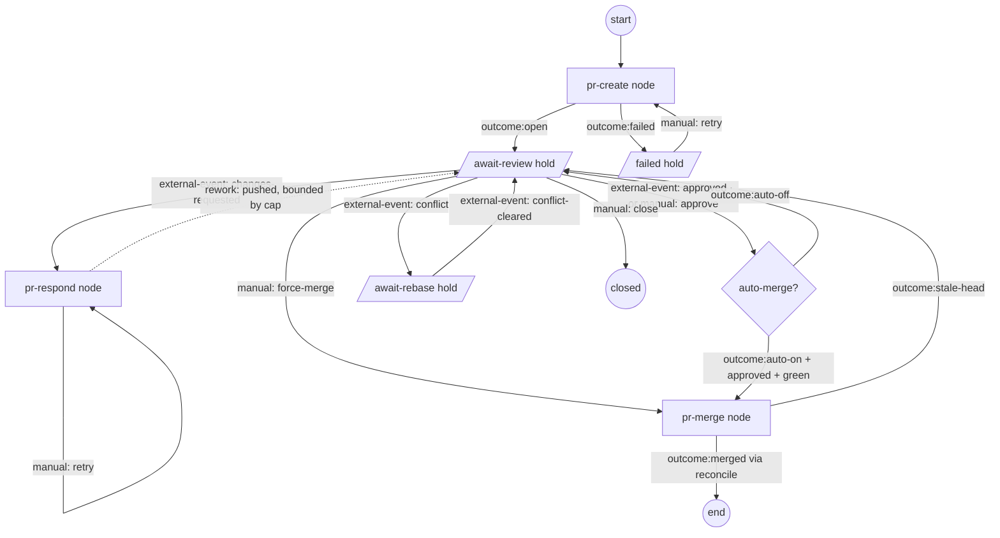
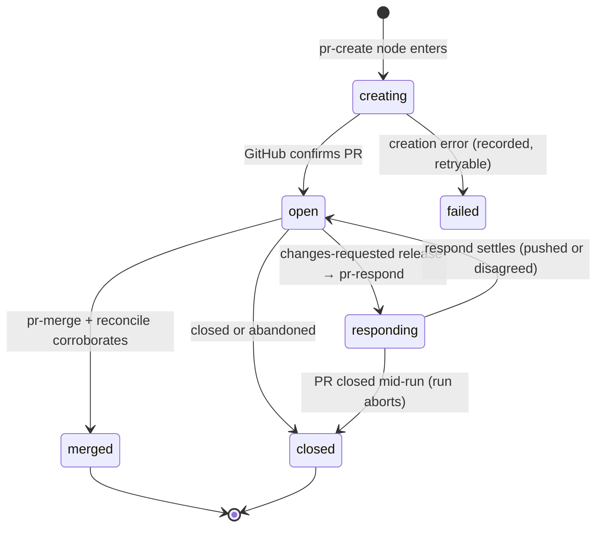

# feat: Unified PR entity as first-class workflow nodes with review-response loop

## Summary

Replace fusion's split PR machinery with a single first-class **PR entity** whose entire lifecycle — create, await review, respond/retry, await merge, merge — is expressed as **first-class workflow-graph nodes and edges**. The node handlers own all GitHub side effects and emit outcomes; stage progression, the review-response loop, and user-controlled review/retry/merge are graph edges (outcome-routed, rework, and manual-release). State is corroborated by GitHub (never speculative). The scheduler has zero knowledge of PRs — it only runs the existing node-kind-agnostic substrate (hold-release sweep, graph dispatch); the PR nodes and the workflow drive the flow.

---

## Problem Frame

Fusion's PR support is split across a per-task command (`fn task pr-create`) and the branch-group single-PR pipeline. The brainstorm's premise that the group flow "never worked" is stale for this checkout — the #1357 repairs landed. What remains true: PR logic is procedural and scattered (merger, comment-handler, monitor), the actually-valuable capability (responding to review feedback) exists only as the `PrCommentHandler` indirection that turns comments into steering tasks, and there is no unified view of checks, threads, mergeability, or conflicts. (See origin: docs/brainstorms/2026-06-05-pr-lifecycle-replacement-requirements.md.)

The architectural decision driving this refinement: the PR lifecycle is a **stateful, branching, human-and-event-gated flow** — exactly what the workflow graph executor (behind `experimentalFeatures.workflowGraphExecutor`) exists to model. Building it as scheduler-resident background loops (an earlier draft) would bury PR semantics in the scheduler and duplicate the graph's own waiting, routing, and retry primitives. Instead the PR lifecycle becomes node kinds the graph walks, waiting becomes hold columns with external-event/manual release, the review loop becomes a bounded rework cycle, and retry/approve/merge become user-controlled edges. The scheduler stays generic; the node + workflow control everything.

---

## Requirements

Carried from origin (R1–R13) plus plan-discovered requirements (R14–R20).

**PR entity and node lifecycle** (origin + node framing)

- R1. Every landing path — single task or shared branch group — drives the same first-class PR entity through the same workflow-node lifecycle. A branch group yields exactly one PR for the group.
- R2. PR creation generates title and body from task/group context (AI-assisted), with manual override (post-hoc edit).
- R3. The new node-based lifecycle replaces the existing per-task and branch-group PR code paths for graph-executed workflows; the old procedural machinery is removed, not kept alongside.
- R20. The PR lifecycle is expressed as first-class workflow-graph node kinds (create, respond, merge) with edges for stage progression, the review-response loop (bounded rework cycle), and user-controlled review/retry/merge. The scheduler contains no PR-specific logic; PR nodes plug into the existing node-handler registry and the generic hold-release/dispatch substrate.

**State truth and reconciliation** (origin)

- R4. Fusion never persists PR state GitHub has not corroborated. Failed creation records the failure; the entity is never marked open speculatively.
- R5. Each open PR entity is continuously reconciled against GitHub: review threads, check runs, mergeability/conflict state, merged/closed status — including changes made entirely outside fusion. Reconciliation fires the external-event releases that advance waiting nodes.

**Review-response loop** (origin)

- R6. Fusion detects new review feedback (comments, review threads, requested changes) from humans and bots on fusion-created PRs.
- R7. On new feedback, the respond node dispatches an agent that evaluates each actionable item and either (a) implements a fix, pushes to the PR branch, replies to the thread, and resolves it, or (b) disagrees — posting its reasoning as a reply and leaving the thread unresolved. No human approval before a push.
- R8. The loop repeats on subsequent feedback until the PR is merged or closed, bounded by an iteration cap implemented as the rework-cycle bound.

**Merge** (origin)

- R9. Merge is a human action by default, available from the fusion dashboard and from GitHub. In the graph, merge is a node reached by a user-controlled (manual-release) edge unless auto-merge is enabled.
- R10. Auto-merge is opt-in: when enabled, the merge node proceeds once the PR is approved and all required checks have concluded successfully (pending ≠ green), re-evaluated after every push.

**Surfaces** (origin)

- R11. The dashboard has a dedicated PR view per entity: CI checks (per check), review threads (including agent replies and disagreements), merged/unmerged status, merge-conflict state, and the PR node's current graph position.
- R12. PR state is reachable from the work it belongs to — the task or branch group surfaces its PR's node state and links to the PR view.
- R13. Every PR action available in the dashboard (create, inspect, trigger response run, approve/retry, merge, toggle auto-merge) is also available to agents via the CLI.

**Lifecycle safety** (plan-discovered)

- R14. A graph-executed task's merge happens only through the merge node; the legacy merge queue is not engaged for graph-executed tasks. (This supersedes the earlier predicate-based exclusion — see Key Decisions.)
- R15. Node handlers are idempotent, fast, and fail-closed. Long waits (for review, for checks, for merge readiness) are modeled as hold columns with external-event/manual release, never as blocking in-handler polling. Per-thread response state is persisted (keyed by thread id + head OID); crash/restart never duplicates a fix or silently skips feedback.
- R16. Moving a task off its PR-await hold "backward" (e.g. into in-progress) while its PR is open is blocked with guidance, unless the move is an explicit user-controlled release the workflow defines.
- R17. The GitHub reconcile that fires external-event releases is node-kind-agnostic substrate — it polls per-repo with adaptive cadence, ETag-conditional probes, and backoff, and persists an audit signal on error. It does not live in scheduler PR-specific code.
- R18. Reconcile stops for terminal (merged/closed) entities; feedback arriving after a terminal state is dropped in v1 (no auto-created follow-up tasks).
- R19. Pre-existing `branch_groups.prState`/`prNumber`/`prUrl` values are treated as unverified — reconciled against GitHub on first poll, never trusted as-is. **Unverified is a hard gate, not a display hint:** until first successful reconciliation, an entity is excluded from auto-merge evaluation and response dispatch, dashboard/CLI merge and respond actions refuse, and the entity stays parked in its await hold (it never advances on stale state). The reconcile promptly clears fictional entities (no real PR behind them).

---

## Key Technical Decisions

- **PR lifecycle is workflow-graph nodes + edges, not procedural code or scheduler loops.** Three new node kinds — `pr-create`, `pr-respond`, `pr-merge` — register in the existing handler registry (`createDefaultNodeHandlers` in `packages/engine/src/workflow-node-handlers.ts`) and the kind union (`packages/core/src/workflow-ir-types.ts`). Stage progression, the review loop, and user-controlled actions are edges. This reuses the graph's waiting, routing, retry, and persistence primitives instead of reinventing them in the scheduler. Available behind `experimentalFeatures.workflowGraphExecutor`.
- **Waiting is hold columns with external-event/manual release — never in-handler polling.** Node handlers must be fast/idempotent/fail-closed (research: handlers re-run on crash-resume and must not block). "Await review" and "await merge readiness" are hold columns whose release conditions are `external-event` (GitHub state changed) and `manual` (user forced the transition). The generic hold-release sweep (already node-kind-agnostic, in the scheduler substrate) moves the card; it has no PR knowledge.
- **The review→respond loop is a bounded rework cycle.** Today rework edges (`kind: "rework"`, the only legal graph cycle) are foreach-scoped. This plan generalizes the bounded-rework mechanism to cover a PR review region: the changes-requested edge from await-review to `pr-respond` and back is a rework cycle, and the R8 iteration cap is the rework bound (`maxReworkCycles`). Reuses the existing cycle-detection exemption and bound enforcement rather than introducing a new cycle concept.
- **User-controlled flows are edges.** Approve, request-retry, force-merge, and close are `manual` hold-release transitions plus `outcome:*` edges (e.g. `outcome:approved`, `outcome:changes-requested`, `outcome:merged`, `outcome:conflict`). The dashboard/CLI fire `promoteHeldTask`/`releaseHeldTaskByEvent` (existing routes) to drive them — no new control plane.
- **The scheduler gains zero PR knowledge.** It runs the existing generic substrate: graph dispatch and the hold-release sweep. The GitHub reconcile that fires `external-event` releases is a node-agnostic, per-repo poller living in the PR feature's own module (not `scheduler.ts`), plugged into the substrate tick. It keys on "entities with tasks parked in PR-await holds," not on node kinds, so adding the PR nodes requires no scheduler edits. This is the load-bearing constraint the user set.
- **Legacy merge-queue exclusion dissolves for graph workflows.** Because the executor flag already routes a graph-executed task away from the legacy execute/merge path, and merge is now the `pr-merge` node, the earlier 32-site `isPrBacked` predicate is unnecessary for graph workflows — the merge node *is* the merge path. The only residual concern is ensuring a graph-executed PR task is not also picked up by the legacy merger; the executor's existing graph/legacy routing already enforces this, and U6 adds a single assertion test rather than predicate plumbing.
- **GitHub-corroboration is structural.** Only two writers touch GitHub-mirror fields (state, mergeability, checks, threads): the `pr-create` node (after a confirmed GitHub response) and the reconcile. Everything else reads — including `pr-merge`, which performs the merge and lets the next reconcile transition the entity to `merged`; it never writes `merged` itself. Makes the prior `prState: "open"`-without-a-PR failure impossible by construction (see docs/solutions/integration-issues/branch-group-single-pr-synthetic-id-dead-wiring.md).
- **New `pull_requests` table (schema v109) + child `pull_request_thread_state` table.** The entity owns lifecycle, GitHub-mirror fields, and per-thread response state; tasks/branch_groups reference it by id. The migration is non-transactional (research: `applyMigration` bumps version only after the body succeeds) so the v109 body is fully re-runnable: `IF NOT EXISTS` DDL, set-based `INSERT OR IGNORE` copy of legacy fields, three named partial unique indexes. (Detail in U1.)
- **`expectedHeadOid` is net-new GitHub plumbing.** It exists nowhere in the repo today; `pr-merge` requires it to defeat the push/merge race. Added alongside the other net-new GitHub primitives (thread reply, thread resolve, ETag probe) in U2.
- **Security is built into the respond node.** Untrusted review-comment bodies are delimited and declared non-instructions in the agent prompt (prompt-injection defense); the bot/self-marker skip honors a marker only when its author is the authenticated viewer (marker-spoofing defense); a bot denylist (`*[bot]` by default) prevents responding to machine reviewers; a pre-push secret scan guards agent-authored commits.

---

## High-Level Technical Design

The PR sub-graph (nodes are graph nodes; await-* are hold columns with the named release conditions; the respond→await-review back edge is a bounded rework cycle):



PR entity state machine (persisted on the entity; every transition GitHub-corroborated):



Reconcile / release wiring (node-agnostic substrate; scheduler has no PR branch):

```mermaid
sequenceDiagram
    participant SUB as Substrate tick (generic)
    participant REC as PR reconcile (per repo, node-agnostic)
    participant GH as GitHub
    participant ENT as PR entity (store)
    participant HOLD as Hold-release sweep (generic)
    SUB->>REC: tick (entities with tasks in PR-await holds)
    REC->>GH: ETag probe (free on 304)
    GH-->>REC: changed
    REC->>GH: GraphQL deep-fetch (threads, checks, mergeability)
    REC->>ENT: persist mirror state + audit
    REC->>HOLD: releaseHeldTaskByEvent(taskId, "github:pr-<event>")
    HOLD->>HOLD: moveTask (generic, no PR knowledge)
    Note over REC,HOLD: scheduler.ts never references PR; reconcile + nodes own it
```

Diagrams render authoritative content alongside the prose; on disagreement the prose governs.

---

## Implementation Units

### Phase A — Foundation

### U1. PR entity: types, schema v109, store CRUD, predicates

- **Goal:** A persisted `PrEntity` with lifecycle states (`creating`, `open`, `responding`, `merged`, `closed`, `failed`), GitHub-mirror fields (number, url, state, mergeability, checks rollup, review decision, head OID), a child table for per-thread response state, links from `tasks`/`branch_groups`, and a core unverified-gate predicate.
- **Requirements:** R1, R4 (state shape), R15 (thread-state table), R19 (unverified hard gate)
- **Dependencies:** none
- **Files:** `packages/core/src/types.ts`, `packages/core/src/db.ts` (SCHEMA_SQL + v109 migration + compat helper + docstring fix), `packages/core/src/store.ts` (CRUD + lookups by task/group/repo + "entities with tasks in await holds" query), new `packages/core/src/pr-entity.ts` (predicates), `packages/core/src/__tests__/pr-entity.test.ts`, `packages/core/src/__tests__/store-pull-requests.test.ts`
- **Approach:** `applyMigration` is non-transactional (version bumps only after the body succeeds; a crash mid-body re-runs the whole body) — the v109 body must be fully re-runnable. Model on migration 72 (DDL+backfill), not v108 (pure DDL): `CREATE TABLE/INDEX IF NOT EXISTS`, set-based `INSERT ... SELECT` with `INSERT OR IGNORE` for the legacy-field copy. Fix the misleading "runs inside a transaction" docstring. Uniqueness is three named partial unique indexes: (1) one non-terminal entity per `(sourceType, sourceId)`; (2) one non-terminal entity per `(repo, headBranch)`; (3) one entity per `(repo, prNumber) WHERE prNumber IS NOT NULL`. Reopen (same number) is a state transition on the existing row; recreate-after-close (new number) is a new entity — reconcile logic owns that division. Indexes live in `SCHEMA_SQL`, the v109 block, AND an idempotent `ensurePullRequestsSchemaCompatibility` helper (the compat pass adds columns only, never indexes). Per-thread response state is a child table `pull_request_thread_state` keyed `(prEntityId, threadId, headOid)` with CASCADE — mirroring `workflow_run_step_instances` — not a JSON column. Legacy `branch_groups` PR fields are copied read-only and left in place; `DROP COLUMN` is out of scope.
- **Patterns to follow:** `db.ts` migration 72 and v108 block; `ensureEvalTaskResultsSchemaCompatibility` for the compat helper; `branch-group-completion.ts` for core-owned predicates; see docs/solutions/logic-errors/branch-group-name-collision-strands-mission-triage.md.
- **Test scenarios:**
  - Migration from empty and from a DB with legacy group PR fields → entities created, flagged unverified, version lands at 109
  - Re-running the v109 body after a simulated partial copy → no duplicates (re-entrancy)
  - Create-or-reuse: same source twice → one entity; same branch under a different source → no second open entity; reopened PR (same number) reconciles onto existing entity; recreate-after-close (new number) → new entity, old stays closed
  - Unverified gate: unverified entity → merge/respond predicates refuse; cleared after first reconcile
  - Thread-state CRUD round-trips keyed by thread id + head OID; cascade on entity delete
  - "Tasks parked in PR-await holds" query returns only entities whose task is in an await column
- **Verification:** core suite green; fresh DB and upgraded DB converge on identical `pull_requests` schema; no other package writes GitHub-mirror columns (grep-able invariant).

### U2. GitHub primitives: thread reply, thread resolve, change probe, expectedHeadOid merge

- **Goal:** Close the genuine gaps in `GitHubClient`: reply to a specific review thread, resolve/unresolve a thread, an ETag-conditional change probe, and `expectedHeadOid` on merge. Consolidate a deep-fetch returning threads (two-level pagination), checks rollup, mergeability, and review decision.
- **Requirements:** R5, R6, R7 (reply/resolve), R9/R10 (expectedHeadOid), R17 (probe)
- **Dependencies:** none
- **Files:** `packages/dashboard/src/github.ts`, `packages/core/src/gh-cli.ts` (if the merge head-match needs a low-level flag), `packages/dashboard/src/__tests__/github-pr-threads.test.ts`
- **Approach:** GraphQL `addPullRequestReviewThreadReply` and `resolveReviewThread` (thread node ids from existing `getPrReviewDetails`); honor `viewerCanReply`/`viewerCanResolve`. Change probe uses REST with stored ETags (304 is rate-limit-free); deep-fetch via GraphQL. `mergeable: UNKNOWN` → "recompute pending", short-backoff re-poll, never "no conflict". **`expectedHeadOid` is net-new:** extend `MergePrParams` with `expectedHeadOid?: string`, pass `--match-head-commit <sha>` in the gh path and `sha` in the REST body, and map the resulting 405/conflict to a typed stale-head error the `pr-merge` node re-evaluates on. Confirm what `getPrReviewDetails` already paginates before rebuilding pagination (it may already cover threads+comments).
- **Patterns to follow:** existing dual gh-CLI/API fallbacks in `github.ts`; `classifyGhError` for structured failures.
- **Test scenarios:**
  - Thread reply targets the given thread id; resolve only fires when `viewerCanResolve`
  - Nested pagination: a thread with >100 comments and a PR with >50 threads fully enumerate
  - Probe returns unchanged on 304 and does not trigger deep-fetch
  - Merge with a matching `expectedHeadOid` succeeds; with a stale one → typed stale-head error, no merge
  - `UNKNOWN` mergeability never maps to mergeable or conflicting
- **Verification:** dashboard tests green with faked gh/API layers; no live-network tests.

### Phase B — PR node kinds and the substrate

### U3. PR node kinds and handlers (pr-create, pr-respond, pr-merge)

- **Goal:** Three first-class node kinds whose handlers own the PR side effects and emit outcomes the graph routes on. `pr-create` creates the PR (or reuses, for groups) and writes the entity; `pr-respond` runs the review-response loop body; `pr-merge` merges tool-side with `expectedHeadOid`.
- **Requirements:** R1, R2, R3, R4, R20, AE3, AE6
- **Dependencies:** U1, U2
- **Files:** `packages/core/src/workflow-ir-types.ts` (add `pr-create`/`pr-respond`/`pr-merge` to `WorkflowIrNodeKind`), `packages/engine/src/workflow-node-handlers.ts` (register handlers in `createDefaultNodeHandlers`), new `packages/engine/src/pr-nodes.ts` (handler bodies), `packages/cli/src/commands/task-lifecycle.ts` (inject GitHub client into handler context at the three CLI sites), `packages/engine/src/__tests__/pr-nodes.test.ts`
- **Approach:** Handlers follow the established contract: `(node, ctx) => Promise<WorkflowNodeResult>` with `{ outcome, value, contextPatch }`, idempotent and fast (no indefinite waits — those are holds, U4). GitHub access is injected into the node context via the existing seam-injection pattern (never import the dashboard client into the engine; mirror how `createGroupPr`/`syncGroupPr` are wired at `daemon.ts`/`serve.ts`/`dashboard.ts`). `pr-create`: writes entity `creating`, calls GitHub, flips to `open` on confirmation (emit `outcome:open`) or records `failed` with the classified error (emit `outcome:failed`); AI title/body via `pr-metadata-generator`; group promotion keeps its completion gate and create-or-reuse idempotency. `pr-merge`: merges with `expectedHeadOid`, does NOT write `merged` (reconcile corroborates), emits `outcome:stale-head` on race. `pr-respond` body is U5.
- **Patterns to follow:** `createStepReviewHandler`/`createParseStepsHandler` in `workflow-node-handlers.ts` (handler shape, outcome values, context patches); the `merge` seam (`executor.ts`) for a node doing a merge and awaiting an outcome; the three-site callback wiring from task-lifecycle.ts.
- **Test scenarios:**
  - Covers AE6. `pr-create` on a complete group → exactly one entity + one PR; re-entry reuses it
  - `pr-create` on a single task → entity + PR with generated title/body; emits `outcome:open`
  - Covers AE3. Creation failure → entity `failed`, emits `outcome:failed`, never `open`
  - `pr-merge` with stale head → `outcome:stale-head`, entity stays `open`, no `merged` write
  - Handlers are idempotent: re-running `pr-create`/`pr-merge` on an already-advanced entity is a no-op with the correct outcome
  - GitHub client injected at all three CLI sites (consistency test enumerating construction sites)
- **Verification:** engine tests green with faked GitHub client + node context; node kinds resolve in `createDefaultNodeHandlers`; missing-handler path fails closed.

### U4. Await states (hold release) + node-agnostic GitHub reconcile

- **Goal:** Model "await review", "await merge readiness", "await rebase", and "failed" as hold columns with `external-event`/`manual` release; and a per-repo, node-kind-agnostic reconcile that fires those external-event releases from GitHub state. The scheduler gains no PR-specific code.
- **Requirements:** R5, R15, R16, R17, R18, R19, AE4
- **Dependencies:** U1, U2, U3
- **Files:** new `packages/engine/src/pr-reconcile.ts` (the poller + release-firing), substrate tick registration (the generic hook the substrate already exposes — NOT a PR branch in `scheduler.ts`), `packages/engine/src/hold-release.ts` (only if a generic event-tag plumbing gap exists), `packages/engine/src/__tests__/pr-reconcile.test.ts`
- **Approach:** Reconcile queries "entities with tasks parked in PR-await holds" (U1 store query), groups by repo, and per repo: ETag-cheap probe, GraphQL deep-fetch on change, persist mirror state, then call the existing `releaseHeldTaskByEvent(store, taskId, "github:pr-<event>")` for each transition (changes-requested, approved, conflict, conflict-cleared, merged, closed). The generic hold-release sweep moves the card; it never learns PR semantics. Adaptive cadence (~15–30s active, 60–120s idle, 5min dormant), backoff, per-repo batching for rate-limit safety. Every caught error persists an audit event (silent catch-and-continue is the documented stall mode). Unverified entities are reconciled-or-cleared on first pass and never advance on stale state (R19). Terminal entities are dropped from the poll set (R18). Conflict → fire `conflict` event (card parks in await-rebase; response loop not dispatched; auto-merge blocked).
- **Patterns to follow:** `pr-monitor.ts` (cadence/backoff/injected gh client) for the *poller shape only*; `hold-release.ts` `releaseHeldTaskByEvent`/`promoteHeldTask` for the release API; the substrate tick the hold-release sweep already runs under (reconcile registers the same way, node-agnostic).
- **Test scenarios:**
  - Covers AE4. PR merged/closed directly on GitHub → reconcile fires the terminal event, card releases to end, polling stops
  - Changes-requested on GitHub → reconcile fires `github:pr-changes-requested`, generic sweep releases card to `pr-respond`
  - Unverified imported entity with stale `prState:"open"` and no real PR → corrected on first poll; its card does not advance on stale state
  - N open PRs in one repo → one batched probe per tick, not N
  - Probe 304 → no deep-fetch, no writes; deep-fetch error → backoff + persisted audit event, poller survives
  - `scheduler.ts` contains no reference to PR entities/nodes/events (grep-able invariant)
- **Verification:** engine tests green with fake gh client; reconcile runs under the generic substrate tick; scheduler diff touches no PR symbol.

### Phase C — Response loop, user-controlled flow, merge

### U5. pr-respond handler: the review-response run (bounded rework body)

- **Goal:** The fix-or-disagree agent run that is `pr-respond`'s handler body: batch actionable threads, dispatch a mutating agent in the PR branch worktree, push safely, reply/resolve per thread (or disagree and leave open), persist per-thread outcomes, restart-safe; emit the outcome that drives the bounded rework edge back to await-review.
- **Requirements:** R6, R7, R8, R15, AE1, AE2
- **Dependencies:** U1, U2, U3, U4
- **Execution note:** Build the per-thread state machine test-first — restart and abort behavior cannot be retrofitted cleanly.
- **Approach:** Filter threads: `!isResolved && !isOutdated && !viewerDidAuthor && author not in bot-denylist`. Batch into one run per push cycle; mid-run arrivals queue for the next cycle (no parallel runs per branch). Agent dispatch mirrors `makeMutatingAgent` (resolved session, coding tools, rate-limit retry, commit trailers); agree/disagree per thread via the `parseReviewVerdict` marker pattern. **Security (built-in):** wrap each comment body in a delimiter declared untrusted/non-instruction in the system prompt (prompt-injection defense); the marker-skip honors `<!-- fusion:pr-entity ... -->` only when the comment author is the authenticated viewer (marker-spoofing defense); bot denylist defaults to `*[bot]`; a pre-push secret scan guards agent-authored commits. **Push safety:** re-reconcile (PR still open, head matches) then fetch + ff-check; non-ff aborts and re-batches; never force-push. **Crash recovery:** push/reply is the commit point; the thread-state row persists *after* GitHub confirms; on restart, an un-persisted-but-pushed outcome is recovered by detecting the marker+SHA and the advanced head OID — never re-fixed, never assumed-fixed (worst case redundant re-evaluation, never silent skip). Detached-turn contract: never rejects, inactivity watchdog re-armed on progress, abort honored at every await (PR closed mid-run, shutdown). Emit `outcome:pushed` (drives the bounded rework edge back to await-review) or `outcome:disagreed-only`. The R8 iteration cap is the rework bound; at the cap, emit a terminal outcome and persist an audit event (the card parks rather than looping). Unverified entities never dispatch (R19).
- **Patterns to follow:** `merger-ai.ts` `makeMutatingAgent`/`parseReviewVerdict`; detached-turn rules in docs/solutions/architecture-patterns/observable-long-running-agent-turns-through-blocking-plugin-route-seam.md; the foreach rework-bound enforcement for the cap.
- **Test scenarios:**
  - Covers AE1. Actionable comment → fix committed, pushed, thread replied (marker+SHA), resolved, outcome persisted, emits `outcome:pushed`
  - Covers AE2. Disagreement → reasoned reply, no push for that thread, thread left unresolved, marker-tagged so it is not re-detected
  - Prompt injection: a comment containing instruction-shaped text produces only a code change or disagreement, never an unexpected tool call
  - Marker spoofing: a third-party comment containing a valid marker does NOT suppress evaluation of that thread
  - Bot denylist: a `renovate[bot]` thread never dispatches a run
  - Pre-push secret scan: a fix that would commit a credential is blocked before push
  - Restart mid-run, outcome persisted → skipped via row; outcome NOT persisted but pushed → skipped via marker+SHA detection (no duplicate fix, no silent skip)
  - Human pushed between fetch and push → non-ff abort, no force-push, re-batch
  - Iteration cap reached → terminal outcome, audit event, card parks (no infinite rework)
- **Verification:** engine tests green with faked agent session + gh client; no force-push path exists; rework bound enforced.

### U6. User-controlled flow + merge node wiring + bounded-rework generalization

- **Goal:** Wire the user-controlled edges (approve, retry, force-merge, close), the auto-merge gate, and the `pr-merge` node into the graph; generalize the bounded-rework-cycle mechanism beyond foreach so the review loop is a legal bounded cycle; assert graph-executed PR tasks bypass the legacy merge queue.
- **Requirements:** R8 (rework bound), R9, R10, R14, R16, AE5
- **Dependencies:** U3, U4, U5
- **Files:** `packages/engine/src/workflow-graph-executor.ts` (generalize rework-cycle legality + bound beyond foreach), `packages/core/src/workflow-ir-types.ts` (edge/region annotation if needed for the PR rework region), `packages/dashboard/src/routes/register-task-workflow-routes.ts` (reuse `promoteHeldTask`/`releaseHeldTaskByEvent` for approve/retry/force-merge/close), `packages/engine/src/__tests__/pr-graph-flow.test.ts`, `packages/engine/src/__tests__/pr-rework-bound.test.ts`
- **Approach:** Auto-merge is a `gate` node after approval: `outcome:auto-on` (approved + all required checks concluded successful + `mergeable == MERGEABLE`, re-evaluated after every push; unverified never passes) routes to `pr-merge`; `outcome:auto-off` parks in await-review for a manual-release merge. User actions are existing release calls: approve = manual release on await-review → gate; retry = manual release re-dispatching `pr-respond`; force-merge = manual release → `pr-merge`; close = manual release → closed. Generalize the rework mechanism: lift the foreach-only restriction so a designated PR review region permits a `kind: "rework"` back edge bounded by a cap (the cycle-detection exemption and bound enforcement already exist for foreach — extend their scope, don't fork them). R14: add a test asserting a graph-executed PR task is never enqueued in the legacy merge queue (the executor's existing graph/legacy routing enforces this; the test pins it) — no predicate plumbing across 32 sites.
- **Patterns to follow:** foreach rework-cycle detection + `maxReworkCycles` in `workflow-graph-executor.ts`; `promoteHeldTask`/`releaseHeldTaskByEvent` routes in `register-task-workflow-routes.ts`; `gate` handler (`createGateHandler`) for the auto-merge decision.
- **Test scenarios:**
  - Covers AE5. Auto-merge on + approved + green → gate routes to `pr-merge`; auto-merge off → parks for manual merge
  - Manual approve / retry / force-merge / close each fire the right release and route correctly
  - Bounded rework: review→respond→review cycles up to the cap, then parks; cap is enforced (no infinite loop); cycle detection does not reject the legal PR rework edge
  - Pending/expected checks or `UNKNOWN` mergeability or unverified entity → gate does not route to merge
  - A graph-executed PR task is never enqueued in the legacy merge queue (regression pin for R14)
- **Verification:** engine tests green; rework generalization does not regress foreach bound tests; legacy-queue-bypass test passes.

### Phase D — Surfaces and cutover

### U7. Dashboard PR view, node-state rendering, and user controls

- **Goal:** A dedicated PR view rendering checks, threads (with agent replies/disagreements), merge status, conflict state, and the PR node's current graph position; live updates; and the user-controlled actions (approve, retry, force-merge, close, toggle auto-merge) wired to the release routes. Full per-state UI spec so implementers don't invent product behavior.
- **Requirements:** R11, R12, R13, R16
- **Dependencies:** U3, U4, U5, U6
- **Files:** new `packages/dashboard/src/routes/register-pull-requests-routes.ts`, `packages/dashboard/src/routes/register-integrated-routers.ts`, new `packages/dashboard/app/components/PullRequestView.tsx`, `packages/dashboard/app/components/TaskCard.tsx` (node-state badge/link), `packages/dashboard/src/__tests__/routes-pull-requests.test.ts`, `packages/dashboard/app/__tests__/pull-request-view.test.tsx`
- **Approach:** Express router registered in `register-integrated-routers.ts` with engine capabilities injected as option callbacks (the branch-groups router is the model). Live updates via the existing SSE/store-event channel reconcile writes; side-effecting actions (merge, approve, retry, close) re-fetch authoritative state before acting — never gate on an SSE-delivered copy (see docs/solutions/logic-errors/queued-chat-message-flush-trusts-stale-isgenerating.md). **Per-node-state UI spec (resolves design-review gaps):** `creating` → "Creating PR…" placeholder; `failed` → error reason + "Retry PR creation" (distinct error badge on the card, not the open-PR badge); `unverified` → "Verifying with GitHub…" notice, checks/threads hidden, merge/respond disabled with tooltip; `responding` → "Response run in progress — N threads pending" banner, respond disabled, per-thread pending markers; await-review → action bar with Approve / Request retry / Merge / Close and the auto-merge toggle showing its current gate ("Waiting for checks" / "Waiting for approval" / "Blocked: conflict" / "Ready to merge"); conflict → Merge disabled, "Resolve conflicts on GitHub ↗" link; agent disagreements visually distinguished from human-awaiting threads. Content hierarchy: identity header → action bar → merge-readiness summary (mergeability, review decision, checks rollup) → checks list → threads (agent replies nested). Column-move-backward block returns the structured rejection message "This task has an open PR. Merge or close the PR before moving it back." Register the lazy-loaded view in the App inventory (lazy-loaded-views test).
- **Patterns to follow:** `register-branch-groups-routes.ts`; lazy-view registration + `lazy-loaded-views-docs.test.ts`; the promote/event-release routes in `register-task-workflow-routes.ts`; CSS conventions from the component-file split; TUI aesthetic (single-confirm merge, not a heavy modal).
- **Test scenarios:**
  - View renders each node state distinctly (creating/failed/unverified/responding/await-review/conflict) with the specified controls
  - Merge/approve/retry/close actions re-fetch authoritative state before firing; stale SSE copy alone never acts
  - Auto-merge toggle shows the live blocking gate reason
  - Column move-backward with an open PR → rejected with guidance; allowed once merged/closed
  - Task/group cards expose PR node state and link (R12)
  - View registered in lazy-import inventory
- **Verification:** dashboard route + component tests green; no new TS diagnostics beyond the known pre-existing set.

### U8. CLI parity: `fn pr` commands

- **Goal:** `fn pr create|show|list|respond|approve|retry|merge|close|automerge` covering every dashboard action (R13); `fn task pr-create` retired.
- **Requirements:** R3 (CLI half), R13
- **Dependencies:** U3, U4, U5, U6
- **Files:** new `packages/cli/src/commands/pr.ts`, `packages/cli/src/bin.ts` (dispatch + help), removal in `packages/cli/src/commands/task.ts`, `packages/cli/src/__tests__/pr-command.test.ts`, `.changeset/` entry
- **Approach:** One file per noun, `run*` exports, lazy imports from `bin.ts` (the `branch-group.ts` store-direct + engine-call pattern). User-control subcommands (approve/retry/merge/close) fire the same release routes as the dashboard. Mirror every action across surfaces and add a consistency test so a capability can't exist on one surface only (see docs/solutions/integration-issues/bundled-plugin-registration-drift.md, generalized). Changeset: `@runfusion/fusion` minor (new commands, breaking removal of `task pr-create`).
- **Patterns to follow:** `packages/cli/src/commands/branch-group.ts`; bin.ts lazy-import registration; hand-maintained help block.
- **Test scenarios:**
  - Each subcommand routes to the same store/engine/release paths the dashboard uses
  - `fn task pr-create` no longer dispatches; help text updated
  - Surface-parity consistency test: dashboard PR actions ⊆ CLI actions
- **Verification:** CLI tests green; changeset present; help output covers new commands.

### U9. Built-in PR workflow template + retire superseded paths

- **Goal:** Ship a built-in workflow graph wiring the PR nodes end to end (the "wire it end to end" deliverable), and retire the superseded procedural machinery.
- **Requirements:** R3 (removal half), R18, R20
- **Dependencies:** U3, U4, U5, U6, U7, U8
- **Files:** workflow template definition (the built-in graph that places `pr-create`/await-review/`pr-respond`/gate/`pr-merge` with the await holds and rework edge — alongside the existing built-in workflow definitions), `packages/engine/src/pr-comment-handler.ts` (remove/strip), `packages/engine/src/pr-monitor.ts` + `packages/engine/src/pr-monitor-gh.ts` (retire — `pr-monitor-gh.ts` is imported only by `pr-monitor.ts`), `packages/cli/src/commands/task-lifecycle.ts` (`syncGroupPr` → entity), affected tests across `packages/engine/src/__tests__/`, `CONCEPTS.md`
- **Approach:** Provide a built-in PR-bearing workflow graph (behind `workflowGraphExecutor`) so a task/group routed through it gets the full create→review→respond→merge lifecycle with no hand-authoring. Deletion-by-supersession, one consumer at a time: each old behavior is re-pointed at the entity/nodes (group PR body sync, member-landing checklist) or deliberately dropped with the decision recorded (changes-requested → in-progress move; post-close comment → follow-up task, dropped per R18). Legacy `branch_groups` PR fields become read-through frozen; physical `DROP COLUMN` deferred. Update CONCEPTS.md (PR entity, Review-response loop, and new PR node-kind vocabulary).
- **Patterns to follow:** existing built-in workflow/graph definitions for the template shape; prior cutover discipline (docs/plans/2026-06-03-002-feat-workflow-interpreter-cutover-plan.md).
- **Test scenarios:**
  - End-to-end (fast, faked GitHub): a task routed through the built-in PR workflow goes create → await-review → (changes-requested) respond → (approved) gate → merge → end, with reconcile firing the releases
  - No code path moves a task to in-progress in response to review feedback
  - Group member lands after PR open → entity-driven body sync updates the same PR (AE6 regression)
  - Post-merge comment → no follow-up task, no zombie polling
  - Engine boots and shuts down cleanly with old monitors gone; grep finds no callers of retired symbols
- **Verification:** full engine + dashboard fast suites green; existing branch-group slow suites (run locally, not added to) still pass against the node-backed flow.

---

## Scope Boundaries

**Deferred for later** (carried from origin)

- Multi-user GitHub auth, permissions, approval policies — until teammates exist.
- The response loop acting on PRs fusion didn't create.
- Agent auto-fixing failing CI checks and merge conflicts — the view shows them in v1 (conflict parks in await-rebase and blocks auto-merge); acting on them is the natural next extension (a future `pr-resolve-conflict` node).
- Non-GitHub forges.

**Deferred to follow-up work** (plan-local)

- Webhook ingestion as an alternative to polling (the reconcile's external-event firing is webhook-ready; a public endpoint is future).
- PR node kinds contributed by plugins (today node kinds are built-in only; a plugin node-kind registry is a separate effort).
- The legacy (non-graph, `workflowGraphExecutor` off) path keeps the current working branch-group/per-task PR flow unchanged — the node lifecycle is the graph-executor path. Converging the legacy path onto nodes is out of scope.
- Post-merge feedback notifications; GitHub-native auto-merge fallback; capturing gh rate-limit/pagination learnings into `docs/solutions/` once the reconcile ships.

---

## Risks & Dependencies

- **Node handlers must never block.** The single most important node-model constraint: long waits are holds, not in-handler polling. A handler that awaits GitHub indefinitely breaks crash-resume idempotency. Mitigation: U3/U5 handlers return fast outcomes; all waiting is U4 hold release.
- **Rework-cycle generalization touches the executor's cycle rules.** Lifting the foreach-only restriction risks regressing cycle detection or bound enforcement. Mitigation: extend the existing mechanism's scope rather than forking it; keep foreach bound tests green as a guardrail (U6).
- **Scheduler-ignorance is an invariant, not a convention.** Mitigation: a grep-able test asserting `scheduler.ts` references no PR symbol (U4 verification).
- **Push side effects:** each respond push can mark threads outdated and dismiss stale approvals. Mitigation: reconcile re-fetches post-push; the gate re-evaluates after every push.
- **Rate limits / async mergeability:** GraphQL deep-fetches are point-expensive; `UNKNOWN` is common post-push. Mitigation: REST+ETag probe gates deep-fetches, per-repo batching, bounded re-poll, `UNKNOWN` never gates as mergeable.
- **`expectedHeadOid` is net-new** (not existing machinery): U2 builds it; `pr-merge` depends on it for the stale-head guard.
- **Security:** untrusted review comments reach a coding agent. Mitigation: prompt-delimiting, viewer-authenticated markers, bot denylist, pre-push secret scan — all built into U5 and tested.
- **Behavioral assumption:** single-user `gh` auth acts as the user for all actions; agent replies are attributed to the user's account, so the marker (viewer-authenticated) distinguishes agent replies from the user's own manual comments.

---

## System-Wide Impact

- **Workflow graph executor:** three new node kinds, generalized bounded-rework cycles, a built-in PR workflow template. Behind `workflowGraphExecutor`; legacy path unchanged.
- **Merge lifecycle:** for graph-executed tasks, merge is a node, not a merge-queue entry — the legacy merger is not their merge path (R14). The earlier 32-site predicate plumbing is unnecessary in this architecture.
- **Scheduler:** unchanged for PR purposes — runs only the generic substrate (graph dispatch, hold-release sweep). The reconcile registers as node-agnostic substrate.
- **CONCEPTS.md:** PR entity and Review-response loop entries exist; U9 adds the PR node-kind vocabulary and updates Group promotion's "managed PR identity" to note it is realized by the entity + nodes.
- **Operational:** a new per-repo reconcile poll (node-agnostic) with persisted audit events; one dashboard lazy view; a breaking CLI change (changeset + help).

---

## Sources & Research

- Origin requirements: docs/brainstorms/2026-06-05-pr-lifecycle-replacement-requirements.md (R1–R13, AE1–AE6 carried; lifecycle preserved).
- Workflow node system (verified): node kinds in `packages/core/src/workflow-ir-types.ts`; handler registry `createDefaultNodeHandlers` and handler contract in `packages/engine/src/workflow-node-handlers.ts`; executor walk + edge routing (`outcome:<value>`, rework cycles) in `packages/engine/src/workflow-graph-executor.ts`; hold release (`manual`/`external-event` via `promoteHeldTask`/`releaseHeldTaskByEvent`, node-agnostic sweep) in `packages/engine/src/hold-release.ts`; promote/release routes in `packages/dashboard/src/routes/register-task-workflow-routes.ts`; `merge` seam precedent in `packages/engine/src/executor.ts`.
- Verified current state: #1357 fixes landed; `GitHubClient` already has review-thread reads, checks, mergeability, `updatePr`, `closePr`. Net-new GitHub work: thread reply/resolve, ETag probe, and `expectedHeadOid` on merge (confirmed absent in repo).
- Templates to mirror: `pr-monitor.ts` (poller shape only), `merger-ai.ts` (mutating agent + verdict), `db.ts` migration 72 + v108 block, `register-branch-groups-routes.ts` (router), foreach rework-bound enforcement.
- Institutional learnings applied: synthetic-id/dead-wiring post-mortem (sole-writer, DI seams, prototype tests), per-task auto-merge override gating, branch-group name-collision idempotency, detached-turn architecture, SSE enrichment-field staleness — all under `docs/solutions/`.
- External (verified against live GitHub GraphQL schema): `reviewThreads`/`isResolved`/`isOutdated`/`viewerDidAuthor`/`fullDatabaseId`; `addPullRequestReviewThreadReply`, `resolveReviewThread`, `mergePullRequest` with `expectedHeadOid`; `mergeable`/`mergeStateStatus` enums and the async-recompute gotcha; ETag conditional requests are rate-limit-free; two-level thread pagination; prior-art batching (one run per push cycle, fix-or-disagree, iteration caps).
```
