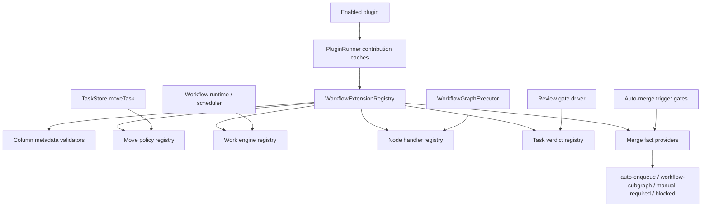
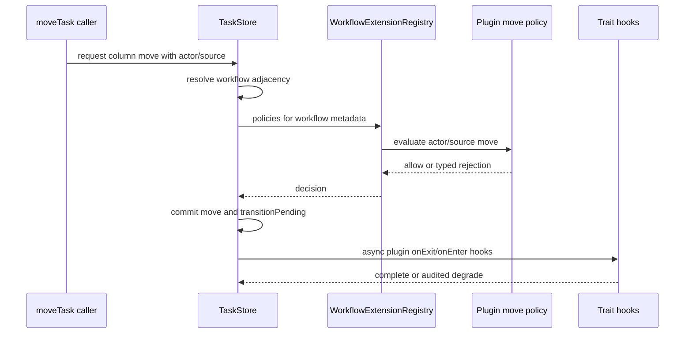
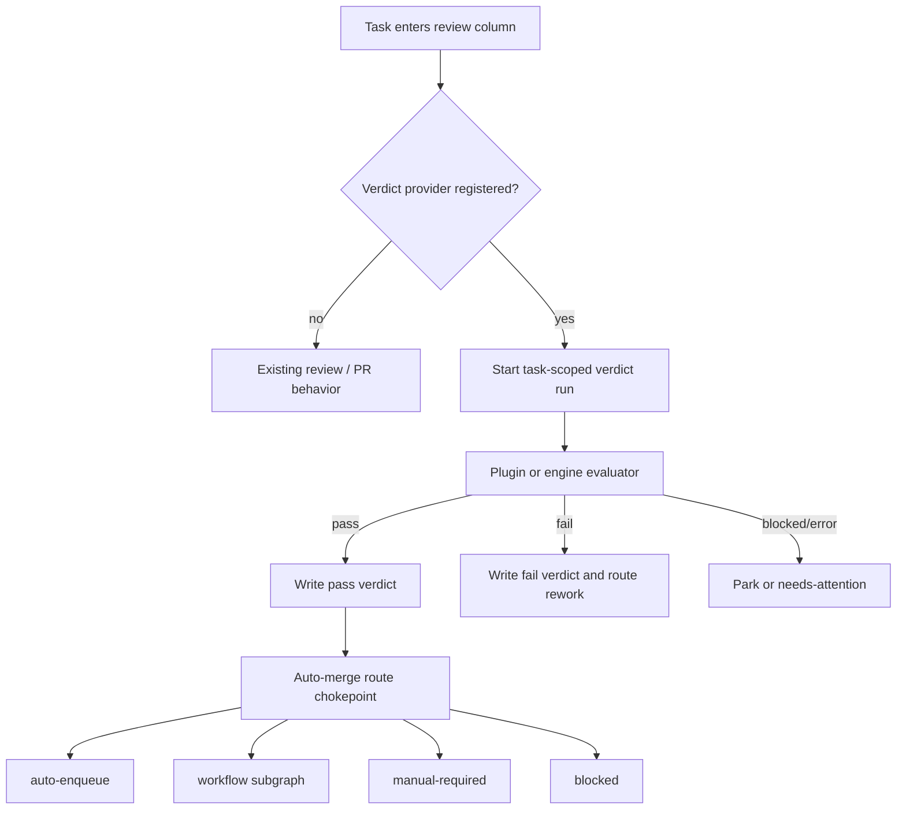

# feat: Add workflow extension plugins

## Summary

Make the workflow engine extensible enough that optional workflow packages can add board semantics, workflow node behavior, review gates, merge routing, and column-owned work engines through plugins. The shared engine remains the compatibility layer: built-in workflows keep today’s default behavior, while installed plugins contribute extra workflow capabilities without product-specific branches in core engine code.

---

## Problem Frame

The current workflow stack already supports custom columns, traits, settings, graph nodes, PR nodes, plugin traits, plugin step parsers, plugin workflow steps, and plugin-hosted interactive AI sessions. A local workflow comparison shows the next extension pressure is not another fixed workflow, but a set of policies that currently want to cross engine boundaries: actor-aware movement, typed column roles, column-bound work engines, verdict-backed review gates, verdict-aware merge routing, shared board actions, and specialized PR response dispatch.

Hardcoding those policies into the engine would fork the lifecycle model. The engine should instead define extension contracts that plugins can register, validate, degrade, and observe. The default engine path must stay byte-identical when no plugin extension is installed.

---

## Requirements

- R1. Workflow IR can carry plugin-defined column metadata and column work-engine bindings without adding product-specific fields to the core workflow schema.
- R2. Plugins can contribute workflow node handlers and column work engines that run through engine-owned dispatch seams, with plugin absence degrading or parking according to the declared policy.
- R3. Plugins can contribute movement policies that evaluate actor/source-aware moves without bypassing existing workflow adjacency, task locks, or hard-cancel semantics.
- R4. Plugins can contribute review or verdict providers that persist task-scoped outcomes and expose them to workflow gates, merge gates, and recovery.
- R5. Auto-merge trigger layers consult one route-producing chokepoint that can combine existing global/per-task settings with plugin-contributed gate facts.
- R6. Shared board actions used by HTTP routes and agent tools flow through engine-level service functions rather than duplicated route logic.
- R7. Plugin extension disable/uninstall paths are safe: live dependents block normal disable, force disable degrades executable hooks and policies without stranding tasks.
- R8. Default workflows and existing custom workflows remain unchanged when no plugin extension is active.
- R9. The implementation covers every known surface: workflow validation, store moves, agent tools, dashboard routes, scheduler/runtime dispatch, PR nodes, merge triggers, self-healing, and plugin lifecycle.

---

## Key Technical Decisions

- KTD-1. Use a generic workflow extension registry instead of core schema fields for optional semantics. Column roles, lock markers, work-engine bindings, and actor policies should be plugin-namespaced contributions referenced from open metadata, not first-class product-specific properties.
- KTD-2. Engine owns dispatch; plugins own behavior. The engine should expose narrow `WorkflowWorkEngine`, `WorkflowNodeHandler`, `WorkflowMovePolicy`, `TaskVerdictProvider`, and `AutoMergeFactProvider` seams. Plugins register implementations; runtime code calls registries through typed adapters.
- KTD-3. Default behavior is the absence baseline. Built-in workflows, legacy default columns, additive global/per-task auto-merge behavior, PR workflow nodes, and existing plugin trait semantics must remain the fallback when no extension claims a task or workflow.
- KTD-4. Extension failures degrade by contract. A missing plugin in a fresh dispatch can fall back when the extension declares `degradeToDefault`; a missing plugin for a parked artifact-consuming state should park with a needs-attention diagnostic. The policy is explicit per contribution, not guessed by the caller.
- KTD-5. Review/verdict data is a generic task-scoped contract. The engine should support task-keyed verdict runs independent of mission validators, with write-once terminal outcomes, identity-aware pass rules, invalidation, and re-drive support.
- KTD-6. Merge routing returns destinations, not booleans. Trigger gates need to distinguish auto-enqueue, workflow subgraph, manual-required, and blocked so manual-required tasks are parked deliberately rather than skipped.
- KTD-7. Shared actions live below routes and tools. Board movement, plan rejection, board creation/seed, and board deletion/rehome should be callable by dashboard routes and agent tools through one engine service layer.
- KTD-8. Plugin lifecycle must see live workflow dependents. Existing plugin trait dependent checks are the pattern: extension contributions need equivalent dependent discovery before disable/uninstall and a force-degrade path with audit records.

---

## High-Level Technical Design

---

## Scope Boundaries

### In Scope

- Add generic plugin contribution contracts for workflow metadata, move policies, work engines, node handlers, verdict providers, and merge facts.
- Add validation and registry plumbing so workflow IR can reference plugin-owned semantics safely.
- Adapt runtime, graph execution, store movement, review gates, auto-merge triggers, and shared board actions to consume those contracts.
- Preserve default workflow behavior when no extension contribution is present.
- Add tests for lifecycle parity, plugin disable/degrade, and cross-surface behavior.

### Deferred to Follow-Up Work

- Moving every existing built-in PR node into an external plugin. This plan creates the seam and can migrate individual behaviors after compatibility is proven.
- A marketplace or remote plugin distribution model beyond existing plugin install/enable behavior.
- New dashboard design for authoring complex plugin policies. This plan can expose metadata to existing workflow/board surfaces, but rich editors can follow.

### Out of Scope

- Replacing the current workflow graph executor.
- Rewriting the merger, PR entity store, or mission validator.
- Changing task identity, board persistence, or the default column enum.
- Creating tier-specific language or behavior in core engine code.

---

## Implementation Units

### U1. Workflow Extension Contribution Contract

- **Goal:** Define the plugin-facing contribution types and manifest metadata for workflow extensions.
- **Requirements:** R1, R2, R4, R5, R7, R8.
- **Dependencies:** None.
- **Files:** `packages/core/src/plugin-types.ts`, `packages/core/src/workflow-extension-types.ts` (new), `packages/core/src/__tests__/plugin-contribution-types.test.ts`, `packages/cli/src/__tests__/plugin-sdk-export.test.ts`, `docs/PLUGIN_AUTHORING.md`, `docs/plugins/external-authoring.md`.
- **Approach:** Add a `workflowExtensions` contribution group covering column metadata schemas, move policies, work engines, node handlers, task verdict providers, and merge fact providers. Keep identifiers plugin-namespaced, versioned, and additive. Contributions should declare fallback posture: `degradeToDefault`, `parkNeedsAttention`, or `failClosed`.
- **Patterns to follow:** `PluginTraitContribution`, `PluginWorkflowStepContribution`, `PluginPromptContributions`, `PluginSetupHooks`, and `validatePluginTraitContribution`.
- **Test scenarios:** A valid contribution with every extension kind validates and exports through the SDK; invalid ids reject; missing schema version rejects; reserved built-in ids reject; unsupported fallback posture rejects; a plugin with no workflow extensions remains valid.
- **Verification:** Plugin manifest validation, SDK export tests, and authoring docs agree on the same contribution shape.

### U2. Extension Registry And PluginRunner Integration

- **Goal:** Aggregate enabled plugin workflow extensions into a hot-reloadable registry with safe disable/degrade behavior.
- **Requirements:** R2, R7, R8, R9.
- **Dependencies:** U1.
- **Files:** `packages/core/src/workflow-extension-registry.ts` (new), `packages/engine/src/plugin-runner.ts`, `packages/engine/src/plugin-workflow-extension-adapter.ts` (new), `packages/core/src/__tests__/plugin-loader-contributions.test.ts`, `packages/engine/src/__tests__/plugin-workflow-extension-adapter.test.ts`.
- **Approach:** Mirror the plugin trait and parser adapters. `PluginRunner` caches workflow extension contributions, registers them on load/reload, unregisters cleanly when no live dependents exist, and force-degrades executable parts when requested. Registry lookups return typed degraded results so callers audit and continue instead of crashing.
- **Patterns to follow:** `syncPluginTraits`, `disablePluginTraits`, `registerPluginStepParsers`, `degradePluginTraits`, and `recordRunAuditEvent` usage for plugin degradation.
- **Test scenarios:** Plugin load registers all contribution kinds; reload refreshes handlers without duplicate ids; normal disable with live dependents returns a typed dependent error; force disable degrades handlers and emits audit; disabling a plugin with no dependents unregisters cleanly; registry lookup for a missing extension returns the declared fallback posture.
- **Verification:** Registry tests prove plugin lifecycle changes cannot leave a task referencing an executable handler that silently disappears.

### U3. Plugin-Namespace Workflow IR Metadata

- **Goal:** Let workflow IR carry plugin-owned column and node metadata without adding optional feature fields to `WorkflowIrColumn`.
- **Requirements:** R1, R2, R8, R9.
- **Dependencies:** U1, U2.
- **Files:** `packages/core/src/workflow-ir-types.ts`, `packages/core/src/workflow-ir.ts`, `packages/core/src/workflow-ir-resolver.ts`, `packages/core/src/__tests__/workflow-ir.test.ts`, `packages/core/src/__tests__/workflow-ir-resolver.test.ts`, `packages/core/src/__tests__/workflow-ir-extension-metadata.test.ts` (new).
- **Approach:** Add an open `extensions` bag to workflow columns and nodes, keyed by `plugin:<pluginId>:<extensionId>`. Validation resolves schemas from the registry when available and validates shape; missing plugins use fallback rules and preserve data. Built-in workflows should serialize byte-identically unless they intentionally use an extension.
- **Patterns to follow:** workflow custom field and workflow setting validation, plugin trait namespacing, and step parser fail-closed behavior.
- **Test scenarios:** Default built-in workflow has no extension metadata; a workflow with valid plugin metadata parses; malformed metadata rejects with field-specific errors when the plugin schema is available; metadata for a disabled plugin is preserved but marked degraded; v1-to-v2 upgrade does not synthesize extension bags; workflow save rejects attempts to use untrusted built-in namespaces.
- **Verification:** Workflow parse/resolution tests cover active plugin, missing plugin, malformed metadata, and no-extension fallback.

### U4. Actor-Aware Movement Policy Seam

- **Goal:** Move actor/source-specific column movement rules out of hardcoded workflow transition logic and into plugin-contributed policies.
- **Requirements:** R3, R7, R8, R9.
- **Dependencies:** U2, U3.
- **Files:** `packages/core/src/workflow-transitions.ts`, `packages/core/src/store.ts`, `packages/core/src/workflow-extension-registry.ts`, `packages/core/src/__tests__/workflow-transitions.test.ts`, `packages/core/src/__tests__/move-task-characterization.test.ts`, `packages/engine/src/__tests__/agent-tools-board-routing.test.ts` (new).
- **Approach:** Extend `moveTask` context with actor/source details already implied by routes, agent tools, and engine moves. Resolve base workflow adjacency first, then ask registered move policies for allow/reject decisions. Engine/recovery moves keep explicit bypass semantics and still log why guards were bypassed.
- **Patterns to follow:** `resolveColumnAdjacency`, `VALID_TRANSITIONS`, plugin trait gate evaluation outside locks, `bypassGuards`, and `moveSource`.
- **Test scenarios:** Human moves on a workflow with no move policy behave as today; agent tool moves include agent identity; a policy can reject skip-forward with a typed reason; engine-sourced rehome/reset can bypass policies only with `bypassGuards`; plugin policy throw degrades according to contribution posture; hard cancel from `in-progress` to `todo` remains authoritative.
- **Verification:** Store and agent-tool tests prove movement policy applies consistently across dashboard, tools, and engine moves.

### U5. Column Work Engine Dispatch Seam

- **Goal:** Allow a workflow column to dispatch work through a plugin-provided work engine instead of the default task executor.
- **Requirements:** R2, R7, R8, R9.
- **Dependencies:** U2, U3.
- **Files:** `packages/engine/src/workflow-task-runtime.ts`, `packages/engine/src/workflow-node-handlers.ts`, `packages/engine/src/plugin-work-engine-dispatch.ts` (new), `packages/engine/src/scheduler.ts`, `packages/engine/src/__tests__/workflow-work-engine-dispatch.test.ts` (new), `packages/engine/src/__tests__/scheduler.test.ts`.
- **Approach:** Add a runtime dispatch probe before default execution: resolve the task workflow, current column metadata, and any registered work-engine binding. The registered work engine receives a task context, effective settings, actor identity, and a session factory if it needs interactive AI. Fresh dispatch can degrade to default only when declared; parked release states park on missing plugin when the extension owns the artifact-consuming continuation.
- **Patterns to follow:** plugin interactive session factory, `WorkflowTaskRuntime` plan, `PluginRunner` caches, `createDefaultNodeHandlers`, and PR node dependency injection.
- **Test scenarios:** No work-engine binding runs the default engine; a registered work engine claims the task and prevents duplicate default execution; missing plugin with `degradeToDefault` runs default with audit; missing plugin with `parkNeedsAttention` parks with diagnostic; headless/interactive posture is carried per run context; abort cancels plugin-owned sessions through the same hard-cancel path.
- **Verification:** Scheduler/runtime tests show one owner per task run and no silent fallback when the plugin declared parking.

### U6. Plugin-Contributed Workflow Node Handlers

- **Goal:** Let plugins bind specialized node kinds or node-handler overrides through the workflow graph executor.
- **Requirements:** R2, R7, R8, R9.
- **Dependencies:** U2, U3.
- **Files:** `packages/engine/src/workflow-node-handlers.ts`, `packages/engine/src/workflow-graph-executor.ts`, `packages/engine/src/plugin-workflow-node-adapter.ts` (new), `packages/engine/src/__tests__/workflow-node-handlers.test.ts`, `packages/engine/src/__tests__/workflow-graph-executor.test.ts`.
- **Approach:** Extend handler creation to consult plugin node-handler registry for namespaced node kinds or metadata-bound handlers. Preserve built-in handlers for `pr-create`, `pr-respond`, `pr-merge`, `parse-steps`, `foreach`, and core prompt/script/gate behavior. Plugin handlers run through engine-owned adapters that provide task context, audit, cancellation, and limited host capabilities.
- **Patterns to follow:** `PrNodeDeps`, `buildPrNodeDeps`, `createDefaultNodeHandlers`, and plugin trait hook execution via synthetic workflow nodes.
- **Test scenarios:** Built-in PR nodes still route to built-in handlers; a plugin node kind executes and returns graph outcomes; handler throw maps to `failure` and audit; disabled plugin handler follows fallback posture; plugin cannot override built-in node kinds unless a contribution explicitly targets an extension metadata key; cancellation signal reaches long-running plugin handler.
- **Verification:** Graph tests show plugin node outcomes participate in normal edge routing without special cases in the executor.

### U7. Task-Scoped Verdict Provider And Review Gate

- **Goal:** Add a generic task verdict store and review gate driver that plugins can use for workflow-specific approval semantics.
- **Requirements:** R4, R5, R7, R9.
- **Dependencies:** U1, U2, U3.
- **Files:** `packages/core/src/task-verdict-store.ts` (new), `packages/core/src/db.ts`, `packages/core/src/types.ts`, `packages/engine/src/reviewer-gate.ts` (new), `packages/core/src/__tests__/task-verdict-store.test.ts` (new), `packages/engine/src/__tests__/reviewer-gate.test.ts` (new).
- **Approach:** Generalize task-keyed reviewer runs into a `TaskVerdictStore`: start, complete write-once, invalidate, list stale running, and get latest covering verdict. Providers can evaluate with read-only AI, plugin sessions, or deterministic logic. Pass verdicts can require an expected writer identity; fail/blocked/error can be written by recovery.
- **Execution note:** Characterization-first around existing mission validator behavior and in-review stall behavior before adding generic verdict gating.
- **Patterns to follow:** mission `Validator Run` methods, PR response run fail-safe posture, task log diagnostics, and `resolveMaxReworkCycles`.
- **Test scenarios:** Starting a run persists running status; completing a pass with matching identity succeeds; completing a pass with missing/mismatched identity rejects; terminal verdict cannot be rewritten; fail verdict can move the task backward through move policies; error verdict does not block recovery re-drive; stale running verdicts reap to error.
- **Verification:** Verdict store and gate tests prove write-once, identity, recovery, and rework-budget behavior.

### U8. Auto-Merge Route Chokepoint With Extension Facts

- **Goal:** Replace scattered merge-trigger booleans with one route-producing predicate that can include plugin verdict and workflow-mode facts.
- **Requirements:** R5, R8, R9.
- **Dependencies:** U7.
- **Files:** `packages/core/src/auto-merge-gate.ts` (new), `packages/engine/src/auto-merge-gate-engine.ts` (new), `packages/core/src/task-merge.ts`, `packages/engine/src/project-engine.ts`, `packages/engine/src/self-healing.ts`, `packages/core/src/__tests__/auto-merge-gate.test.ts` (new), `packages/engine/src/__tests__/auto-merge-gate-engine.test.ts` (new).
- **Approach:** Keep existing global/per-task auto-merge processing semantics additive, but return `auto-enqueue`, `workflow-subgraph`, `manual-required`, or `blocked`. Engine binding resolves the task workflow, whether a workflow-owned merge node is present, extension facts, and latest task verdict. Every auto-merge trigger consults this same binding.
- **Patterns to follow:** `allowsAutoMergeProcessing`, `ProjectEngine.requestInterpreterMerge`, PR `auto-merge` gate handler, and the per-task auto-merge override solution.
- **Test scenarios:** Global on plus unset task auto-enqueues; global on plus task false routes manual-required; global off plus task true still processes; global off plus unset routes manual-required; workflow-owned merge routes to workflow subgraph; non-pass verdict blocks; pass verdict routes according to merge mode; self-healing and moved-to-review triggers produce the same route.
- **Verification:** Core predicate tests and engine trigger tests show manual-required tasks are not starved and plugin facts are consulted consistently.

### U9. Shared Board Action Services For Routes And Agent Tools

- **Goal:** Move duplicated board/task action logic into engine services that dashboard routes and agent tools share.
- **Requirements:** R6, R9.
- **Dependencies:** U4, U5.
- **Files:** `packages/engine/src/board-actions.ts` (new), `packages/engine/src/agent-tools.ts`, `packages/dashboard/src/routes/register-task-workflow-routes.ts`, `packages/dashboard/src/routes/register-board-routes.ts`, `packages/engine/src/__tests__/board-actions.test.ts` (new), `packages/engine/src/__tests__/agent-tools-board-actions.test.ts` (new), `packages/dashboard/src/__tests__/board-routes.test.ts`.
- **Approach:** Extract rehome, delete/rehome, plan reject, and board create/seed behaviors into service functions with structured results. Routes map results to HTTP responses; tools map them to tool output. Service functions use `moveSource: "engine"` and `bypassGuards` only for system-owned moves that must bypass human/agent movement policy.
- **Patterns to follow:** route helper style, task log entries, agent binding release, board store APIs, and `superviseSpawn` rules where subprocesses are involved.
- **Test scenarios:** Route and tool move a task to a board through the same service; rehome releases execution-agent bindings; deleting a board rehomes tasks or refuses when no safe target exists; plan rejection clears status and removes `PROMPT.md`; create board seeds optional team bindings idempotently; service result mapping is route/tool-specific without duplicated business logic.
- **Verification:** Route and tool tests prove one implementation drives both surfaces.

### U10. Documentation, Compatibility, And Release Boundary

- **Goal:** Document the extension model and preserve compatibility expectations for plugin authors and downstream users.
- **Requirements:** R7, R8, R9.
- **Dependencies:** U1-U9.
- **Files:** `docs/PLUGIN_AUTHORING.md`, `docs/plugin-management.md`, `docs/workflow-steps.md`, `docs/architecture.md`, `CONCEPTS.md`, `.changeset/workflow-extension-plugins.md` (new), `packages/core/src/__tests__/workflow-parity.test.ts`, `packages/core/src/__tests__/workflow-parity-summary.test.ts`.
- **Approach:** Document workflow extension contribution types, fallback posture, dependent checks, force-degrade behavior, and examples for move policy, work engine, node handler, verdict provider, and merge fact provider. Add a patch changeset because published `@runfusion/fusion` plugin and workflow behavior changes.
- **Patterns to follow:** plugin authoring sections for traits, workflow steps, prompt contributions, binary setup hooks, and bundled plugin drift documentation.
- **Test scenarios:** Documentation inventory tests stay current; default workflow parity summary still reports unchanged default columns and transitions; plugin authoring examples use plugin-namespaced ids; changeset names `@runfusion/fusion` as patch.
- **Verification:** Docs and parity tests establish that extensions are opt-in and the default engine remains the shared baseline.

---

## System-Wide Impact

This plan changes the extension boundary of the engine, not the default workflow contract. The highest-risk surfaces are task moves, task execution ownership, review gating, and auto-merge routing because they participate in hard lifecycle invariants. The design keeps those invariants in the engine and lets plugins provide facts, handlers, and policies through typed registries.

Affected parties:

- Plugin authors get durable extension points for workflow semantics instead of relying on routes, prompt contributions, or hardcoded engine changes.
- Engine maintainers get one shared lifecycle with opt-in extension registries, rather than a branch per workflow package.
- Dashboard and CLI surfaces get shared services for board actions, reducing behavior drift between UI and agent tools.
- Users keep default workflow behavior when no extension is installed, and receive explicit diagnostics when an installed extension disappears mid-lifecycle.

---

## Risks & Dependencies

- Extension metadata can become an untyped escape hatch. Mitigation: metadata must reference registered versioned schemas; unknown plugin data is preserved but not executed.
- Plugin handlers can wedge lifecycle work if they run in task locks. Mitigation: executable plugin code runs outside locks through adapters; in-lock checks consume cached verdicts or prior gate records.
- Merge routing can regress manual-required semantics. Mitigation: use a route-producing predicate and test every global/per-task combination at each trigger layer.
- Force-disable can hide important behavior. Mitigation: block normal disable with live dependents; force-disable audits affected tasks and degrades executable hooks to passive only where the contribution declares it safe.
- Optional work engines can bypass security controls. Mitigation: engine-owned adapters provide cancellation, audit, worktree policy, and secret-scan/pre-push guard hooks where a plugin-owned session can mutate code.

---

## Documentation / Operational Notes

- The implementation should update plugin authoring docs alongside the contribution types, not after the fact.
- Because the change affects published `@runfusion/fusion` behavior, add a patch changeset with the implementation.
- No external third-party integration is introduced by this plan; upstream release/checksum evidence is not required unless a later implementation adds a new managed binary or external CLI.

---

## Sources & Research

- `STRATEGY.md` anchors the work in the ecosystem and adaptability track.
- `CONCEPTS.md` defines Workflow Setting, Default workflow, Trait, Column agent, transitionPending, PR entity, Review-response loop, and plugin concepts that this plan extends.
- `docs/plans/2026-06-07-001-refactor-workflow-runtime-cutover-plan.md` establishes the workflow engine as the execution owner.
- `docs/plans/2026-06-03-002-feat-workflow-interpreter-cutover-plan.md` records the earlier seam-based graph cutover direction and why legacy re-entry should disappear.
- `packages/core/src/plugin-types.ts`, `packages/engine/src/plugin-runner.ts`, `packages/engine/src/plugin-trait-adapter.ts`, and `packages/engine/src/plugin-parser-adapter.ts` provide the existing contribution, registry, and degrade patterns.
- `packages/core/src/workflow-ir-types.ts`, `packages/core/src/workflow-ir.ts`, `packages/core/src/workflow-transitions.ts`, and `packages/core/src/store.ts` are the current workflow schema, validation, transition, and move surfaces.
- `packages/engine/src/workflow-node-handlers.ts`, `packages/engine/src/pr-nodes.ts`, and `packages/core/src/builtin-pr-workflow-ir.ts` provide graph node and PR workflow patterns to keep built-in and plugin handlers aligned.
- `docs/solutions/architecture-patterns/observable-long-running-agent-turns-through-blocking-plugin-route-seam.md` supports the session dispatch posture: keep pull-based terminal semantics and add observable, detached, void-safe execution for long-running plugin sessions.
- `docs/solutions/integration-issues/bundled-plugin-registration-drift.md` informs the lifecycle/dependent-check risk: plugin registrations must have drift guards and explicit fallback behavior.
