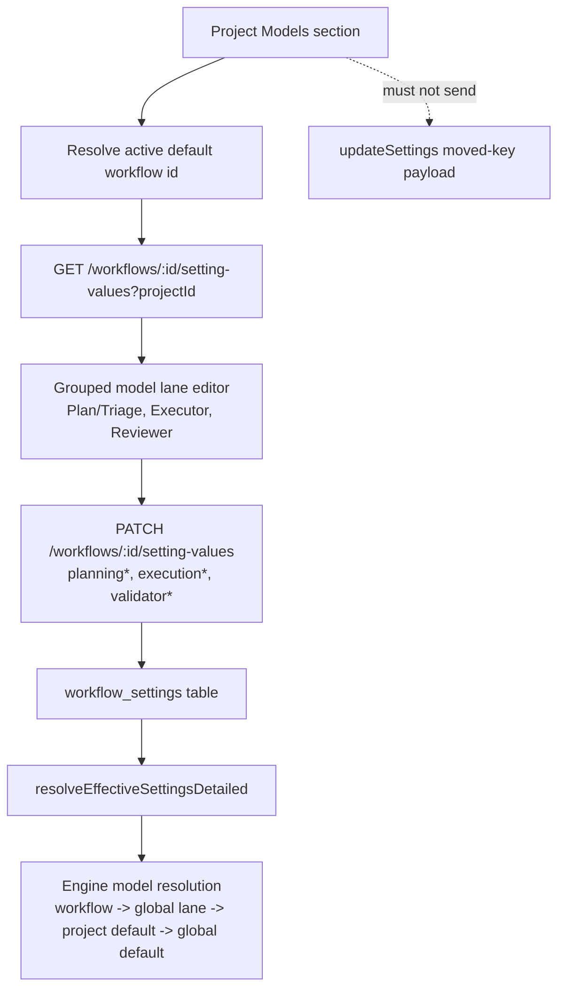

# feat: Simplify workflow settings and restore main settings model lanes

## Summary

Keep workflow setting values as the only persisted authority for moved workflow policy, but make the common path usable again from Settings. Main project settings should expose Plan/Triage, Executor, and Reviewer model selectors by proxy-editing the active default workflow's model-lane values. The workflow editor should stop leading with schema mechanics for normal users and instead present grouped value sections with an advanced definitions area.

---

## Problem Frame

The workflow settings hard move solved the source-of-truth problem: per-phase model lanes and workflow execution policy no longer live as ambient project settings. The resulting UX is too expensive for the most common task. A user who only wants to set the model used for planning/triage, execution, or review now has to leave Settings, open the workflow editor, understand definitions vs values, and find raw setting ids among unrelated workflow policy knobs.

The fix is not to reintroduce the old project settings keys. Those keys are intentionally tombstoned in `packages/core/src/moved-settings.ts`, and stale writes are stripped before persistence. The fix is to add a first-class proxy surface in Settings for the active project's default workflow values, while making the workflow settings panel itself grouped, value-first, and less schema-editor-shaped.

---

## Requirements

**Main Settings Model Lanes**

- R1. The Project Models section exposes three project-level workflow model lanes: Plan/Triage, Executor, and Reviewer.
- R2. Saving those controls writes workflow setting values for the active project's default workflow, never the tombstoned project settings keys.
- R3. The selectors preserve the current model picker affordances: provider/model choices, favorites, loading/empty states, reset-to-inherit, and visible inherited/customized state.
- R4. When no active project or default workflow is available, the controls render a clear disabled state and do not write.

**Workflow Settings Usability**

- R5. Workflow settings values are grouped by user intent: Models, Review & Approval, Step Execution, and Advanced.
- R6. For built-in workflows, the panel opens to grouped Values by default and hides Definitions behind a read-only Advanced area.
- R7. For custom workflows, declaration editing remains available, but normal value editing stays the primary surface.
- R8. Moved-setting redirect stubs in Settings are replaced or narrowed so users are not sent away for the model-lane case.

**Authority and Compatibility**

- R9. `MOVED_SETTINGS_KEYS` remains the persistence boundary; no moved key is restored to `DEFAULT_PROJECT_SETTINGS`, settings export project payloads, sync diffs, or CLI `settings set`.
- R10. Engine model resolution remains unchanged: workflow lane value -> global lane -> project default -> global default.

---

## Scope Boundaries

### In scope

- Project Models UI for Plan/Triage, Executor, and Reviewer model lanes, backed by workflow setting-value endpoints.
- A reusable grouped workflow-setting value editor shared between `ProjectModelsSection` and `WorkflowSettingsPanel`.
- Narrow copy and navigation changes for moved-setting stubs.
- Focused tests for proxy writes, grouped rendering, and persistence-boundary regressions.

### Deferred

- Full workflow setting sync across nodes. The existing "workflow settings are not synced yet" stance remains.
- Per-task workflow setting overrides.
- New model-lane types or engine resolution changes.
- Reworking workflow declaration schema.

### Out of scope

- Re-adding `executionProvider`, `planningProvider`, `validatorProvider`, or related moved keys to project settings.
- Changing task-level model override behavior in `TaskForm`.
- Moving merge trait or capacity settings into this follow-up.

---

## Key Technical Decisions

- KTD-1 — **Proxy-edit default workflow values from Settings.** The Project Models section reads the active default workflow id, calls `fetchWorkflowSettingValues(workflowId, projectId)`, and saves patches through `updateWorkflowSettingValues`. This keeps the source of truth in `workflow_settings` while restoring the main Settings workflow users expect.

- KTD-2 — **Use user-facing lane names, not storage names.** Settings labels should be Plan/Triage, Executor, and Reviewer. They map to `planningProvider`/`planningModelId`, `executionProvider`/`executionModelId`, and `validatorProvider`/`validatorModelId`. The existing engine still calls the reviewer lane `validator`; the UI should not expose that implementation vocabulary as the primary label.

- KTD-3 — **Grouped values are display metadata, not IR schema.** Add dashboard-side grouping metadata for known workflow settings rather than expanding `WorkflowSettingDefinition` immediately. Custom or unknown settings fall into Advanced. This avoids a schema change for a UX-only regrouping.

- KTD-4 — **One reusable value editor.** Extract the Values-tab row rendering from `WorkflowSettingsPanel.tsx` into a reusable component that can render a filtered set of workflow settings. `ProjectModelsSection` uses it in model-lane mode; `WorkflowSettingsPanel` uses it for all grouped sections.

- KTD-5 — **Keep save authorities separate.** Settings modal project/global saves continue through `updateSettings` / `updateGlobalSettings`. Workflow model-lane saves happen through a dedicated workflow-values save path. The UI may place them on the same screen, but the payloads must not be fused.

---

## High-Level Technical Design

The Settings modal remains a shell over multiple authorities. Its regular Save button can either save normal project settings and workflow lane values in one user action with two API calls, or the lane group can have its own inline "Save workflow models" action. Implementation should choose the smaller UI change after checking the current dirty-state model in `SettingsModal.tsx`; the invariant is that moved model keys never enter the project settings payload.

---

## Implementation Units

### U1. Workflow setting display metadata and grouped value editor

- **Goal:** Create the reusable display and editing primitives needed by both Settings and the workflow editor.
- **Requirements:** R3, R5, R6, R7
- **Files:** `packages/dashboard/app/components/workflow-setting-display.ts` (new), `packages/dashboard/app/components/WorkflowSettingValueEditor.tsx` (new), `packages/dashboard/app/components/WorkflowSettingValueEditor.css` (new), `packages/dashboard/app/components/WorkflowSettingsPanel.tsx`, `packages/dashboard/app/components/__tests__/WorkflowSettingsPanel.test.tsx`
- **Approach:** Add a dashboard-side catalog mapping known ids to group, label, description, and lane pair metadata. Extract the current Values-tab row logic into `WorkflowSettingValueEditor`, accepting declarations, stored/effective values, orphaned values, allowed ids/group filter, project stale state, and save callback. Unknown declarations render under Advanced.
- **Test scenarios:**
  - Built-in workflow values render grouped as Models, Review & Approval, Step Execution, Advanced.
  - Plan/Triage, Executor, and Reviewer labels appear instead of raw planning/execution/validator storage names.
  - Unknown custom setting renders in Advanced.
  - Orphaned values still render in the disclosure and delete through a null patch.
  - Built-in workflow opens to Values by default; Definitions remains read-only and secondary.

### U2. Main Settings proxy model lanes for the default workflow

- **Goal:** Let users set Plan/Triage, Executor, and Reviewer models from Project Models without restoring project setting keys.
- **Requirements:** R1, R2, R3, R4, R8, R9
- **Files:** `packages/dashboard/app/components/settings/sections/ProjectModelsSection.tsx`, `packages/dashboard/app/components/SettingsModal.tsx`, `packages/dashboard/app/components/__tests__/SettingsModal.test.tsx`, `packages/dashboard/app/components/__tests__/SettingsModalNodeRouting.test.tsx`
- **Approach:** Resolve the active project's default workflow id from the project settings already loaded in the modal, defaulting to `builtin:coding` when unset, matching `workflow-settings-resolver.ts`. Load workflow setting values for that id and render only model lane pairs. Reset clears the stored workflow value via null patch. Keep the project default model lane in the existing project-settings save path.
- **Test scenarios:**
  - Project Models renders Plan/Triage, Executor, and Reviewer lane controls when a project is active.
  - Editing Plan/Triage writes `planningProvider` and `planningModelId` through `updateWorkflowSettingValues`, not `updateSettings`.
  - Editing Executor writes `executionProvider` and `executionModelId`.
  - Editing Reviewer writes `validatorProvider` and `validatorModelId`.
  - Reset sends nulls for the relevant workflow setting ids.
  - No active project disables workflow model controls and makes no API call.
  - Normal Project Default Model still saves through `updateSettings`.

### U3. Save-flow and error handling integration

- **Goal:** Make mixed project-settings and workflow-values edits feel coherent without blurring persistence boundaries.
- **Requirements:** R2, R3, R9
- **Files:** `packages/dashboard/app/components/SettingsModal.tsx`, `packages/dashboard/app/components/settings/save-split.ts`, `packages/dashboard/app/__tests__/settings-save-split.test.ts`, `packages/dashboard/app/components/__tests__/SettingsModal.test.tsx`
- **Approach:** Keep `splitSettingsSave` focused on actual settings keys. Add a separate workflow-values dirty state in `SettingsModal`. If the global Save button covers both authorities, run the normal settings save and workflow-values save as separate calls and report partial failures with section-local errors. If the workflow lane group uses its own save button, keep the global dirty state untouched by workflow lane edits.
- **Test scenarios:**
  - A workflow lane edit never appears in `splitSettingsSave` output.
  - A combined save issues separate `updateSettings` and `updateWorkflowSettingValues` calls when both authorities are dirty.
  - A workflow value rejection renders on the lane row and does not discard pending edits.
  - A project settings save failure does not falsely report workflow lane values as saved.

### U4. Narrow moved-setting stubs and workflow editor entry points

- **Goal:** Stop sending users away from Settings for the model-lane case while keeping workflow-owned policy discoverable.
- **Requirements:** R5, R8
- **Files:** `packages/dashboard/app/components/settings/sections/ProjectModelsSection.tsx`, `packages/dashboard/app/components/settings/sections/MergeSection.tsx`, `packages/dashboard/app/components/settings/sections/SchedulingSection.tsx`, `packages/dashboard/app/components/settings/sections/MovedSettingsStub.tsx`, `packages/dashboard/app/components/__tests__/SettingsModal.test.tsx`
- **Approach:** Replace the Project Models moved stub with the proxy model controls. Keep or narrow stubs for step execution and review/approval settings that remain workflow-editor-only. Update stub copy to say "Advanced workflow policy" instead of implying all per-phase model lanes require leaving Settings.
- **Test scenarios:**
  - Project Models no longer renders the generic "Open workflow settings" stub for per-phase model lanes.
  - Merge/Scheduling still do not render moved setting inputs such as `verificationFixRetries`.
  - Stub button still opens the workflow editor for advanced workflow policy.

### U5. Documentation and permanent boundary tests

- **Goal:** Document the simplified mental model and guard against accidental project-key resurrection.
- **Requirements:** R9, R10
- **Files:** `docs/settings-reference.md`, `docs/dashboard-guide.md`, `packages/core/src/__tests__/settings-parity.test.ts`, `packages/core/src/__tests__/settings-consistency.test.ts`, `packages/dashboard/app/__tests__/settings-sections.test.tsx`
- **Approach:** Update docs to state that Settings can edit default-workflow model lanes, while workflow settings remain the source of truth. Extend parity tests to assert moved model-lane keys are absent from project/global schema lists and present in built-in workflow declarations. Add a UI section test that Project Models contains the proxy lane surface.
- **Test scenarios:**
  - `executionProvider`, `planningProvider`, and `validatorProvider` remain absent from `PROJECT_SETTINGS_KEYS`.
  - Built-in workflow declarations still include all proxy-edited model lane ids.
  - Settings section inventory includes Project Models proxy controls and no stale moved-key stub for model lanes.

---

## Acceptance Examples

- AE1. Given an active project using the default built-in workflow, when a user sets Plan/Triage to `openai/gpt-5` from Project Models and saves, then `workflow_settings` stores `planningProvider: "openai"` and `planningModelId: "gpt-5"` for `(builtin:coding, projectId)`, and the project settings payload contains neither key.
- AE2. Given a project with a custom default workflow, when a user sets Executor from Project Models, then the value is written for that custom workflow id, not globally for every workflow.
- AE3. Given no project is selected, when Settings opens Project Models, then workflow model lane controls are disabled and no workflow setting-value request is sent.
- AE4. Given a built-in workflow is opened in the workflow editor, when the Settings panel opens, then grouped Values are primary and Definitions are read-only secondary details.

---

## Risks & Dependencies

- **Default workflow ambiguity:** Settings must resolve the same default workflow id as the engine, including unset defaults falling back to `builtin:coding`. Reuse the resolver's normalization behavior in tests.
- **Two-authority save UX:** A shared Save button can create partial-success states. Keep errors section-local and avoid mutating the project settings payload with workflow keys.
- **Terminology drift:** Reviewer maps to `validator*` internally. Tests should assert the user-facing label so the UI does not regress back to storage vocabulary.

---

## Sources

- Prior workflow settings hard move: `docs/plans/2026-06-04-002-feat-workflow-settings-mechanism-plan.md`
- Workflow setting value authority: `packages/core/src/workflow-settings.ts`, `packages/core/src/store.ts`
- Effective settings resolver and engine merge semantics: `packages/core/src/workflow-settings-resolver.ts`
- Built-in moved setting declarations: `packages/core/src/builtin-workflow-settings.ts`
- Tombstone boundary: `packages/core/src/moved-settings.ts`
- Current workflow settings UI: `packages/dashboard/app/components/WorkflowSettingsPanel.tsx`
- Current Project Models section and moved stub: `packages/dashboard/app/components/settings/sections/ProjectModelsSection.tsx`, `packages/dashboard/app/components/settings/sections/MovedSettingsStub.tsx`
