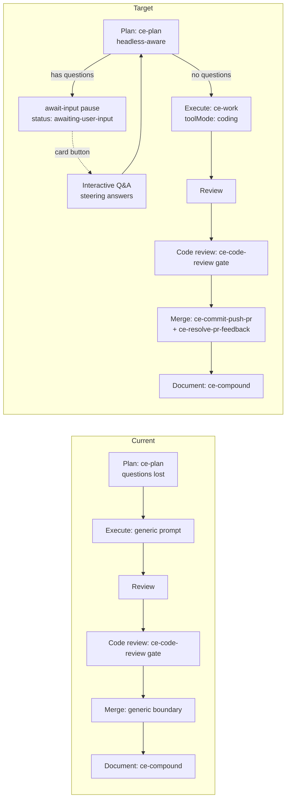
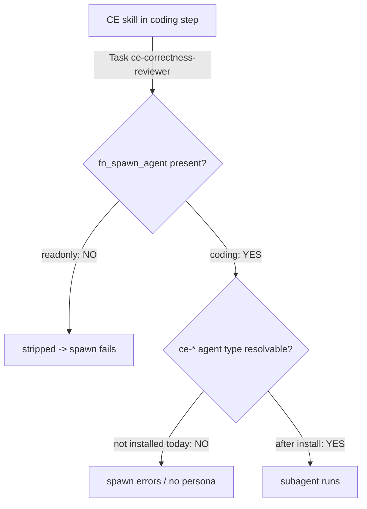

# feat: Make the compound-engineering built-in workflow actually run the CE way

## Summary

The built-in `compound-engineering` workflow (`packages/core/src/builtin-workflows.ts:153-193`) *looks* like compound engineering — Plan → Execute → Review → Code-review → Merge → Document — but on autonomous board runs it doesn't deliver the CE experience:

1. **Planning questions never reach a human.** The Plan step invokes `ce-plan`, which asks clarifying questions through a blocking tool (`AskUserQuestion`). Workflow steps run as ephemeral, headless sessions with no `actionGateContext` (`packages/engine/src/executor.ts` `executeWorkflowStep` ~11698-11915; ephemeral gate skip at `packages/engine/src/pi.ts:1768-1772`), so the call has no listener — questions are silently lost.
2. **Implementation isn't done the CE way.** The Execute node uses the generic `builtinPromptConfig("execute")` instead of the `compound-engineering:ce-work` skill.
3. **Merge isn't done the CE way.** The Merge node is a generic `builtinPromptConfig("merge")` boundary; it does not use CE's commit / push-PR / resolve-PR-feedback flows.
4. **Subagents don't work inside workflow steps.** The CE skills fan out to subagents (`ce-repo-research-analyst`, the `ce-*-reviewer` personas, parallel `ce-work` executors). Readonly workflow steps strip `fn_spawn_agent` entirely (`packages/engine/src/workflow-step-tool-policy.ts`), and even in `coding` mode the `ce-*` subagent **types are not installed anywhere Fusion can resolve** — the plugin bundles skills but **no agent definitions**.
5. **Three CE skills are missing.** `ce-commit`, `ce-commit-push-pr`, and `ce-resolve-pr-feedback` are referenced by the bundled skills but are **not bundled** in `.fusion-ce-skills/`.

This plan fixes all five so the workflow genuinely leverages compound engineering end-to-end, with a human-in-the-loop affordance for planning questions surfaced as a **button on the task card** that launches an interactive Q&A session.

**Target repo:** this repo (kb / Fusion). All paths repo-relative.

---

## Problem Frame

`ce-plan`, `ce-work`, and `ce-code-review` were authored for an *interactive* Claude Code session where (a) a human is present to answer blocking questions and (b) the `Agent`/`Task` subagent primitive resolves a rich registry of `ce-*` agent types. Fusion runs them in the opposite environment: an **autonomous, ephemeral, readonly-by-default** workflow-step session with **no human attached** and **no `ce-*` agent registry**. The result is a workflow that name-drops compound engineering at each stage but executes a degraded version of it.

The fix has four threads:
- **Signal** the autonomous/headless context to the skills so they adapt instead of calling dead tools.
- **Enable subagents** inside CE steps (spawn tool + resolvable `ce-*` agent types).
- **Rewire the workflow nodes** to invoke the right CE skills at execute and merge, and to pause for planning questions.
- **Surface planning questions to a human** via a task-card button and interactive answering, then resume.

---

## Requirements

- **R1** — The Execute node runs `compound-engineering:ce-work` in coding mode, not the generic execute prompt.
- **R2** — The Merge stage runs CE's commit / push-PR flow, and PR-feedback resolution is available as a CE-driven step.
- **R3** — On an autonomous board run, when `ce-plan` has clarifying questions, the task **pauses** with the questions surfaced; a **button on the task card** lets a user open an interactive session to answer them; answers feed back and planning resumes.
- **R4** — When genuinely headless (no human, e.g. LFG/pipeline), `ce-plan` degrades honestly: it records assumptions and proceeds rather than blocking or losing questions.
- **R5** — Subagents spawned by CE skills (research, reviewer personas, parallel executors) **resolve and run** inside CE workflow steps, or degrade to a documented single-agent fallback when they cannot.
- **R6** — `ce-commit`, `ce-commit-push-pr`, and `ce-resolve-pr-feedback` are bundled and installed by the plugin.
- **R7** — All existing `builtin-workflows` tests pass; new behavior is covered by tests.

---

## Key Technical Decisions

- **KTD-1 — Headless signal via env var on the workflow-step session.** No context flag reaches the skill text today; the only env injected is `FUSION_NODE_PROMPT` (`executor.ts` ~5942/5979). Add a `FUSION_WORKFLOW_STEP=1` (and, when no interactive surface exists, `FUSION_HEADLESS=1`) env var to the workflow-step session's `taskEnv` (built ~`executor.ts:6808-6812`, threaded into `createResolvedAgentSession` ~11857). The CE skills read this to choose the interactive-vs-headless branch they already describe ("LFG or any `disable-model-invocation` context"). *Rationale:* smallest reliable contract; env is already plumbed; skills already have headless branches that just lack a trigger.

- **KTD-2 — Planning questions use the existing await-input machinery, not a new tool.** Fusion already pauses tasks for input: `runAwaitInputNode` sets `status: "awaiting-user-input"` + `pausedReason: "workflow-input:{nodeId}@{ts}: {question}"`, and resume consumes the newest steering comment as the answer (`executor.ts:5442-5496`; submit route `register-workflow-routes.ts:580-599`; UI `WorkflowResultsTab.tsx:65-944`). `ce-plan` in workflow context emits its questions into this channel; the workflow parks the task; the card button + interactive session capture answers as steering comments; the executor resumes `ce-plan` with the answers available. *Rationale:* reuse the proven pause/resume path instead of inventing a parallel one.

- **KTD-3 — The task-card button launches the existing chat-steering surface, scoped to the questions.** Live steering already exists (FN-6338): `addSteeringComment` → `POST /tasks/:id/steer`, `TaskChatTab` with `sessionLive`, `isActiveAgentSession()`. The new button (on `TaskCard.tsx` `card-header-actions` ~2025-2102, shown when `status === "awaiting-user-input"` with a planning marker) deep-links into the task's chat/Q&A surface. *Rationale:* the user asked specifically for a card button + interactive answer session; the steering plumbing already carries answers back.

- **KTD-4 — Install `ce-*` agent definitions the same way skills are installed.** The plugin installs bundled skills via `installBundledCeSkills()` (`src/index.ts:111-131`, `src/skill-installation.ts`). Add a parallel `installBundledCeAgents()` that installs bundled `ce-*` agent definitions into a location Fusion's subagent resolver discovers. The exact resolver path is unverified (see Risk-1 / U2) and must be confirmed before this is wired. *Rationale:* mirror the working skill-install pattern; keep agents versioned with the plugin.

- **KTD-5 — CE steps run in `coding` toolMode where they must spawn or write.** `toolMode` is read from node config (`executor.ts:5969`, default readonly). Execute (ce-work) and the merge/PR steps get `toolMode: "coding"` so `fn_spawn_agent` and write tools are present. Plan/review stay readonly unless subagent fan-out is required there too (then coding). *Rationale:* readonly strips the spawn + write tools the CE skills need.

- **KTD-6 — CE commit/PR flow must coexist with Fusion's workflow-owned merge.** Fusion has its own merge machinery (the `workflow-owned-merge-*` line of work). The CE merge step prepares the commit + PR (and resolves feedback) but must **not** double-drive the actual board merge transition. Define the boundary: CE step owns commit/push/PR-creation/feedback-resolution; Fusion owns the board-state merge. *Rationale:* avoid two systems racing the same git/branch state. (See Risk-3.)

---

## High-Level Technical Design

### Current vs. target workflow shape



### Planning-question pause/resume (reusing await-input)

```mermaid
sequenceDiagram
  participant W as Workflow executor
  participant CP as ce-plan (step session)
  participant T as Task store
  participant U as User (dashboard)
  W->>CP: run Plan step (FUSION_WORKFLOW_STEP=1)
  CP->>CP: detect non-interactive; gather clarifying questions
  CP-->>W: emit questions (await-input marker)
  W->>T: status=awaiting-user-input, pausedReason=workflow-input:plan@ts: Qs
  U->>T: clicks "Answer planning questions" on card
  U->>T: interactive answers -> steering comments
  U->>W: submit & resume
  W->>CP: resume; consume steering answers (watermark)
  CP-->>W: write plan with answers; continue to Execute
```

### Subagent enablement (the load-bearing gap)



---

## Output Structure (new/changed surfaces)

```
packages/
  core/src/builtin-workflows.ts                      # rewire execute/merge/plan nodes
  core/src/__tests__/builtin-workflows.test.ts       # updated assertions
  engine/src/executor.ts                             # headless env signal; plan await-input wiring
  engine/src/workflow-step-tool-policy.ts            # confirm coding-mode spawn allowance
dashboard/
  app/components/TaskCard.tsx                         # "Answer planning questions" button
  app/components/WorkflowResultsTab.tsx (or TaskChatTab) # planning Q&A render/capture
plugins/fusion-plugin-compound-engineering/
  .fusion-ce-skills/ce-commit/SKILL.md               # NEW (bundled)
  .fusion-ce-skills/ce-commit-push-pr/SKILL.md        # NEW (bundled)
  .fusion-ce-skills/ce-resolve-pr-feedback/SKILL.md   # NEW (bundled)
  .fusion-ce-agents/ce-*.md                           # NEW (bundled agent defs)
  src/agent-installation.ts                           # NEW installBundledCeAgents()
  src/index.ts                                         # install agents on load
  .fusion-ce-skills/ce-plan/SKILL.md                  # headless/await-input branch
```

---

## Implementation Units

### U1. Inject a headless/workflow-step signal into step sessions
- **Goal:** Give skills a reliable way to detect they're running in a Fusion autonomous workflow step with no interactive user.
- **Requirements:** R3, R4
- **Dependencies:** none
- **Files:** `packages/engine/src/executor.ts` (taskEnv build ~6808-6812 and `executeWorkflowStep` ~11833-11861); test in `packages/engine/src/__tests__/` (mirror existing executor tests).
- **Approach:** Set `FUSION_WORKFLOW_STEP=1` on every workflow-step session env. Additionally set `FUSION_HEADLESS=1` when the run has no interactive/steering surface (i.e. autonomous board execution, LFG/pipeline). Keep the variable names stable — they become the contract the skills read.
- **Patterns to follow:** existing `FUSION_NODE_PROMPT` injection (~5942/5979) and `taskEnv` assembly.
- **Test scenarios:**
  - Happy path: a workflow-step session is created with `FUSION_WORKFLOW_STEP=1` in its env.
  - Headless: autonomous run sets `FUSION_HEADLESS=1`; an interactive/steered run does not.
  - Edge: env var does not leak into the user's interactive chat sessions (non-workflow paths).
- **Verification:** new env keys present on step sessions; absent on interactive sessions.

### U2. Verify and wire `ce-*` subagent-type resolution
- **Goal:** Make CE-spawned subagent types actually resolve inside Fusion sessions — or prove they can't and document the fallback.
- **Requirements:** R5
- **Dependencies:** none (spike first)
- **Files:** `packages/engine/src/pi.ts` (~1930-2042 readonly/extension handling, spawn-agent path), agent/subagent resolution code (search `fn_spawn_agent`, `subagent_type`, agent registry); findings recorded in this plan's Risk section.
- **Approach:** **Spike first** — trace exactly how `fn_spawn_agent` resolves a `subagent_type` string to an agent definition in a Fusion-spawned session. Determine whether a bundled-on-disk agent definition (`.claude/agents`-style or plugin-registered) is discoverable. Output: a definitive answer + the install target path that U3/KTD-4 needs. If no resolver exists, the unit's deliverable becomes the minimal resolver hook (or the documented single-agent fallback per R5).
- **Patterns to follow:** how skills are resolved (`skill-resolver.ts`) as the analogue for agent resolution.
- **Test scenarios:**
  - Spawn `subagent_type: "ce-correctness-reviewer"` from a coding-mode step resolves to the installed definition.
  - Unknown agent type degrades gracefully (documented error, not a crash).
  - Edge: readonly step has no spawn tool (asserts the negative).
- **Verification:** a coding-mode step can spawn a named `ce-*` agent and receive its output; gap (if any) is documented with the chosen fallback.

### U3. Bundle and install `ce-*` agent definitions in the plugin
- **Goal:** Ship the `ce-*` agent definitions with the plugin and install them where U2 determined they resolve.
- **Requirements:** R5
- **Dependencies:** U2
- **Files:** `plugins/fusion-plugin-compound-engineering/.fusion-ce-agents/*.md` (NEW), `plugins/fusion-plugin-compound-engineering/src/agent-installation.ts` (NEW, mirror `skill-installation.ts`), `plugins/fusion-plugin-compound-engineering/src/index.ts` (onLoad — call `installBundledCeAgents()` alongside `installBundledCeSkills()`), `src/skills.ts` analogue for agents.
- **Approach:** Mirror the skill-installation pattern: a bundled source dir, an installer that copies into the resolver's discovery location (from U2), an emitted `compound-engineering:agents-installed` event. Bundle the agent definitions the CE skills actually spawn (research: `ce-repo-research-analyst`, `ce-learnings-researcher`, `ce-best-practices-researcher`, `ce-framework-docs-researcher`, `ce-web-researcher`, `ce-spec-flow-analyzer`; review personas: `ce-correctness-reviewer`, `ce-maintainability-reviewer`, `ce-testing-reviewer`, `ce-project-standards-reviewer`, and the conditional reviewers; ship `ce-pr-comment-resolver` for U9).
- **Patterns to follow:** `src/skill-installation.ts`, `installBundledCeSkills()`, the onLoad block in `src/index.ts:111-131`.
- **Test scenarios:**
  - onLoad installs agent definitions; install result reports counts.
  - Re-install is idempotent (matches skill-install behavior).
  - Edge: missing/corrupt bundled agent file is skipped with a warning, not a throw.
- **Verification:** after plugin load, the agent definitions exist at the discovery path and U2's resolution test passes against them.

### U4. Swap the Execute node to `ce-work` (coding mode)
- **Goal:** Implementation runs the CE way.
- **Requirements:** R1
- **Dependencies:** U1 (headless signal so ce-work adapts); U2/U3 if ce-work's parallel executors must spawn.
- **Files:** `packages/core/src/builtin-workflows.ts:168`.
- **Approach:** Replace `{ id: "execute", kind: "prompt", config: builtinPromptConfig("execute", "Execute") }` with a skill-executor node mirroring the Plan node: `executor: "skill"`, `skillName: "compound-engineering:ce-work"`, `toolMode: "coding"`, and a short prompt ("Execute the plan, following existing patterns and maintaining quality"). Confirm `ce-work` is bundled (it is: `.fusion-ce-skills/ce-work/SKILL.md`).
- **Patterns to follow:** the Plan and Code-review skill node shapes (`builtin-workflows.ts:158-179`).
- **Test scenarios:**
  - `compileWorkflowToSteps` yields an Execute step whose compiled `toolMode === "coding"`.
  - The Execute step's prompt is wrapped with the `Invoke the "compound-engineering:ce-work" skill ...` preamble (executor.ts:5903-5904 path).
  - Step count/names for the workflow remain valid.
- **Verification:** updated `builtin-workflows.test.ts` asserts the ce-work execute step + coding mode.

### U5. Make `ce-plan` headless-aware and emit pending questions
- **Goal:** In a Fusion workflow step, `ce-plan` stops calling a dead blocking tool; it either records assumptions (fully headless) or emits clarifying questions into the await-input channel (human reachable via card button).
- **Requirements:** R3, R4
- **Dependencies:** U1
- **Files:** `plugins/fusion-plugin-compound-engineering/.fusion-ce-skills/ce-plan/SKILL.md` (Interaction Method + headless-mode branches it already documents), possibly a small reference file.
- **Approach:** Teach the skill's interaction section to read `FUSION_WORKFLOW_STEP` / `FUSION_HEADLESS`: when `FUSION_HEADLESS=1`, take the existing assumptions-writing path (no questions); when in a workflow step that *can* reach a human, emit the clarifying questions in the await-input format the executor consumes (KTD-2) rather than `AskUserQuestion`. Keep interactive Claude Code behavior unchanged.
- **Patterns to follow:** the skill's existing "Headless mode" routing and `references/synthesis-summary.md` headless sections.
- **Test scenarios:**
  - With `FUSION_HEADLESS=1`, the plan output contains an `## Assumptions` section and no blocking-tool call.
  - With `FUSION_WORKFLOW_STEP=1` (human reachable), unresolved blockers are emitted as await-input questions.
  - Interactive (neither var) path still uses `AskUserQuestion`.
  - `Test expectation:` skill-doc behavior is asserted via the executor integration test in U6, not a unit test of the markdown.
- **Verification:** running the Plan step headless produces assumptions; running it with a reachable human parks the task with questions.

### U6. Wire the Plan step's await-input pause/resume into the workflow
- **Goal:** When `ce-plan` emits questions, the workflow parks the task `awaiting-user-input` and resumes with the answers.
- **Requirements:** R3
- **Dependencies:** U5
- **Files:** `packages/core/src/builtin-workflows.ts` (Plan node / add an await-input gate keyed off the plan step), `packages/engine/src/executor.ts` (`runAwaitInputNode` reuse ~5442-5496; Plan-step output → await-input marker).
- **Approach:** After the Plan skill step, route emitted questions through the existing await-input marker (`workflow-input:plan@ts: ...`) so the proven pause/resume + steering-answer consumption applies. Prefer reusing `runAwaitInputNode` semantics over a bespoke pause. If `ce-plan` reports no questions, fall straight through to Execute.
- **Patterns to follow:** `runAwaitInputNode`, the submit/resume route `register-workflow-routes.ts:580-599`, watermark answer consumption.
- **Test scenarios:**
  - Plan emits questions → task status becomes `awaiting-user-input` with a parseable `pausedReason`.
  - A submitted answer (steering comment) resumes the plan step and is available to it.
  - No questions → no pause; Execute runs next.
  - Edge: resume with no new steering comment re-parks (matches `runAwaitInputNode`).
- **Verification:** executor integration test drives pause→answer→resume→continue.

### U7. Task-card "Answer planning questions" button + interactive Q&A
- **Goal:** A button on the task card lets the user open an interactive session to answer the pending planning questions.
- **Requirements:** R3
- **Dependencies:** U6
- **Files:** `packages/dashboard/app/components/TaskCard.tsx` (`card-header-actions` ~2025-2102), `packages/dashboard/app/components/WorkflowResultsTab.tsx` (question render/submit ~65-944) and/or `TaskChatTab.tsx` (steering surface), API client `packages/dashboard/app/api/legacy.ts` (reuse `addSteeringComment`/`submitTaskWorkflowInput`).
- **Approach:** Show the button when the task is `awaiting-user-input` with a planning marker. Clicking opens the task's Q&A surface (WorkflowResultsTab input banner, or the chat-steering tab) focused on the question; submitting posts a steering comment / workflow input and unpauses (existing routes). Keep it to the existing pause/answer plumbing — no new persistence model.
- **Patterns to follow:** Send-back menu button pattern (`TaskCard.tsx:2066-2096`), `parseWorkflowInputQuestion` + submit banner (`WorkflowResultsTab.tsx:914-944`), live-session detection (`isCliSessionLive`).
- **Test scenarios:**
  - Button renders only when status is `awaiting-user-input` with a planning marker; hidden otherwise.
  - Clicking surfaces the pending question(s).
  - Submitting an answer posts the steering/input request and unpauses the task.
  - Edge: multiple queued questions are answered in sequence (one-at-a-time, matching ce-plan's "ask one question at a time").
- **Verification:** component tests (mirror `TaskChatTab.test.tsx`) for render-gating and submit; manual board run shows the loop end-to-end.

### U8. Bundle `ce-commit`, `ce-commit-push-pr`, `ce-resolve-pr-feedback`
- **Goal:** Ship the three missing CE shipping skills with the plugin.
- **Requirements:** R6
- **Dependencies:** none (parallel to U1-U7)
- **Files:** `plugins/fusion-plugin-compound-engineering/.fusion-ce-skills/ce-commit/SKILL.md`, `.../ce-commit-push-pr/SKILL.md`, `.../ce-resolve-pr-feedback/SKILL.md` (NEW; source from the canonical CE skill set), `src/skills.ts` (register them in the bundled list), installer picks them up automatically.
- **Approach:** Add the three skill dirs to the bundled set and the `COMPOUND_ENGINEERING_SKILLS` manifest array (`src/index.ts:48-58`). Vendor the skill content from the upstream CE skill definitions, adapting the Interaction Method sections for the headless signal (KTD-1) like U5.
- **Patterns to follow:** existing bundled skill dirs and `src/skills.ts:16-79`, manifest registration `src/index.ts:48-58`.
- **Test scenarios:**
  - Plugin manifest lists the three new skills.
  - onLoad installs them; install count increases by 3.
  - `Test expectation: none` for the skill markdown content itself; covered by manifest/install assertions.
- **Verification:** the three skills are installed and discoverable after plugin load.

### U9. Rewire the Merge node to CE commit/push-PR + resolve-feedback
- **Goal:** The merge stage uses CE's commit/PR flow and offers PR-feedback resolution, without fighting Fusion's workflow-owned merge.
- **Requirements:** R2
- **Dependencies:** U8 (skills must exist), U2/U3 (resolve-feedback spawns `ce-pr-comment-resolver`), KTD-6 boundary.
- **Files:** `packages/core/src/builtin-workflows.ts:181` (merge node), possibly an added post-review step; check engine merge handling (`executor.ts` pre-merge/merge path) for the ownership boundary.
- **Approach:** Replace the generic merge boundary with a `compound-engineering:ce-commit-push-pr` skill step (coding mode) that commits, pushes, and opens the PR; add a `compound-engineering:ce-resolve-pr-feedback` step/gate for addressing review threads. Honor KTD-6: the CE step prepares git/PR state; Fusion's machinery still owns the board-state merge transition. Document the division explicitly in the node config/comments.
- **Patterns to follow:** Code-review gate node shape (`builtin-workflows.ts:170-179`); Fusion merge handling in `executor.ts`.
- **Test scenarios:**
  - `compileWorkflowToSteps` includes a `ce-commit-push-pr` merge step (coding mode) and a `ce-resolve-pr-feedback` step.
  - The CE merge step does not duplicate Fusion's board merge transition (boundary asserted).
  - Step ordering: review → code-review gate → commit/push-PR → resolve-feedback → document.
- **Verification:** updated workflow test asserts the new merge-stage steps and ordering.

### U10. Update built-in workflow tests
- **Goal:** Lock in the new node wiring and gating.
- **Requirements:** R7
- **Dependencies:** U4, U6, U9
- **Files:** `packages/core/src/__tests__/builtin-workflows.test.ts`.
- **Approach:** Extend the existing compound-engineering tests (compile-to-steps ~268-274; plugin gating ~314-333) to assert: ce-work execute step + `toolMode: "coding"`; the plan await-input pause path compiles; the merge stage contains the ce-commit-push-pr + ce-resolve-pr-feedback steps; plugin gating still holds.
- **Patterns to follow:** existing assertions in the same file.
- **Test scenarios:**
  - Execute step name/skill/toolMode.
  - Merge-stage steps present and ordered.
  - Workflow still hidden without plugin, shown with plugin.
  - Plan step compiles with the await-input branch.
- **Verification:** `pnpm --filter @fusion/core test builtin-workflows` green.

---

## Scope Boundaries

**In scope:** the five fixes above for the `builtin:compound-engineering` workflow; the headless signal; subagent enablement; bundling the three shipping skills; the task-card planning-question button and its interactive answer loop.

### Deferred to Follow-Up Work
- Applying the headless signal / subagent enablement to the *other* built-in workflows (`builtin:coding`, `builtin:stepwise-coding`).
- A general plugin-provided **agent-definition registry** API (this plan installs CE agents via a focused installer; a generic plugin-agents contribution surface is larger).
- Evidence-capture / demo-reel integration in the PR flow (`ce-demo-reel`).
- HTML/Proof handoff for plans generated inside Fusion.

### Out of scope
- Redesigning Fusion's workflow engine, the await-input mechanism, or the workflow-owned-merge system itself.
- Changing interactive Claude Code behavior of the CE skills.

---

## Risks & Dependencies

- **Risk-1 (high) — Subagent type resolution may not exist in Fusion's spawn path.** Research indicates `fn_spawn_agent` is present in coding mode but found **no discovery mechanism** that resolves `ce-*` `subagent_type` strings to definitions. **Mitigation:** U2 is a spike that must resolve this before U3/U9 are wired; if no resolver exists, deliver the minimal resolver hook or fall back to single-agent CE behavior (R5) and document it. *This is the largest uncertainty in the plan.*
- **Risk-2 (med) — Readonly default silently degrades CE steps.** Any CE step needing spawn/write must set `toolMode: "coding"` or it loses tools with no error. **Mitigation:** KTD-5; tests assert compiled `toolMode`.
- **Risk-3 (med) — CE PR flow vs. Fusion workflow-owned merge collision.** Two systems touching branch/PR/merge state can race. **Mitigation:** KTD-6 boundary; verify against the engine merge path before U9; keep CE to commit/push/PR-creation/feedback and leave the board merge transition to Fusion.
- **Risk-4 (low) — Question loop UX.** One-at-a-time questions over the steering channel could feel clunky for multi-question plans. **Mitigation:** sequence questions; reuse the existing input banner; keep ce-plan's "ask one question at a time" discipline.
- **Dependency:** the three new shipping skills (U8) must be vendored from the canonical CE skill set with headless adaptation.

---

## Verification Strategy

- Unit/integration tests per unit (above), centered on `builtin-workflows.test.ts` and executor pause/resume tests.
- A manual autonomous board run of the compound-engineering workflow on a real task: confirm (1) ce-work executes, (2) planning questions appear on the card and the button opens the Q&A, answers resume planning, (3) merge produces a commit + PR and surfaces feedback resolution, (4) subagents either run or fall back as documented.
- `pnpm` typecheck + the affected package test suites green before PR.

---

## Sources & Research

- Workflow definition + skill node shapes: `packages/core/src/builtin-workflows.ts:153-193`; `builtinPromptConfig` at `packages/core/src/builtin-workflow-prompts.ts:23-25`.
- Skill-executor wrapping + WorkflowStep build: `packages/engine/src/executor.ts:5903-5904`, `:5959-5975`, `executeWorkflowStep` ~11698-11915.
- Readonly tool policy: `packages/engine/src/workflow-step-tool-policy.ts`; mutation tools `packages/engine/src/gating-classifications.ts:48-52`; readonly extension exclusion `packages/engine/src/pi.ts:1930-2042`, ephemeral gate skip `:1768-1772`.
- Await-input pause/resume: `packages/engine/src/executor.ts:5442-5496`; submit route `packages/dashboard/src/routes/register-workflow-routes.ts:580-599`; UI `packages/dashboard/app/components/WorkflowResultsTab.tsx:65-944`.
- Steering / live sessions (FN-6338): `packages/dashboard/app/components/TaskChatTab.tsx`, `TaskDetailModal.tsx`, `app/api/legacy.ts` (`addSteeringComment` ~1509), `register-task-workflow-routes.ts:2720-2752`.
- Plugin install: `plugins/fusion-plugin-compound-engineering/src/index.ts:48-143`, `src/skill-installation.ts`, `src/skills.ts:16-79`; bundled skills under `.fusion-ce-skills/` (7 today; ce-commit/-push-pr/-resolve-pr-feedback absent).
- Tests: `packages/core/src/__tests__/builtin-workflows.test.ts:239-333`.
