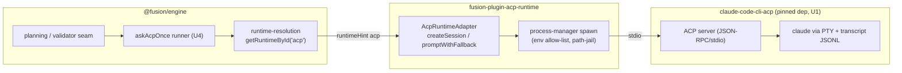
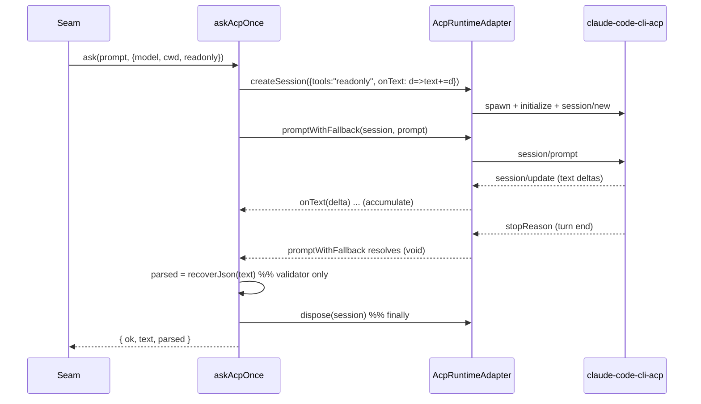

# feat: Route Claude through the ACP runtime + `claude-code-cli-acp` bridge (replace `claude -p`)

## Summary

Fusion invokes Claude through `claude -p` on **two independent routes**, and both must move off `-p` onto the **already-shipped** `fusion-plugin-acp-runtime` (runtimeId `acp`) pointed at the external **`claude-code-cli-acp`** bridge — a Rust ACP server that drives the real interactive `claude` through a PTY and reads the transcript JSONL, exposing it over JSON-RPC/stdio:

- **Route A — the `pi-claude-cli` provider (PRIMARY, highest traffic).** A vendored pi provider (`@fusion/pi-claude-cli`) registered whenever `useClaudeCli` is on. Selecting it as the model/provider makes *every* AI lane — chat, executor, validator, reviewer, **workflow `model` nodes**, title summarization, reflection, merger — spawn `claude -p --input-format stream-json --output-format stream-json --mcp-config …` (`packages/pi-claude-cli/src/process-manager.ts:37-101`). This is the bulk of real `-p` traffic and is **MCP-tool-bearing** (Fusion injects its tools).
- **Route B — the one-shot seams (planning, validator).** `runOneShotSession` launches `claude -p` and scrapes a `--output-format json` frame for `PlanningResponse` / `ValidatorVerdict`. These are dependency-injected seams with **no production caller today**.

The bridge is pinned as a dependency of the ACP runtime plugin so it ships with Fusion. For Route B, a thin engine-side "ask once" runner drives a single ACP turn and returns the existing `{ ok, text, parsed }` shape so the rewires stay small. For Route A, the provider's `streamSimple` is re-pointed from `spawnClaude` to an ACP-bridge client.

**Success criterion: `-p` removal is mandatory, not best-effort.** Removing `claude -p` is the whole point — including for Route A, which is the *bulk* of `-p` traffic. So "leave the provider on `-p`" is **not** an acceptable outcome. If the Route A feasibility gates (U9 external MCP passthrough, U14 internal blockers) return no-go, the response is to **block the feature and sponsor the missing capability upstream** (bridge MCP passthrough and/or the ACP `mcpServers` forwarding), not to ship with Claude still on `-p`. Route B may still ship first as independent progress, but the feature is not "done" until Route A is off `-p` too.

**Scope is Claude only.** codex/droid/pi keep their existing `exec`/`--print` non-interactive forms (no ACP bridge exists for them); converting them is explicitly deferred.

---

## Problem Frame

**Why `-p` is being removed.** Per the request, Claude must be driven through an interactive PTY session, not `claude -p`. Investigation showed the cleanest way to get this without re-implementing PTY-spawn + transcript-tailing ourselves is to reuse the existing ACP runtime and an external bridge that already does exactly that PTY+transcript work and speaks ACP.

**Two independent `-p` routes — do not conflate them.** Investigation found Claude is spawned with `-p` from two unrelated code paths:

- **Route A — `pi-claude-cli` provider.** Provider id `"pi-claude-cli"` (`packages/pi-claude-cli/index.ts:27,217`), registered into the pi `ModelRegistry` by `registerExtensionProviders` (`packages/engine/src/pi.ts:1366-1422`) inside the shared `createFnAgent` session factory used by **all** lanes. When selected, `streamSimple` → `streamViaCli` → `spawnClaude` → `spawn("claude", ["-p", "--input-format","stream-json","--output-format","stream-json", …, "--mcp-config", …])` (`packages/pi-claude-cli/src/process-manager.ts:37-101`). Gated by `GlobalSettings.useClaudeCli` (`packages/core/src/types.ts:2993`) and surfaced/hidden in model pickers accordingly (`packages/dashboard/src/routes/register-model-routes.ts:140-174`). **This is the high-traffic route and the one the user means by "the claude cli model type used for workflow execution and anywhere else models are used."**
- **Route B — one-shot seams.** `runOneShotSession`/`runCliAgentValidation`/`runCliAgentPlanning` have **no production call site** — they are dependency-injection seams exercised only by tests; the CE orchestrator's `cli-agent` branch is explicitly "not yet wired." Replacing `-p` here = change each seam's injected runner + delete the Claude one-shot branches; there is no live `-p` traffic to cut over, and this plan does **not** make these lanes actually run in production (pre-existing TODO).

**The MCP-tool dependency (Route A's hard problem).** The `pi-claude-cli` provider injects Fusion's tools into Claude via `--mcp-config` and maps Claude↔pi tool names (`packages/pi-claude-cli/src/{mcp-config.ts,tool-mapping.ts}`). The ACP runtime opens sessions with **empty `mcpServers`** (MCP custom-tool forwarding was explicitly deferred in the ACP plugin — see `plugins/fusion-plugin-acp-runtime` scope and the ACP learning doc). Until ACP forwards MCP servers *and* the bridge passes them through to the underlying `claude`, routing Route A to the bridge would strip Fusion's tool-calling — almost certainly unacceptable for executor/workflow lanes. **This makes ACP MCP forwarding a prerequisite of Route A, not an optional extra (OQ1).**

**The core technical tension — prose vs structured JSON.** `claude -p --output-format json` returns a structured envelope (`{ type: "result", result, is_error }`); the validator parses it (`OneShotResult.parsed`). ACP delivers the assistant message as **streamed prose** via the `onText` callback; `promptWithFallback` resolves `void` and even the terminal `stopReason` is currently discarded by the adapter (`plugins/fusion-plugin-acp-runtime/src/runtime-adapter.ts:143`). So structured parsing must move caller-side: the "ask once" runner accumulates the prose, and the validator coaxes a trailing JSON object out of the model and recovers it.

**The bridge is young.** `claude-code-cli-acp` is v0.1.1 (Apache-2.0, 11 stars, 2 releases). It is pinned at an exact version and isolated behind the existing ACP security floor (per-category permission gating, env allow-list, realpath path-jail). It still requires `claude` to be installed and authenticated separately.

---

## Requirements

**Shared foundation**
- **R2** — `claude-code-cli-acp` is pinned as a dependency of `fusion-plugin-acp-runtime`, resolved to an absolute path inside the plugin's own `node_modules` (never a PATH-resolved substitute), with integrity recorded against a source-reviewed pinned commit.
- **R3a** — A read-only ACP ask posture (fs OFF) is available for Route B turns.
- **R3b** — A tool-bearing ACP posture pinned to the bridge (the `acp-claude` runtime, KTD9) is available for the Route A provider, without altering the generic `acp` runtime's "any ACP agent" contract.
- **R8** — The bridge's absence/auth failure surfaces as a typed, actionable error (probe taxonomy), not a hang or opaque crash.
- **R16** — Every bridge subprocess env is built from an explicit allow-list (never inherited `process.env`); the Claude profile's allow-list is enumerated with per-entry justification (`HOME`, `PATH` in; `ANTHROPIC_API_KEY`/`ANTHROPIC_AUTH_TOKEN` deliberately out — `claude` uses its `~/.claude` session token).

**Route A — `pi-claude-cli` provider (primary)**
- **R9** — When `useClaudeCli` is on and Claude CLI is the selected provider, AI lanes (chat, executor, validator, reviewer, workflow `model` nodes, summarization) invoke Claude via the ACP bridge, not `claude -p`. Existing persisted `defaultProvider="pi-claude-cli"` selections continue to work (re-routed under the hood; no forced re-selection).
- **R10** — Fusion's MCP tools remain available to Claude over the ACP path (or the route is explicitly gated off until MCP forwarding lands — see OQ1). Tool-name mapping (Claude↔pi) is preserved.
- **R11** — Streaming fidelity is preserved: token/thinking/tool-call deltas reach the lane callbacks with tool-call argument integrity and start/end correlation intact (OQ3).
- **R12** — The picker/auth/status surface (`/auth/claude-cli`, `/providers/claude-cli/status`, `claude-cli-probe`, picker filtering) reflects the ACP-backed reality, with probe `detail` sanitized (no internal paths/OS error strings) before HTTP exposure.
- **R13** — Multi-turn lanes (chat, executor, workflow) preserve conversation context over ACP — via session resume or full-history prompts. No path sends the latest turn only without resume (OQ2).
- **R14** — Route A retains a config-only rollback to `claude -p`: `spawnClaude`/`buildClaudeSpawnArgs` stay behind a runtime kill-switch (not deleted) until the ACP provider path has soaked in production.
- **R15** — The validator never infers `pass` from prose on the ACP path, and an abnormal/truncated stop (`max_tokens`, `cancelled`) maps to `error`. The prose backstop may only ever yield `fail`/`blocked`/`error`.

**Route B — one-shot seams**
- **R1** — Claude planning/validator ask-paths no longer use `claude -p`; they route through the `acp` runtime driving `claude-code-cli-acp`.
- **R4** — A reusable engine-side "ask once" runner drives a single ACP turn and returns `{ ok, text, parsed }` (plus a typed failure on connection/turn error) so seam consumers change minimally and the validator's "never a silent pass" rule is preserved.
- **R5** — The planning seam (`runCliAgentPlanning`) produces a `PlanningResponse` from ACP prose with no contract change.
- **R6** — The validator seam (`runCliAgentValidation`) produces a `ValidatorVerdict` from ACP prose, keeping the `ValidatorVerdict` contract and never degrading an undecidable result to a silent pass.
- **R7** — The Claude-specific `-p` branches in the one-shot machinery and their tests are deleted; codex/droid/pi one-shot paths remain intact.

---

## High-Level Technical Design

The ask path crosses three processes. The engine resolves the `acp` runtime, which spawns the bridge subprocess, which in turn drives the real `claude` over a PTY.



One ask turn (the runner's control flow — directional, not implementation spec):



---

## Key Technical Decisions

- **KTD1 — Reuse the ACP runtime, do not bolt ACP onto the PTY `claude-code` adapter.** The cli-agent `CliAgentAdapter` contract is a PTY byte-stream (readiness detector, injection). ACP is JSON-RPC. The `acp` runtime (`AgentRuntime`) already models ACP correctly. "Have the Claude cli adapter use this" is satisfied by routing Claude through the ACP runtime, not by changing `claude-code.ts`.
- **KTD2 — Pin the bridge as a plugin dependency** (`claude-code-cli-acp@0.1.1` in `plugins/fusion-plugin-acp-runtime/package.json`), resolved to an absolute path from the plugin's `node_modules/.bin` so spawn never depends on global PATH. Chosen over user-installed-probe per the dependency decision; the probe/setup is still added (U3) for the `claude`-binary + auth preconditions the bridge itself needs.
- **KTD3 — Caller-side structured recovery.** The runner accumulates `onText` (the only channel for assistant text — established idiom: `packages/engine/src/evaluator.ts:151-165`). For the validator, the system prompt instructs Claude to end its turn with a single JSON object; the runner recovers it via the existing `extractJsonObjects` (`packages/engine/src/cli-agent/one-shot-session.ts:189`) into `parsed`, so `mapParsedToVerdict` works unchanged off `verdict`/`passed`/`blocked`. The claude-`-p`-specific `is_error` tier becomes dead and is removed.
- **KTD4 — Read-only ask posture.** Ask turns set `tools: "readonly"` and leave fs capabilities OFF (the ACP defaults), so the bridge never trips a gated permission category and no `actionGateContext` is required. This matches the existing read-only posture of validator/planning one-shots.
- **KTD5 — Keep the `OneShotResult` machinery for codex/droid/pi.** Only the `claude-code` branches are deleted (`buildOneShotSettings` lines 67-69, `parseOneShotOutput` lines 139-148). The generic runner and other adapters' non-interactive forms survive.
- **KTD6 — Surface `stopReason` from the adapter (required for the validator path).** `promptWithFallback` returns `void` and discards the SDK `stopReason` (`runtime-adapter.ts:143`; `promptAcpSession` does return it at `provider.ts:374`). Surfacing it is an `AgentRuntime` interface change (a new optional return/callback on `promptWithFallback`, consumed engine-side) — a real cost, but **justified and required for U6**: without it a `max_tokens` truncation that leaves a parseable trailing `{...}` passes silently, violating the validator's cardinal rule (R15). It stays *optional* for U5 (planning tolerates prose). The "JSON-presence-only" fallback is explicitly **rejected for the validator** — it's the exact gap that breaks no-silent-pass.
- **KTD7 — Route A re-points the provider internally; keep the `pi-claude-cli` provider key.** The smallest-blast option is to leave the provider id `"pi-claude-cli"` and `useClaudeCli` semantics intact and replace `spawnClaude`'s NDJSON subprocess inside `@fusion/pi-claude-cli` with an ACP-bridge client — so persisted selections and pickers need no migration (R9). Rejected alternative: register a new ACP-backed provider key and migrate all saved `defaultProvider`/`executionProvider` values (larger blast radius, user-visible churn).
- **KTD8 — Route A is gated on ACP MCP forwarding (prerequisite, not optional).** Fusion's tools reach Claude today via the provider's `--mcp-config`. The ACP runtime opens `session/new` with empty `mcpServers` (hardcoded `mcpServers: []` at `plugins/fusion-plugin-acp-runtime/src/provider.ts:356`, KTD5-deferred). Route A therefore requires: (1) the ACP runtime to forward Fusion's MCP server(s) on `session/new` (U10), **and** (2) the `claude-code-cli-acp` bridge to pass those through to the underlying interactive `claude` **with tool calls still traversing the ACP permission gate** (verified by U9). Because `-p` removal is mandatory (see Summary), a no-go on either does **not** license staying on `-p`: it blocks the feature and triggers upstream work to add the missing capability. This is the plan's central open question (OQ1).
- **KTD9 — Per-route ACP posture needs a real mechanism (the runtime is a single global instance).** `acpRuntimeFactory` builds one `AcpRuntimeAdapter` from a frozen settings blob (`plugins/fusion-plugin-acp-runtime/src/index.ts:22-23`); `binaryPath`/`args`/fs-toggles/`model` are fixed at construction, and per-call `AgentRuntimeOptions` carries only cwd/tools/callbacks/gate. Route A (tool-bearing, Claude bridge) and Route B (read-only ask) cannot both draw distinct postures from one shared constructor. **Decision:** register a second runtime id `acp-claude` pinned to the bridge with tool-bearing defaults, leaving the generic `acp` runtime's "any ACP agent" contract intact — rather than hard-binding the global `acp` default to the bridge. (Resolved in U14; supersedes the earlier U2 framing of "default the `acp` runtime to the bridge.")
- **KTD10 — The pi extension reaches ACP via an injected client, never by importing engine internals.** `@fusion/pi-claude-cli` declares no dependency on `@fusion/engine`/the ACP plugin and cannot resolve `getRuntimeById('acp')` itself. **Decision:** the engine constructs an ACP-bridge client/driver at provider-registration time (`packages/engine/src/pi.ts:1366-1422`) and threads it into the provider's `streamSimple` options — mirroring how `mcpConfigPath` is already passed via `StreamViaCliOptions` — so the vendored fork stays dependency-clean. (Designed in U14, consumed in U11.)
- **KTD11 — `AgentRuntimeOptions` gains an `mcpServers` field (engine + plugin-local copy).** Forwarding MCP is a multi-layer contract change, not a local edit: a new optional field on the engine `AgentRuntimeOptions` (`packages/engine/src/agent-runtime.ts`) and its structural copy (`plugins/fusion-plugin-acp-runtime/src/types.ts`), a new `newAcpSession` signature, the `createSession` call-site, with back-compat default `[]` for Route B. The stdio MCP server shape `mcp-config.ts` already builds (`{ command, args }`) maps directly onto ACP's `mcpServers` entry.

---

## Open Questions

- **OQ1 (blocking for Route A; resolved by U9) — Can Fusion's MCP tools traverse the ACP bridge to Claude, *through the permission gate*?** Two parts: (a) does `claude-code-cli-acp` plumb `session/new` `mcpServers` to the underlying `claude` (its README does not mention MCP); and (b) **do the resulting tool calls surface as ACP `session/request_permission` (gated), or does `claude` invoke them autonomously inside the bridge, bypassing the gate?** U9 must test **(b) with the real Fusion MCP config** that `mcp-config.ts` builds — not a trivial stub — and record both answers. If tool calls bypass the gate, a separate control (MCP-layer hooks, or excluding sensitive-category tools from forwarding) is required before U10. Mandatory-`-p` means a no-go escalates to upstream work, not a `-p` fallback.
  - **FN-6465 recovery outcome (2026-06-14): UNRESOLVED / BLOCKED; combined Route A verdict: NOT GO.** Recovery status: **NOT-RECOVERED** — `fn_task_show FN-6459` retained only archived task metadata plus an archive log entry, this worktree has no `.fusion/tasks/FN-6459/`, and `fn_task_document_read(key="research")` returned not found in FN-6465's context. No authoritative U9 verdict survived to transcribe. The U9 spike was **not re-run to a verdict** in this recovery task: local binaries are present (`claude` 2.1.177 and pinned `claude-code-cli-acp` 0.1.1), but no authenticated, instrumented run against the real Fusion MCP config and ACP `session/request_permission` telemetry was completed. Therefore both security-critical U9 answers remain unknown: (1) forwarded real Fusion MCP tool invocation through the bridge is **unproven**; (2) permission-gate traversal versus bridge-local autonomous invocation is **unproven**. FN-6460 must not start U10-U13 until a follow-up spike records both answers here and in `docs/acp-contract.md`; the no-go path is upstream bridge/ACP MCP passthrough or permission-hook work, not a `claude -p` fallback.
  - **FN-6466 authenticated-bridge spike outcome (2026-06-14): still UNRESOLVED / BLOCKED; combined Route A verdict remains NOT GO.** The spike bypassed the ACP runtime's current `mcpServers: []` helper by opening `session/new` directly against pinned `claude-code-cli-acp` **0.1.1** with a **non-empty** ACP payload built from the real Fusion Route-A config shape: one stdio MCP server named `custom-tools`, `command: "node"`, `args: [packages/pi-claude-cli/src/mcp-schema-server.cjs, <temp schema file>]`, `env: []`, and a schema file containing **62** captured Fusion custom tools from `packages/cli/src/extension.ts`. The bridge accepted `initialize` and `session/new` with that payload, but the first prompt turn ended before any MCP tool invocation with assistant text **`Not logged in · Please run /login`**. Therefore answer **(1)** remains **unproven** — no forwarded Fusion tool was actually invoked through the bridge — and answer **(2)** remains **unproven** because no `session/request_permission` call or tool-call update occurred. The required escalation is unchanged: rerun U9 in an environment where the underlying `claude` is authenticated for the bridge, and if a later authenticated run still ignores `mcpServers` or bypasses the permission gate, sponsor the missing bridge/ACP capability upstream instead of falling back to `claude -p`.
  - **FN-6467 rerun outcome (2026-06-14): UNRESOLVED / BLOCKED; combined Route A verdict remains NOT GO.** This rerun verified the same local bridge prerequisites (`claude` **2.1.177** on PATH, pinned `claude-code-cli-acp` **0.1.1** binary present under `plugins/fusion-plugin-acp-runtime/node_modules/.bin`, lockfile integrity `sha512-qpfRGOXkOs9mqI7oumsGistWisyXcCC0r7ng7wdLvGMIORdzHjmUUa+94Jftgr/NYAVnAUe6N7kimD8PaO3D5g==`) and opened the pinned bridge directly with one non-empty ACP stdio MCP server named `custom-tools`, `command: "node"`, `args: [packages/pi-claude-cli/src/mcp-schema-server.cjs, <temp schema file>]`, `env: []`, containing **62** Fusion custom-tool names confirmed from `packages/cli/src/extension.ts` and matching the FN-6466 payload shape. `initialize` returned `agentInfo.name="claude-code-cli-acp"`, `version="0.1.1"`, and `authMethods=["claude-code-login"]`; `session/new` accepted the non-empty `mcpServers` entry and returned a session. The prompt explicitly asked Claude to call `fn_task_list`, but the only assistant content was **`Not logged in · Please run /login`** with stopReason `end_turn`, **zero** tool-call updates, and **zero** ACP `session/request_permission` callbacks. Therefore answer **(1)** remains **UNPROVEN / BLOCKED** (no forwarded Fusion tool was invoked) and answer **(2)** remains **UNPROVEN / BLOCKED** (gate traversal cannot be classified as GATED or BYPASSED). The escalation path remains an authenticated rerun or upstream bridge/ACP MCP permission work; a `claude -p` fallback is explicitly not acceptable.
  - **FN-6473 escalation outcome (2026-06-15): UNRESOLVED / BLOCKED; combined Route A verdict remains NOT GO.** This explicit escalation again verified real bridge prerequisites (`claude` **2.1.177** at `/Users/eclipxe/.local/bin/claude`, plugin-local pinned `claude-code-cli-acp` **0.1.1**, unchanged lockfile integrity `sha512-qpfRGOXkOs9mqI7oumsGistWisyXcCC0r7ng7wdLvGMIORdzHjmUUa+94Jftgr/NYAVnAUe6N7kimD8PaO3D5g==`) and drove the pinned bridge with explicit `session/request_permission` instrumentation. The non-empty ACP payload was the Route-A `custom-tools` stdio server (`command: "node"`, `args: [packages/pi-claude-cli/src/mcp-schema-server.cjs, <temp schema file>]`, `env: []`) carrying **62** Fusion custom-tool names confirmed from `packages/cli/src/extension.ts` and matching `mcp-config.ts`'s `writeMcpConfig` shape. `initialize` returned `agentInfo.name="claude-code-cli-acp"`, `version="0.1.1"`, and `authMethods=["claude-code-login"]`; `session/new` accepted the non-empty `mcpServers` entry. The prompt instructed Claude to call `fn_task_list`, but the turn ended with **`Not logged in · Please run /login`**, stopReason `end_turn`, **zero** tool-call updates, and **zero** ACP `session/request_permission` callbacks. Therefore answer **(1)** remains **UNPROVEN / BLOCKED** and answer **(2)** remains **UNPROVEN / BLOCKED** (neither GATED nor BYPASSED observed). Sponsor bridge/ACP MCP permission-forwarding and rerun in a genuinely authenticated bridge environment; never resolve this by falling back to `claude -p`.
  - **FN-6475 upstream sponsorship (2026-06-15): sponsorship authored and filed; combined Route A verdict remains NOT GO.** The ready-to-file package is committed at [`docs/upstream/claude-code-cli-acp-mcp-permission-forwarding.md`](../upstream/claude-code-cli-acp-mcp-permission-forwarding.md) and filed upstream as https://github.com/moabualruz/claude-code-cli-acp/issues/2. It requests both required upstream capabilities: forwarding ACP `session/new.mcpServers` to authenticated `claude`, and routing forwarded MCP tool calls through ACP `session/request_permission` or an equivalent MCP-layer permission hook. This is an escalation/tracking action only; OQ1 stays **UNRESOLVED / BLOCKED**, U9 stays **NOT GO**, and no `claude -p` fallback is acceptable.
  - **FN-6476 genuinely-authenticated rerun attempt (2026-06-15): still UNRESOLVED / BLOCKED; combined Route A verdict remains NOT GO.** This run re-confirmed `claude` **2.1.177** at `/Users/eclipxe/.local/bin/claude`, pinned `claude-code-cli-acp` **0.1.1** under `plugins/fusion-plugin-acp-runtime/node_modules/.bin`, and unchanged lockfile integrity `sha512-qpfRGOXkOs9mqI7oumsGistWisyXcCC0r7ng7wdLvGMIORdzHjmUUa+94Jftgr/NYAVnAUe6N7kimD8PaO3D5g==`. The FN-6473 payload was supplied by the committed OQ1 record and rebuilt from the real Route-A shape: one `custom-tools` stdio server (`command: "node"`, `args: [packages/pi-claude-cli/src/mcp-schema-server.cjs, <temp schema file>]`, `env: []`) carrying **62** Fusion custom-tool names from `packages/cli/src/extension.ts`. The authenticated-readiness proof opened ACP directly and drove a no-MCP prompt turn before any tool verdict; the bridge returned **`Not logged in · Please run /login`** with stopReason `end_turn`, zero tool-like updates, and zero `session/request_permission` callbacks. Therefore answer **(1)** remains **UNPROVEN / BLOCKED** (no forwarded Fusion tool invoked) and answer **(2)** remains **UNPROVEN / BLOCKED** (neither GATED nor BYPASSED observed). FN-6475 remains the sponsorship path; no `claude -p` fallback is acceptable.
  - **✅ INTERACTIVE-SESSION SPIKE (2026-06-15): U9 MECHANICS = GO — overturns the NOT-GO chain above, with one operational precondition.** Run in an **interactive TTY with `claude` logged in** (`loggedIn:true`, claude.ai / eclipxe@gmail.com) — the exact condition every headless task (FN-6466/6467/6473/6476) lacked. Pinned bridge `claude-code-cli-acp` **0.1.1** driven directly over ACP (SDK **0.24.0**) with a **non-empty** `session/new.mcpServers`: one stdio server `custom-tools` (`command:"node"`, `args:[<mcp-server.cjs exposing fn_task_list>]`, `env:[]`). Observed: **(auth)** no `/login` wall — the bridged `claude` authenticated via the interactive login/keychain session; **(1) forwarded-tool invocation = PROVEN** — Claude invoked `mcp__custom-tools__fn_task_list`, the MCP server's `tools/call` executed (ground-truth marker file written), and the result flowed back as a `tool_call` `session/update`; **(2) gate traversal = GATED** — a `session/request_permission` (options `allow_once`/`allow_always`/`reject`) fired **before** execution. So the bridge forwards MCP **and** the ACP permission floor holds (NOT bypassed) — both security-critical answers resolved positively. **THE RESIDUAL IS OPERATIONAL, NOT MECHANICAL:** auth succeeds only where the bridged `claude` can reach the login/keychain session. FN-6476 "authenticated" but ran in the **Fusion daemon/worker context** detached from that session → `Not logged in`. **Conclusion: U9 mechanics GO; U10–U13 are unblocked for implementation. New Route-A acceptance gate (R17): the runtime that hosts the `pi-claude-cli` provider must have an authenticated `claude` (keychain/login access, or file-based creds the daemon can read).** The FN-6475 upstream issue is no longer the mechanics blocker; the daemon-auth precondition is the remaining ship gate. Harness: `/tmp/acp-u9-*/{spike.mjs,mcp-server.cjs}`.
- **OQ2 (blocking sub-gate of U11) — Resume loss is amnesia, not a slowdown.** On resume the provider sends **only the latest user turn** (`buildResumePrompt`, `packages/pi-claude-cli/src/provider.ts:114-125`) and relies on `--resume` to load prior conversation from disk. The ACP path opens a **fresh session per turn** with no `sessionId` passthrough (`loadAcpSession` deferred). Dropping resume **without** switching to full-history prompts makes Claude answer multi-turn chat/executor conversations with zero prior context — silently. **Decision required in U11:** either thread `sessionId` → `loadAcpSession`, or send full flattened history (`buildPrompt`) every turn. No path may send latest-turn-only without resume.
- **OQ3 (blocking sub-gate of U11) — Tool-call & partial-message fidelity through the round-trip.** The provider consumes native `stream-json` with `--include-partial-messages` (exact tool-call argument boundaries); the ACP path re-derives chunks from transcript-JSONL → ACP `session/update` → the event bridge, which sanitizes/space-repairs/bounds the stream. Confirm tool-call arguments survive with intact start/end correlation and no space-repair corruption of JSON args, and that executor/reviewer lanes tolerate the transformed deltas. Capture exact tool-call argument bytes in U11's characterization tests, not just token ordering.

---

## Output Structure

New files (everything else is edits to existing files):

```
packages/engine/src/
  cli-agent-ask.ts                 # U4: askAcpOnce runner + typed result
  __tests__/cli-agent-ask.test.ts  # U4 tests (fake AgentRuntime)
plugins/fusion-plugin-acp-runtime/src/
  setup.ts                         # U3: PluginSetupManifest + checkSetup (bridge + claude/auth probe)
  __tests__/setup.test.ts          # U3 tests
```

---

## Implementation Units

### U1. Pin and resolve the `claude-code-cli-acp` bridge

**Goal:** Ship the bridge with the ACP plugin and resolve its binary to an absolute path for spawn.
**Requirements:** R2.
**Dependencies:** none.
**Files:**
- `plugins/fusion-plugin-acp-runtime/package.json` (add `claude-code-cli-acp@0.1.1` to `dependencies`)
- `plugins/fusion-plugin-acp-runtime/src/cli-spawn.ts` (binary resolution)
- `pnpm-lock.yaml`, `pnpm-workspace.yaml` (as needed for the new dep)
- `plugins/fusion-plugin-acp-runtime/README.md` + `AGENTS.md` external-integration evidence (pin version, integrity, repo URL, license)

**Approach:** Add the pinned npm dependency. In `resolveCliSettings`, when `acpBinaryPath` is unset (or set to the sentinel `claude-code-cli-acp`), resolve the binary's absolute path from the plugin's own `node_modules/.bin` (via `require.resolve` of the package's bin, or the cli-printing-press `executorRuntimeEnv` PATH-prepend pattern at `plugins/fusion-plugin-cli-printing-press/src/runtime/executor-runtime-env.ts:15-75`). Record the bridge version + sha integrity in the external-integration evidence block per `AGENTS.md`.
**Patterns to follow:** existing dep pinning of `@agentclientprotocol/sdk@0.24.0`; bundled-binary PATH exposure in cli-printing-press.
**Test scenarios:**
- Resolves to an absolute, existing path when the dep is installed (happy path).
- Falls back / errors clearly when the binary is absent from `node_modules/.bin` (deferred to U3's probe for the user-facing message — here assert the resolver returns a deterministic path or a typed "not resolved" signal, not a throw mid-spawn).
- An explicit user-supplied `acpBinaryPath` still overrides the bundled default (keeps the "any ACP agent" capability — Covers R2).

### U2. Read-only Claude ask profile + bridge env allow-list

**Goal:** Provide a read-only ACP ask posture pinned to the bridge (for Route B) with a justified env allow-list. (The tool-bearing Route A posture is a *separate* registered runtime — see U14/KTD9 — not a mutation of the global `acp` default.)
**Requirements:** R3a, R16.
**Dependencies:** U1.
**Files:**
- `plugins/fusion-plugin-acp-runtime/src/cli-spawn.ts` (`resolveCliSettings`: bridge binary resolution for the ask profile, `acpModel` forwarding, env allow-list default)
- `plugins/fusion-plugin-acp-runtime/src/process-manager.ts` (`buildSpawnEnv` — confirm allow-list discipline)
- `plugins/fusion-plugin-acp-runtime/src/index.ts` (`onLoad` logging)
- `plugins/fusion-plugin-acp-runtime/src/__tests__/` (extend `cli-spawn`/process-manager tests)

**Approach:** Resolve the bridge binary (U1) for the ask profile, `acpArgs` `[]`, fs toggles OFF (read-only), forward `acpModel` to the adapter's `defaultModelId`/`settings.model` seam (`runtime-adapter.ts:39`). **Enumerate the Claude env allow-list:** `HOME` (required — bridge reads `~/.claude` auth/session), `PATH` (sub-executable resolution); **exclude** `ANTHROPIC_API_KEY`/`ANTHROPIC_AUTH_TOKEN` (documented: `claude` uses its stored `~/.claude` token; adding them is an extra leakage surface). Do **not** weaken the security floor (`acpAllowUnrestricted` stays default-false). Note: the existing default `acpBinaryPath` is `"acp-agent"` (`cli-spawn.ts:53`), not the bridge — the ask profile overrides it; the generic default stays for the "any ACP agent" contract.
**Patterns to follow:** existing `resolveCliSettings` defaults; `buildSpawnEnv` allow-list (`process-manager.ts:79-86`).
**Test scenarios:**
- Ask profile resolves the bridge binary + empty args + fs OFF.
- `acpModel` is forwarded so the adapter resolves that model (Covers R3a).
- The bridge subprocess env contains exactly the allow-list keys (`HOME`/`PATH`) and **never** `ANTHROPIC_API_KEY`/inherited `process.env` (Covers R16).
- A bridge spawned without `HOME` fails with a typed, actionable error (ties to U3 probe), not a hang.
- `acpAllowUnrestricted` remains false by default; setting it still logs the warning.

### U3. Bridge readiness probe + setup manifest

**Goal:** Detect the bridge binary and the `claude`/auth preconditions it depends on, and surface a typed, actionable status.
**Requirements:** R8.
**Dependencies:** U1.
**Files:**
- `plugins/fusion-plugin-acp-runtime/src/probe.ts` (extend `probeAcpReadiness` to target the bridge)
- `plugins/fusion-plugin-acp-runtime/src/setup.ts` (new — `PluginSetupManifest` + `checkSetup`)
- `plugins/fusion-plugin-acp-runtime/src/index.ts` (export setup hooks)
- `plugins/fusion-plugin-acp-runtime/src/__tests__/setup.test.ts` (new), extend `probe.test.ts`

**Approach:** Reuse the existing probe taxonomy (`probe.ts:16-22`) against the bridge binary. **Note the latent gap:** today `probeAcpReadiness` returns `ok: true` with `authRequired: true` when auth methods are present (`probe.ts:54`) — it never emits `reason: "unauthenticated"`. U3 must either (a) emit `reason: "unauthenticated"` when the bridge reports it can't reach an authenticated `claude`, or (b) map `authRequired: true` (on an `ok` status) to the setup hint. Pick one and make the test assert the actual shape. Add a `PluginSetupManifest` + `checkSetup` following `plugins/fusion-plugin-agent-browser/src/setup.ts:5-31`, mapping `missing_binary` → "install `claude-code-cli-acp`" and the auth signal → "run `claude` to authenticate." Add a **binary-identity check**: the resolved bridge path must be inside the plugin's own `node_modules` (reject a PATH-resolved substitute). Before merging U1, **spot-review the bridge source at the pinned commit** and record that commit hash in the AGENTS.md evidence block.
**Patterns to follow:** `agent-browser/src/setup.ts`; existing `probeAcpReadiness`.
**Test scenarios:**
- `ok` when the bridge handshakes (use the existing echo-agent fixture style).
- `missing_binary` (ENOENT) → setup reports not-installed with the install hint.
- `handshake_timeout` and `incompatible_protocol` map to distinct, non-`ok` statuses.
- The auth-needed signal surfaces the claude-auth hint **in the shape the probe actually returns** (Covers R8); the test fails if it asserts a `reason` the probe never emits.
- A bridge resolved from outside `node_modules` is rejected by the identity check. Use a fake/fixture agent; do **not** spawn the real bridge in CI.

### U4. `askAcpOnce` reusable runner

**Goal:** Drive a single ACP ask turn and return `{ ok, text, parsed }` with typed failures.
**Requirements:** R4, R6 (no silent pass).
**Dependencies:** U2 (so a resolved `acp` runtime drives the bridge); does not require U5/U6.
**Execution note:** Implement test-first against a fake `AgentRuntime` — the prose-accumulation + JSON-recovery + dispose-on-failure contract is the crux and is fully unit-testable without a real bridge.
**Files:**
- `packages/engine/src/cli-agent-ask.ts` (new)
- `packages/engine/src/__tests__/cli-agent-ask.test.ts` (new)
- optionally `plugins/fusion-plugin-acp-runtime/src/runtime-adapter.ts` (KTD6: surface `stopReason`)
- optionally `plugins/fusion-plugin-acp-runtime/src/__tests__/runtime-adapter.test.ts`

**Approach:** A function taking a resolved `AgentRuntime` (dependency-injected, mirroring the existing seam style) plus `{ prompt, cwd, model, systemPrompt, timeoutMs, recoverJson? }`. Flow: `createSession({ tools: "readonly", defaultModelId: model, systemPrompt, onText: d => text += d })` → `promptWithFallback(session, prompt)` → on resolve, optionally `parsed = recoverJson(text)` via `extractJsonObjects` → `dispose` in a `finally`. Map a spawn/handshake/turn error or abnormal `stopReason` to a typed failure (`ok: false, reason, message`) so the validator's error path keeps working. Enforce `timeoutMs` by racing the prompt and disposing on timeout. Result shape mirrors `OneShotResult` enough that seams change minimally.
**Patterns to follow:** `packages/engine/src/evaluator.ts:146-173` (accumulate-onText + dispose-in-finally idiom); `OneShotResult`/`OneShotFailure` typing in `one-shot-session.ts`.
**Test scenarios:**
- Happy path: fake runtime streams `"hello"` deltas → `{ ok: true, text: "hello" }`.
- Multi-delta accumulation concatenates in order.
- `recoverJson` extracts a trailing `{ ... }` object embedded in prose → populates `parsed`; absent JSON → `parsed` undefined, `ok` still true.
- Error path: `createSession` throws → typed `ok: false` failure; session never leaks (dispose still attempted / not created).
- Turn error: `promptWithFallback` rejects → typed failure, `dispose` called in `finally`.
- Timeout: prompt that never resolves is killed at `timeoutMs` → typed failure (Covers R4).
- KTD6 (if implemented): abnormal `stopReason` (`max_tokens`) is reflected so the caller can refuse to treat a truncated answer as complete.

### U5. Rewire the planning seam onto ACP

**Goal:** `runCliAgentPlanning` produces a `PlanningResponse` from ACP prose.
**Requirements:** R1, R5.
**Dependencies:** U4.
**Files:**
- `packages/engine/src/interactive-ai-session.ts`
- `packages/engine/src/__tests__/interactive-ai-session.test.ts`

**Approach:** Lowest churn — `parseAgentResponse` (lines 153-188) already extracts JSON from prose. Swap the injected `run` for `askAcpOnce`, feed `result.text` (with `rawOutput` as the same accumulated text) into the existing parser. Translate the prior `opts.settings.model` into the ACP model seam. Keep the existing throw-on-failure behavior.
**Patterns to follow:** existing `runCliAgentPlanning` signature + `parseAgentResponse`.
**Test scenarios:**
- ACP prose containing a `{type:"question",data:{...}}` block parses to a `question` response.
- ACP prose containing `{type:"complete",data:{...}}` parses to `complete`.
- Runner failure → throws the existing planning-failure error.
- Prose with no decodable `{type,data}` → throws the parse error (Covers R5). Update `fakeRun` to return the ACP-shaped `{ ok, text }`.

### U6. Rewire the validator seam onto ACP

**Goal:** `runCliAgentValidation` produces a `ValidatorVerdict` from ACP prose without ever silently passing.
**Requirements:** R1, R6.
**Dependencies:** U4.
**Execution note:** This is the contract-sensitive unit — preserve the "never a silent pass" invariant; an undecidable result must map to `error`, never `pass`.
**Files:**
- `packages/engine/src/cli-agent-validator.ts`
- `packages/engine/src/__tests__/cli-agent-validator.test.ts`

**Approach:** Add a validator system prompt instructing Claude to end its turn with a single JSON object (`{ "verdict": "pass|fail|blocked|error", "summary": "...", "assertions": [...] }`). Drive via `askAcpOnce` with `recoverJson` so `result.parsed` is populated; `mapParsedToVerdict` (lines 65-119) then works off `verdict`/`passed`/`blocked`. Remove the claude-`-p`-specific `is_error` tier (line 78). **Close the silent-pass hole (R15):** (1) **`stopReason` surfacing (KTD6) is REQUIRED for this path** (not optional) — an abnormal/truncated stop (`max_tokens`, `cancelled`) forces `error` regardless of recovered prose, because a truncated answer can leave a syntactically-complete trailing `{...}` that would otherwise parse as authoritative. (2) **`inferVerdictFromProse` may only return `fail`/`blocked`/`error` on the ACP path — never `pass`.** A `pass` requires a recovered structured `verdict:"pass"`/`passed:true` from a clean `end_turn`; absent that, the result is `error`. Map runner failure → `status:"error"` (preserve `oneShotResultToVerdict` 157-166).
**Patterns to follow:** `mapParsedToVerdict`, `parseAssertions`; `inferVerdictFromProse` constrained to non-pass outcomes.
**Test scenarios:**
- Parsed `{verdict:"pass", assertions:[...]}` from a clean `end_turn` → `pass` with assertions.
- Parsed `{verdict:"fail"}` / `{passed:false}` → `fail`; `{blocked:true, reason}` → `blocked`.
- **Truncated stop** (`max_tokens`) with a parseable trailing `{verdict:"pass"}` → `error`, NOT `pass` (Covers R15).
- Prose "all assertions pass" with no recovered JSON → `error`, never `pass` (Covers R15).
- Empty/undecidable ACP prose → `error` (cardinal rule — Covers R6).
- Prose "this fails / blocked" with no JSON → `fail`/`blocked` via the constrained backstop.
- Runner failure → `error` with bounded message in summary.

### U7. Delete the Claude `-p` branches

**Goal:** Remove Claude's non-interactive print path and its now-dead parsing/tests.
**Requirements:** R7.
**Dependencies:** U5, U6 (delete only after the replacements are green).
**Files:**
- `packages/engine/src/cli-agent/one-shot-session.ts` (`buildOneShotSettings` claude-code branch lines 67-69; `parseOneShotOutput` claude-code case lines 139-148)
- `packages/engine/src/cli-agent/__tests__/one-shot-session.test.ts` (drop claude `{type:"result"}` shape tests)

**Approach:** Remove the `case "claude-code"` arms in both helpers, leaving codex/droid/pi/generic intact. Keep `runOneShotSession`, `OneShotResult`, and `extractJsonObjects` (the latter is reused by U4/U6). Verify no remaining reference assumes a claude one-shot branch.
**Patterns to follow:** the surrounding switch arms that remain.
**Test scenarios:**
- `Test expectation: none for new behavior` — this is deletion. Verification is that the codex/droid/pi one-shot tests still pass and no test references the removed claude branch.
- Add a guard test asserting `buildOneShotSettings("claude-code", ...)` is no longer a supported path (throws or routes to generic) so a future caller can't silently re-introduce `-p`.

### U9. Spike: external MCP-over-ACP feasibility through the bridge (Route A gate 1 of 2)

**Goal:** Resolve OQ1 — prove (or disprove) that Fusion's MCP tools reach Claude through `claude-code-cli-acp` **and** that tool calls remain gated.
**Requirements:** R10 (feasibility).
**Dependencies:** U1.
**Files:** investigation only; the deliverable is a recorded go/no-go in this plan's **Open Questions (OQ1)** + `docs/acp-contract.md`, committed before U10 starts.
**Approach:** Drive the bridge over ACP with a non-empty `session/new` `mcpServers` carrying **the real Fusion MCP config that `mcp-config.ts` builds today** (not a trivial stub — size, server count, and stdio transport assumptions must be exercised). Verify two things and record both: (1) Claude can invoke a real forwarded Fusion tool; (2) **whether that invocation surfaces as an ACP `session/request_permission` (gated) or is invoked autonomously inside the bridge (gate bypassed)** — this is the security-critical answer (OQ1/security F3). If `mcpServers` is ignored, OR tool calls bypass the gate with no mitigation, Route A is blocked → escalate to upstream bridge/ACP work (mandatory-`-p`: no `-p` fallback). This is a hard go/no-go gate; it is **necessary but not sufficient** — see U14 for the internal blockers.
**Test scenarios:** `Test expectation: none -- spike; the deliverable is a recorded go/no-go decision (with the gate-traversal answer), not shipped code.`

**FN-6465 status (2026-06-14):** **UNRESOLVED / BLOCKED**. The original FN-6459 decision was not recovered, and this task did not complete an authenticated, instrumented bridge spike with the real `mcp-config.ts` output. U9 remains a hard NOT-GO gate: do not implement U10-U13 until a follow-up proves both forwarded-tool invocation and ACP permission-gate traversal (or records a definitive no-go/escalation).

**FN-6466 status (2026-06-14):** **UNRESOLVED / BLOCKED after a real bridge attempt.** The spike used a direct ACP `session/new` call (not the runtime helper that still hardcodes `mcpServers: []`) to send a real non-empty Route-A payload derived from `mcp-config.ts`: one stdio server named `custom-tools` with `command: "node"`, `args: [packages/pi-claude-cli/src/mcp-schema-server.cjs, <temp schema file>]`, `env: []`, and a schema file containing **62** Fusion custom tools. `claude-code-cli-acp` **0.1.1** accepted `initialize` and `session/new`, proving the transport accepted the forwarded server declaration, but the first prompt turn stopped at **`Not logged in · Please run /login`** before any MCP tool call or ACP `session/request_permission` event. U9 therefore remains **NOT GO**: the authenticated-tool path is still unexercised, FN-6460 must not start U10-U13, and the rerun target is an environment where the bridge can reach an authenticated `claude` session. If that authenticated rerun still fails, the escalation is upstream bridge/ACP work — never a `claude -p` fallback.

**FN-6467 status (2026-06-14):** **UNRESOLVED / BLOCKED after a second direct bridge attempt.** This rerun again bypassed the runtime helper and sent `session/new` with the non-empty `custom-tools` stdio MCP server (`command: "node"`, `args: [packages/pi-claude-cli/src/mcp-schema-server.cjs, <temp schema file>]`, `env: []`) carrying **62** Fusion custom-tool names. The pinned bridge **0.1.1** accepted `initialize` and `session/new`; however, `initialize` advertised `authMethods=["claude-code-login"]`, and the first prompt to invoke `fn_task_list` ended with **`Not logged in · Please run /login`**. No forwarded tool invocation and no `session/request_permission` callback were observed, so U9 remains **NOT GO** and FN-6460 must still not start U10-U13 until an authenticated run proves both forwarded-tool invocation and gate traversal (or records a definitive no-go/escalation).

**FN-6473 status (2026-06-15):** **UNRESOLVED / BLOCKED after the explicit escalation rerun.** The harness again used the plugin-local pinned bridge **0.1.1** and the real non-empty Route-A `custom-tools` stdio MCP payload carrying **62** Fusion custom-tool names, with explicit client-side `session/request_permission` instrumentation. Local prerequisites were present (`claude` **2.1.177**, bridge binary resolved, lockfile integrity unchanged), and `session/new` accepted the non-empty `mcpServers` payload. The first prompt to invoke `fn_task_list` still returned **`Not logged in · Please run /login`** with stopReason `end_turn`, zero tool-call updates, and zero permission callbacks. U9 therefore remains **NOT GO**: forwarded-tool invocation is still unproven, gate traversal is neither GATED nor BYPASSED, and the next step is sponsored bridge/ACP MCP permission-forwarding plus an authenticated-environment rerun — not a `claude -p` fallback.

**FN-6475 status (2026-06-15):** **Upstream sponsorship filed; U9 remains NOT GO.** The sponsorship artifact is committed at [`docs/upstream/claude-code-cli-acp-mcp-permission-forwarding.md`](../upstream/claude-code-cli-acp-mcp-permission-forwarding.md) and filed upstream as https://github.com/moabualruz/claude-code-cli-acp/issues/2. It requests that `claude-code-cli-acp`/ACP forwarding pass `session/new.mcpServers` through to authenticated Claude and gate forwarded MCP tool calls via ACP `session/request_permission` or an MCP-layer hook. This does not resolve OQ1; it preserves the blocked state until the upstream capability lands or Fusion chooses an explicit local-patch/fork path.

**FN-6476 status (2026-06-15):** **UNRESOLVED / BLOCKED after the genuinely-authenticated rerun attempt; U9 remains NOT GO.** The run re-confirmed the same pinned bridge prerequisites and the real Route-A `custom-tools` payload with **62** Fusion custom-tool names, but the mandatory authenticated-readiness proof still returned **`Not logged in · Please run /login`** with stopReason `end_turn`, zero tool-like updates, and zero `session/request_permission` callbacks. Because the auth gate failed, the harness did not attempt to classify MCP forwarding or gate traversal; forwarded-tool invocation remains unproven and the security-critical GATED/BYPASSED answer remains unobserved. FN-6475 remains the upstream sponsorship path, and `claude -p` remains an unacceptable Route-A fallback.

### U14. Design-confirmation: resolve Route A's internal blockers (Route A gate 2 of 2)

**Goal:** Resolve the internal blockers that no spike screens — knowable today — before committing U10–U13. **KTD9, KTD10, KTD11.**
**Requirements:** R3b, R11 (enablement).
**Dependencies:** U4 (engine ACP-driver patterns), U9 (go).
**Files:** design note in this plan + `docs/acp-contract.md`; no shipped code (the mechanisms land in U10/U11).
**Approach:** Produce and record concrete mechanisms for three blockers the feasibility review surfaced:
1. **pi-extension injection seam (KTD10):** name the engine file/seam (`packages/engine/src/pi.ts:1366-1422`, `registerExtensionProviders`) that constructs an ACP-bridge client and threads it into the provider's `streamSimple` options (mirroring `mcpConfigPath` in `StreamViaCliOptions`), so `@fusion/pi-claude-cli` never imports engine/plugin internals.
2. **`AgentRuntimeOptions.mcpServers` contract (KTD11):** specify the new field on the engine type + the plugin-local structural copy, the `newAcpSession` signature change, and the `[]` back-compat default.
3. **Per-route posture (KTD9):** confirm the `acp-claude` second runtime id (bridge-pinned, tool-bearing) vs. a per-call override, and how lanes select it (model-id/`useClaudeCli` → `runtimeHint`).
**Test scenarios:** `Test expectation: none -- design gate; deliverable is the recorded mechanisms that unblock U10/U11.`

**FN-6465 U14 confirmation (2026-06-14):** **GO for the internal design mechanisms, subject to U9.** Current source still matches the planned seams:

- **KTD10 / pi-extension injection seam:** `packages/engine/src/pi.ts:1366-1422` is the provider-registration seam (`registerExtensionProviders`) that discovers the vendored `@fusion/pi-claude-cli` and registers pending providers into the pi `ModelRegistry`. The implementation task should construct/inject an ACP bridge client at this engine-owned seam and thread it through the provider options just as `packages/pi-claude-cli/index.ts:222-234` currently threads `mcpConfigPath` into `streamViaCli`; `packages/pi-claude-cli/src/provider.ts:73-77` reads that option shape and `provider.ts:136-156` passes it to the subprocess layer. Add the ACP client/driver as the analogous option field so `@fusion/pi-claude-cli` stays dependency-clean and never imports `@fusion/engine` or plugin internals.
- **KTD11 / `AgentRuntimeOptions.mcpServers` contract:** `packages/engine/src/agent-runtime.ts:35-106` currently has no `mcpServers` option, and the plugin-local structural copy at `plugins/fusion-plugin-acp-runtime/src/types.ts:81-95` mirrors only the fields the runtime reads. `plugins/fusion-plugin-acp-runtime/src/provider.ts:348-356` still hardcodes `mcpServers: []` in `newAcpSession`, and `plugins/fusion-plugin-acp-runtime/src/runtime-adapter.ts:85-89` calls `newAcpSession(connection, { cwd })` without MCP data. U10 should add an optional `mcpServers` field to both option types, change `newAcpSession` to accept it, have `runtime-adapter.ts` pass it through, and default to `[]` when absent for Route-B back compatibility. The existing `packages/pi-claude-cli/src/mcp-config.ts` output is one stdio server under `mcpServers.custom-tools` with `{ command: "node", args: [serverPath, schemaFilePath] }`, which maps directly to an ACP `mcpServers` entry.
- **KTD9 / per-route posture:** `plugins/fusion-plugin-acp-runtime/src/index.ts:13-24` still exposes one global runtime id (`acp`) whose `acpRuntimeFactory` constructs one `AcpRuntimeAdapter` from a frozen settings blob; `plugins/fusion-plugin-acp-runtime/src/runtime-adapter.ts:29-35` resolves that blob once in the adapter constructor. Route A therefore needs a distinct `acp-claude` runtime id/posture pinned to the bridge and tool-bearing defaults rather than a per-call override of the generic `acp` runtime. Lanes should select it through the existing model/provider selection path (`pi-claude-cli` / `useClaudeCli` resolving to a Route-A `runtimeHint`), leaving the generic `acp` contract available for arbitrary ACP agents and Route-B read-only asks.

### U10. ACP MCP-server forwarding in the runtime (Route A enabler)

**Goal:** Forward Fusion's MCP server(s) on `session/new` so the agent can call Fusion tools — implementing the contract change KTD11 specifies.
**Requirements:** R10.
**Dependencies:** U9 (external go), U14 (internal mechanisms).
**Files:**
- `packages/engine/src/agent-runtime.ts` (new optional `mcpServers` on `AgentRuntimeOptions`)
- `plugins/fusion-plugin-acp-runtime/src/types.ts` (matching field on the structural copy)
- `plugins/fusion-plugin-acp-runtime/src/provider.ts` (`newAcpSession` signature + populate `mcpServers`; today hardcoded `[]` at line 356)
- `plugins/fusion-plugin-acp-runtime/src/runtime-adapter.ts` (`createSession` call-site threads the field)
- `plugins/fusion-plugin-acp-runtime/src/__tests__/provider-session.test.ts`

**Approach:** Implement the multi-layer `session/new mcpServers` forwarding (KTD11) within the existing security floor. Source the config the way `pi-claude-cli` builds `--mcp-config` (`packages/pi-claude-cli/src/mcp-config.ts` — its `{ command, args }` stdio shape maps directly to an ACP `mcpServers` entry). **Permission-gate caveat (from U9):** the per-category gate protects ACP `session/request_permission` calls; it only covers MCP tool calls **if** U9 confirmed they traverse that path. If U9 found tool calls bypass the gate, U10 must additionally restrict which tools are forwarded (exclude sensitive categories) or add an MCP-layer permission hook — do **not** claim "security floor unchanged" until that is settled.
**Patterns to follow:** existing `newAcpSession` + the permission-gate wiring in `createBridgingClientHandler`.
**Test scenarios:**
- `session/new` is opened with the forwarded `mcpServers` when provided; `[]` when not (back-compat for Route B ask turns).
- A gated tool call is classified per-category (Covers R10), per the U9-confirmed path.
- If forwarding restricts sensitive tools, a sensitive-category tool is absent from the forwarded set.
- Malformed/oversized MCP config is rejected without crashing the turn.

### U11. Re-point the `pi-claude-cli` provider onto the ACP bridge

**Goal:** Point the provider's `streamSimple` at the ACP bridge while keeping the provider key, preserving context and streaming fidelity. **This is the highest-risk unit in the plan** — the transport translation (not the provider-key stability) is the load-bearing part; do not treat it as "lowest churn."
**Requirements:** R9, R10, R11, R13, R14. **KTD7, KTD10.**
**Dependencies:** U10, U14 (and U9 go).
**Execution note:** Characterize the existing NDJSON stream/tool-mapping behavior — capturing **exact tool-call argument bytes**, not just token ordering — BEFORE swapping the transport. This provider feeds executor/reviewer/workflow lanes.
**Files:**
- `packages/pi-claude-cli/src/provider.ts` (`streamViaCli`/`streamSimple` → ACP client driver injected per KTD10; resume/history branch at lines 114-125)
- `packages/pi-claude-cli/src/process-manager.ts` (`spawnClaude`/`buildClaudeSpawnArgs` **kept behind a runtime kill-switch — NOT deleted** — for config-only rollback per R14)
- `packages/pi-claude-cli/index.ts` (provider registration; `streamSimple` dispatch)
- `packages/pi-claude-cli/src/{tool-mapping.ts,stream-parser.ts,event-bridge.ts,thinking-config.ts}` (adapt to ACP delta/tool shape)
- `packages/pi-claude-cli/src/__tests__/*`

**Approach:** Drive the bridge (createSession → promptWithFallback with streaming callbacks) from inside `streamSimple` via the injected ACP client (KTD10), translating ACP `session/update` deltas + tool events into the pi stream-chunk shape. Preserve Claude↔pi tool-name mapping. **Context (R13/OQ2):** since the ACP path has no Claude-side resume, send **full flattened history (`buildPrompt`) every turn** — never `buildResumePrompt` (latest-turn-only) without a real resume. **Rollback (R14):** gate the transport behind a kill-switch so `useClaudeCli` can fall back to `spawnClaude`-`-p` without a code revert until soak completes. **Fidelity (R11/OQ3):** verify tool-call argument integrity survives the transcript→ACP→event-bridge round-trip (no space-repair corruption, intact start/end correlation). Forward the selected model id as the ACP `defaultModelId`.
**Patterns to follow:** existing `streamViaCli` stream-chunk emission; the ACP event bridge (`plugins/fusion-plugin-acp-runtime/src/event-bridge.ts`).
**Test scenarios:**
- Token deltas from a fake ACP turn surface as pi text chunks in order (Covers R11).
- Thinking deltas and tool-start/tool-end events map to the pi shapes lanes consume.
- A tool call round-trips through the Claude↔pi name mapping **with byte-exact arguments** (Covers R11).
- **2nd-turn call carries prior-turn context** (full history sent); no path sends latest-turn-only without resume (Covers R13).
- Kill-switch off → `streamSimple` uses the `-p` `spawnClaude` path unchanged (Covers R14).
- Turn/connection failure surfaces as the provider's existing error-chunk shape (no silent truncation).
- Model id selected in settings is forwarded to the ACP session.
- Characterization tests for the prior `-p` behavior are updated, not left asserting the old transport.

### U12. Settings, picker, auth, and status surface

**Goal:** Make the Claude-CLI toggle/picker/status reflect the ACP-backed reality without forcing user re-selection.
**Requirements:** R9, R12.
**Dependencies:** U11.
**Files:**
- `packages/dashboard/src/routes/register-model-routes.ts` (picker filtering / `configuredProviders` — lines 140-174)
- `packages/dashboard/src/routes/register-auth-routes.ts` (`/auth/claude-cli`, `/providers/claude-cli/status` — lines 336,344,450-502,579-592)
- `packages/dashboard/src/claude-cli-probe.ts` (probe now targets the ACP bridge + `claude` auth)
- `packages/core/src/types.ts` (`useClaudeCli` doc), `packages/core/src/settings-schema.ts` (`claude-code` entry line 580)
- `packages/cli/src/commands/{claude-cli-extension.ts,provider-auth.ts}` as needed
- corresponding dashboard/core tests

**Approach:** Keep `useClaudeCli` as the enable flag (KTD7) but make its readiness check go through the U3 ACP/bridge probe (and `claude` auth). Picker continues to show Claude CLI models when enabled; status reports bridge+auth health. No migration of persisted provider selections (re-routed under the hood). **Sanitize the status response (R12):** strip internal file paths / OS error strings from the probe `detail`/`reason` and bound its length before returning it from `/providers/claude-cli/status` (match the redaction the existing `ClaudeCliBinaryStatus.reason` applies).
**Patterns to follow:** existing claude-cli probe/status wiring.
**Test scenarios:**
- Picker shows `pi-claude-cli` models iff `useClaudeCli` is on (unchanged behavior).
- `/providers/claude-cli/status` reports healthy when bridge+auth probe is `ok`, and the specific failure when not (Covers R12).
- A `spawn_error` `detail` containing an absolute path is sanitized before it appears in the HTTP body (Covers R12).
- `useClaudeCli` toggle on/off flips `configuredProviders` correctly.
- A persisted `defaultProvider="pi-claude-cli"` resolves and runs via ACP with no re-selection (Covers R9).

### U13. Workflow `model`-node verification

**Goal:** Confirm workflow execution `model` nodes using Claude CLI run over ACP end-to-end (the surface the user explicitly named).
**Requirements:** R9.
**Dependencies:** U11.
**Files:**
- engine workflow executor path (`packages/engine/src/executor.ts` prompt-mode lane) — likely no change beyond U11; this unit is verification + regression tests
- workflow executor tests under `packages/engine/src/__tests__/`

**Approach:** Since workflow `model` nodes go through `createFnAgent` → the pi registry, U11 should cover them automatically. This unit adds a regression test asserting a workflow `model` step with `pi-claude-cli` selected drives the ACP path (via a fake runtime) and does not spawn `claude -p`. **Also assess Route A multi-turn latency:** with per-turn fresh ACP sessions (no resume) every workflow `model` node pays a cold bridge+`claude` spawn; record a rough budget (turns/workflow × spawn cost) and confirm it's tolerable, or flag session-reuse as a Route-A follow-up blocker (ties to OQ2).
**Patterns to follow:** existing workflow-executor model-node tests.
**Test scenarios:**
- A workflow `model` node with `pi-claude-cli` selected produces streamed output via the ACP path.
- No `claude -p` spawn occurs on this path when the kill-switch is on (guard against regression — Covers R9).
- A multi-step workflow's per-node spawn cost is measured/recorded (latency budget note, not a hard assertion).

### U8. Docs, scope notes, and CONCEPTS

**Goal:** Record the new Claude→ACP path and the deferred surfaces.
**Requirements:** Documents the outcomes of R1/R9 (discoverability only — U5/U6/U11 own the functional routing, not this unit).
**Dependencies:** U1, U2, U3, U4, U5, U6, U7.
**Files:**
- `docs/acp-contract.md` (note the Claude bridge profile + ask-once contract)
- `plugins/fusion-plugin-acp-runtime/CHANGELOG.md`, root `CHANGELOG.md`
- `.changeset/*.md` (feature changeset per repo convention)
- `CONCEPTS.md` (only if it exists — add "ACP ask path" / "Claude bridge" if the terms are project-canonical)

**Approach:** Document the runtimeHint `acp` + bridge profile, the prose→JSON recovery contract, and the deferred follow-ups. Add a changeset.
**Test scenarios:** `Test expectation: none -- documentation only.`

---

## Scope Boundaries

**In scope:** Both `-p` routes moving to the ACP runtime + pinned bridge — **Route A** the `pi-claude-cli` provider (all lanes incl. workflow `model` nodes); **Route B** the planning + validator one-shot seams + reusable ask-once runner. Plus the shared bridge dependency, probe/setup, MCP forwarding, per-route ACP posture, picker/auth/status surface, and deletion of Claude one-shot branches. **`-p` removal is mandatory for both routes** (see Summary) — the feature is not done while any Claude path still uses `-p`.

### Sequencing
Route B (U1–U7) is independent and ships first as committed progress. Route A is gated by **two** hard go/no-go checks before U10–U13: **U9** (external — bridge MCP passthrough *and* permission-gate traversal, tested with the real config) and **U14** (internal — pi-extension injection seam, `mcpServers` contract, per-route posture). Both must return go. Because `-p` removal is mandatory, a no-go does **not** drop Route A to a `-p` fallback — it blocks the feature and escalates the missing capability (bridge MCP support / ACP forwarding) to upstream work. Record the gate outcomes in OQ1/U14.

### Deferred to Follow-Up Work
- **CE orchestrator on ACP.** The CE orchestrator never used one-shot (`plugins/fusion-plugin-compound-engineering/src/session/orchestrator.ts:118-127`, "not yet wired"). Routing CE onto the ACP *interactive* runtime is a separate unit; the `CeSessionExecutor` type is untouched by `-p` removal.
- **Production wiring of planning/validator.** These seams have no production caller today; making them actually run is pre-existing TODO, unchanged by this plan.
- **codex / droid / pi off non-interactive mode.** No ACP bridge exists for these agents; their `exec`/`--print` forms stay.
- **Claude-side session continuity over ACP (OQ2).** `loadAcpSession` resume is deferred; if lanes regress without `--resume`, that is follow-up work.
- **OS-level sandboxing of the bridge subprocess.** The ACP runtime does not sandbox the agent's own syscalls (documented v1 residual).

### Non-Goals
- Changing the cli-agent PTY `claude-code` adapter's interactive task-execution path (it stays as-is for `execute`/`chat`).
- Weakening the ACP security floor (per-category gating, env allow-list, path-jail, `acpAllowUnrestricted` default-false).

---

## Alternatives Considered

The user directed the bridge-via-ACP direction; this records the rejected options and why, for honest grounding (the bridge does *not* avoid PTY+transcript scraping — it relocates it into a young external process).

- **Build a thin in-tree PTY+JSONL "ask" ourselves (no external dep).** We already own most pieces (`claude-code.ts` Stop→done hooks + `ClaudeTranscriptTailer`; the legacy `pi-claude-cli` PTY/transcript code). Rejected per user direction in favor of reusing the shipped ACP runtime — but it remains the fallback if the bridge proves unmaintained, and it avoids the supply-chain and path-dependency costs. Recorded so the trade is explicit, not hidden behind "without re-implementing it ourselves."
- **Route the provider through the existing cli-agent PTY `claude-code` adapter.** That adapter already drives interactive Claude over a PTY (the literal "interactive, not `-p`" ask) for execute/chat. Rejected because its `CliAgentAdapter` contract is a raw byte-stream (readiness/injection), not the structured streaming + tool-call/permission surface the provider lanes need; bending it into a model-provider transport is a larger, mismatched change than the ACP path. Noted because "we already have a PTY Claude driver" is a fair challenge to adopting a new dependency.
- **Register a brand-new ACP-backed provider key + migrate saved selections.** Rejected (KTD7) in favor of keeping `pi-claude-cli` and re-routing under the hood — smaller blast radius, no user-visible churn (R9). The cost (a behaviorally-different Claude under a stable label) is mitigated by R11/R13 fidelity bars.

## Risks & Dependencies

- **MCP tool-forwarding is the make-or-break for Route A (highest risk).** The high-traffic provider depends on Fusion tools via `--mcp-config`; ACP forwards no MCP servers today and the bridge's MCP passthrough is unconfirmed. If tools can't traverse the bridge, executor/workflow lanes would run tool-less Claude — unacceptable. Mitigation: U9 is a hard go/no-go spike before any Route A build; Route B is fully independent of this.
- **Highest-traffic path swap.** Re-pointing `pi-claude-cli` touches the lane behind chat/executor/reviewer/workflow. Mitigation: characterization tests before the transport swap (U11 execution note); keep the provider key + `useClaudeCli` semantics (KTD7) so selections/migrations don't move; ship Route B first to de-risk the ACP plumbing.
- **Young external dependency (v0.1.1, 11 stars), and rollback is NOT config-only for Route A.** Reverting `acp` config restores the "any ACP agent" default for Route B / the bridge dependency — but once U11 swaps the provider transport, falling back to `-p` requires the U11 **kill-switch** (R14), not a config flip. The young-dep mitigations (exact-version pin + lockfile integrity + source-review at the pinned commit + isolation behind the security floor) reduce but don't remove the bet on one maintainer's project for Fusion's primary Claude path.
- **Supply-chain: the bridge reads `~/.claude` directly.** Unlike other ACP agents constrained by the path-jail, the bridge reads Claude transcript JSONL outside any `fs/*` ACP call — a compromised bridge could exfiltrate historical session content. Mitigation: lockfile SHA + source-review the pinned commit (U1/U3) + binary-identity check (resolved path must be inside `node_modules`).
- **Resume loss is a correctness regression, not a slowdown (R13/OQ2).** The provider relies on `--resume` for multi-turn context; the ACP path has none. Mitigation: U11 sends full history every turn; a 2nd-turn-context test guards it. Residual cost: larger prompts + cold spawns (latency below).
- **Prose↔JSON brittleness for the validator.** Mitigation: explicit system prompt + `extractJsonObjects` recovery + **required** stopReason (KTD6, R15) + a prose backstop constrained to never yield `pass`. The "JSON-presence only" fallback is rejected for the validator.
- **Per-call spawn latency — worse for Route A than Route B.** Fresh handshake + cold `claude` spawn per turn. For Route B (low-frequency planning/validation) it's acceptable; for Route A's multi-turn chat/executor/workflow lanes it compounds (no warm resume). Mitigation: U13 records a per-node budget; session-reuse (`loadAcpSession`) is a Route-A follow-up blocker if the budget is exceeded.
- **`claude` auth/install is a precondition** the bridge needs but cannot satisfy. Mitigation: U3 probe maps the auth/missing-binary signals to actionable setup status (in the shape the probe actually returns).

---

## Sources & Research

- Existing ACP runtime: `plugins/fusion-plugin-acp-runtime/` (`runtime-adapter.ts`, `provider.ts`, `event-bridge.ts`, `cli-spawn.ts`, `process-manager.ts`, `probe.ts`, `index.ts`, `manifest.json`, `package.json`); shipped via PR #1354, plan `docs/plans/2026-06-02-002-feat-acp-client-integration-plan.md`, learning `docs/solutions/architecture-patterns/acp-persistent-jsonrpc-agent-runtime-integration.md`.
- Engine runtime seam: `packages/engine/src/{agent-runtime.ts,runtime-resolution.ts,plugin-runner.ts,agent-session-helpers.ts,evaluator.ts}`.
- Route B consumers: `packages/engine/src/interactive-ai-session.ts`, `packages/engine/src/cli-agent-validator.ts`, `plugins/fusion-plugin-compound-engineering/src/session/orchestrator.ts`.
- Route A — `pi-claude-cli` provider: `packages/pi-claude-cli/index.ts` (provider id `pi-claude-cli`, registration), `packages/pi-claude-cli/src/{provider.ts,process-manager.ts,mcp-config.ts,tool-mapping.ts,stream-parser.ts,event-bridge.ts,thinking-config.ts}`; engine registration `packages/engine/src/pi.ts:1366-1422` (+ `resolveModelSelection` 1019-1046); `packages/core/src/{types.ts:2993 (useClaudeCli),pi-extensions.ts:319-350,settings-schema.ts:580}`; workflow node kind `packages/core/src/workflow-ir-types.ts:80`; dashboard `packages/dashboard/src/routes/{register-model-routes.ts:140-174,register-auth-routes.ts}`, `packages/dashboard/src/claude-cli-probe.ts`; CLI `packages/cli/src/commands/{claude-cli-extension.ts,provider-auth.ts}`.
- One-shot machinery being trimmed: `packages/engine/src/cli-agent/one-shot-session.ts` and its tests.
- Pattern refs: `plugins/fusion-plugin-agent-browser/src/setup.ts` (setup manifest + probe), `plugins/fusion-plugin-cli-printing-press/src/runtime/executor-runtime-env.ts` (bundled-binary PATH exposure).
- External bridge: `claude-code-cli-acp` — https://github.com/moabualruz/claude-code-cli-acp (v0.1.1, Apache-2.0; npm `claude-code-cli-acp`; "runs `claude` through a PTY, reads transcript JSONL, exposes an ACP server over stdio"; requires `@anthropic-ai/claude-code` installed + authenticated).
- ACP protocol: https://agentclientprotocol.com — SDK `@agentclientprotocol/sdk@0.24.0`.
